# 🕹️ V Arcade SDL Games Suite (Sprite & Real Audio Edition)

A massive collection of **88+ playable 2D and 3D arcade games, retro classics, puzzle adventures, board games, and physics simulations** built entirely in [V](https://vlang.io/) using [vlang/sdl](https://github.com/vlang/sdl).

> **Origin & Attribution**: This repository is a V port from [codecaine-zz/sdl_games](https://github.com/codecaine-zz/sdl_games) featuring extensive graphics and sound enhancements for many of the games.

### 🌟 Key Enhancements:

- **🎨 Modern Sprite Graphics Engine**: Upgraded from procedural vector wireframes to high-fidelity textured sprites, animated sprite sheets, 3D beveled puzzle tiles, and pixel-art matrices.
- **🔊 Real Game Sound Effects & BGM Engine**: Built-in WAV audio engine loading authentic 16-bit 44.1kHz sound clips (`assets/sounds/*.wav`) alongside real-time arcade background music synthesizers.
- **🖼️ Universal Multi-Genre Sprite Pipeline**: Standardized high-resolution PNG sprite sheets in `assets/sprites/` covering all game genres:
  - ⚔️ `fantasy_rpg_sprites.png` (Knight, Mage, Rogue, Dragon, Skeleton, Potions, Swords, Dungeon Brick Walls, Torches)
  - 🍄 `platformer_world_sprites.png` (Jumping Hero, Question Blocks, Warp Pipes, Brick Platforms, Coins, Clouds, Spikes)
  - 🏎️ `sports_racing_sprites.png` (Formula Cars, Rally Cars, Air Hockey Pucks & Mallets, Bowling Pins, Billiard Balls, Darts, Tennis)
  - 🦇 `gothic_horror_sprites.png` (Vampire Lord, Zombies, Bats, Translucent Ghosts, Gravestones, Candelabras, Whips)
  - 🤖 `scifi_mecha_sprites.png` (Cyberpunk Heroes, Mecha Combat Units, Ninja Cyborgs, Alien Sentinels with Walk/Attack Frames)
  - 🚀 `scifi_vehicles_ships.png` (Starfighters, Interceptors, Hovercrafts, Cyberpunk Drift Racers, Thruster Plumes)
  - 🏛️ `scifi_dungeon_tiles.png` (Obsidian Metal Walls, Neon Circuit Floors, Holographic Forcefield Gates, Warp Portals)
  - 💎 `scifi_items_fx.png` (3D Faceted Gems, Powerup Capsules, Tachyon Battery Crystals, Shields, Lightning Arcs)
  - 🕹️ `arcade_spritesheet.png` (Classic Arcade Balls, Paddles, Space Invaders, Pac-Ghosts, Bonus Fruits)
  - 🧱 `puzzle_bricks_spritesheet.png` (3D Jewel Blocks, Tetris Tetrominoes, Crash Orbs)
  - 🏃 `retro_characters_spritesheet.png` (Platformer Runners, Jump Frames, Collectibles)

---

## ⚡ Requirements & Quick Start

Ensure you have [V](https://vlang.io/) installed along with the official **V SDL wrapper**:

```bash
# Install V SDL module
v install sdl
```

> **System Dependencies**: `vlang/sdl` requires SDL2 development libraries.
>
> **macOS**
>
> ```bash
> brew install sdl2 sdl2_gfx
> ```
>
> **Linux (Ubuntu/Debian, apt)**
>
> ```bash
> sudo apt install libsdl2-dev libsdl2-gfx-dev
> ```
>
> **Linux (Homebrew)**
> This repo was verified using a Homebrew install on Linux. If SDL2 was installed via Homebrew, add the Homebrew pkg-config and runtime paths before running a game:
>
> ```bash
> /home/linuxbrew/.linuxbrew/bin/brew install sdl2
> export PKG_CONFIG_PATH="/home/linuxbrew/.linuxbrew/lib/pkgconfig${PKG_CONFIG_PATH:+:$PKG_CONFIG_PATH}"
> export LD_LIBRARY_PATH="/home/linuxbrew/.linuxbrew/lib${LD_LIBRARY_PATH:+:$LD_LIBRARY_PATH}"
> ```
>
> To make that permanent for future shells, add the same lines to `~/.bashrc`.
>
> **Ubuntu/Linux build + desktop launcher flow**
>
> ```bash
> cd /home/parallels/vlang_sdl2_games
> ./build_linux_desktop_apps.sh
> ```
>
> This script compiles every game folder in parallel, creates a native binary next to each game, and generates Ubuntu `.desktop` launchers in:
>
> - `~/Desktop/VSDL_Games`
> - `~/.local/share/applications/VSDL_Games`
>
> After that, you can launch games from the Ubuntu app menu or by double-clicking the generated desktop files.
>
> **Windows**: Pre-bundled with V SDL or install via MSYS2 / vcpkg

To launch any game manually, simply run:

```bash
v run <game_folder>
# Example:
v run mariobros
```

For a compiled binary directly from the terminal:

```bash
cd ./drmario
./drmario
```

---

## 🎮 Master Game Index (88 Games)

|   #    | Game                                                                                 | Folder              | Genre / Style                    | Key Controls                                                      | How to Play                                               |
| :----: | :----------------------------------------------------------------------------------- | :------------------ | :------------------------------- | :---------------------------------------------------------------- | :-------------------------------------------------------- |
| **1**  | [Hyper Air Hockey](#1-hyper-air-hockey-airhockey)                                    | `airhockey/`        | Sports / 2D Physics              | `Mouse / WASD (P1), Arrows / IJKL (P2)`                           | [Guide](#1-hyper-air-hockey-airhockey)                    |
| **2**  | [Asteroids Pro](#2-asteroids-pro-asteroids)                                          | `asteroids/`        | Vector Space Shooter             | `A/D rotate, W thrust, Space fire, H hyper`                       | [Guide](#2-asteroids-pro-asteroids)                       |
| **3**  | [NES Balloon Fight](#3-nes-balloon-fight-balloonfight)                               | `balloonfight/`     | 1984 Flight Arcade               | `WASD/Arrows steer, W/Space flap, P pause`                        | [Guide](#3-nes-balloon-fight-balloonfight)                |
| **4**  | [Battleship Pro](#4-battleship-pro-battleship)                                       | `battleship/`       | 10x10 Naval Strategy             | `Left Click target/place, Right Click/R rotate`                   | [Guide](#4-battleship-pro-battleship)                     |
| **5**  | [Bejeweled Match-3](#5-bejeweled-match-3-bejeweled)                                  | `bejeweled/`        | Cascading Match-3 Gems           | `Mouse Drag/Click swap, WASD, U undo, H hint`                     | [Guide](#5-bejeweled-match-3-bejeweled)                   |
| **6**  | [Blackjack 21 Pro](#6-blackjack-21-pro-blackjack)                                    | `blackjack/`        | Casino / Table Card              | `Space deal, H hit, S stand, D double, P split`                   | [Guide](#6-blackjack-21-pro-blackjack)                    |
| **7**  | [TI-83 Block Dude](#7-ti-83-block-dude-blockdude)                                    | `blockdude/`        | Calculator Puzzle Platformer     | `A/D move, W climb step, Space pick/drop, U undo`                 | [Guide](#7-ti-83-block-dude-blockdude)                    |
| **8**  | [Bomberman Arcade](#8-bomberman-arcade-bomberman)                                    | `bomberman/`        | Action Maze Puzzle               | `WASD/Arrows move, Space plant bomb, E remote`                    | [Guide](#8-bomberman-arcade-bomberman)                    |
| **9**  | [Boulder Dash Retro](#9-boulder-dash-retro-boulderdash)                              | `boulderdash/`      | Subterranean Digging Physics     | `WASD/Arrows dig, Space grab, P/N cave select`                    | [Guide](#9-boulder-dash-retro-boulderdash)                |
| **10** | [10-Pin Bowling Pro](#10-10-pin-bowling-pro-bowling)                                 | `bowling/`          | 3D Perspective Sports            | `A/D position, Space meter (aim, power & spin)`                   | [Guide](#10-10-pin-bowling-pro-bowling)                   |
| **11** | [Breakout Overdrive](#11-breakout-overdrive-breakout)                                | `breakout/`         | Brick Breaker Arcade             | `Mouse/A/D paddle, Space launch/laser, L level`                   | [Guide](#11-breakout-overdrive-breakout)                  |
| **12** | [Bubble Shooter Pro](#12-bubble-shooter-pro-bubbleshooter)                           | `bubbleshooter/`    | Hexagonal Match-3                | `Mouse Aim, Left Click/Space fire bubble`                         | [Guide](#12-bubble-shooter-pro-bubbleshooter)             |
| **13** | [Cyber Centipede Pro](#13-cyber-centipede-pro-centipede)                             | `centipede/`        | Fixed Wave Shooter               | `WASD/Arrows move, Space rapid fire, P pause`                     | [Guide](#13-cyber-centipede-pro-centipede)                |
| **14** | [Chimp Test Pro](#14-chimp-test-pro-chimptest)                                       | `chimptest/`        | Cognitive Memory Benchmark       | `Left Click numbers in ascending order`                           | [Guide](#14-chimp-test-pro-chimptest)                     |
| **15** | [Chip's Challenge Deluxe](#15-chips-challenge-deluxe-chipschallenge)                 | `chipschallenge/`   | Tile Puzzle Adventure            | `WASD/Arrows walk, R restart room`                                | [Guide](#15-chips-challenge-deluxe-chipschallenge)        |
| **16** | [Clicker Arcade Empire](#16-clicker-arcade-empire-clickarcade)                       | `clickarcade/`      | Incremental Idle Tycoon          | `Mouse Click earn tokens, buy arcade cabs`                        | [Guide](#16-clicker-arcade-empire-clickarcade)            |
| **17** | [Sega Columns](#17-sega-columns-columns)                                             | `columns/`          | 1990 Gem Drop Match-3            | `A/D move, W/Up/Space cycle colors, S soft drop, Enter hard drop` | [Guide](#17-sega-columns-columns)                         |
| **18** | [Connect 4 Pro](#18-connect-4-pro-connect4)                                          | `connect4/`         | Vertical Board Strategy          | `1-7/Click drop disc, U undo, A AI duel`                          | [Guide](#18-connect-4-pro-connect4)                       |
| **19** | [Cyber Runner 2088](#19-cyber-runner-2088-cyberrunner)                               | `cyberrunner/`      | 3D Endless Synthwave Runner      | `A/D strafe, Space jump, S slide/boost`                           | [Guide](#19-cyber-runner-2088-cyberrunner)                |
| **20** | [Pub Darts 501 / Cricket](#20-pub-darts-501--cricket-darts)                          | `darts/`            | Realistic Dartboard Sports       | `Mouse Aim, Hold Left Click draw, Release throw`                  | [Guide](#20-pub-darts-501--cricket-darts)                 |
| **21** | [Dig Dug Classic](#21-dig-dug-classic-digdug)                                        | `digdug/`           | Underground Harpoon Action       | `WASD/Arrows dig, Space pump harpoon`                             | [Guide](#21-dig-dug-classic-digdug)                       |
| **22** | [Donkey Kong Arcade](#22-donkey-kong-arcade-donkeykong)                              | `donkeykong/`       | 1981 Girder Climbing Platformer  | `A/D run, Space jump, W/S climb ladders`                          | [Guide](#22-donkey-kong-arcade-donkeykong)                |
| **23** | [Dope Wars 1990](#23-dope-wars-1990-dopewars)                                        | `dopewars/`         | Turn-Based Economy Sim           | `1-8 commodities, B buy, S sell, T subway travel`                 | [Guide](#23-dope-wars-1990-dopewars)                      |
| **24** | [Dr. Mario Classic](#24-dr-mario-classic-drmario)                                    | `drmario/`          | 1990 Megavitamin Puzzle          | `A/D move, W/J rotate CW, K CCW, S soft drop, Space hard drop`    | [Guide](#24-dr-mario-classic-drmario)                     |
| **25** | [Duke Nukem: Cyber Outpost](#25-duke-nukem-cyber-outpost-duke)                       | `duke/`             | 1991 Side-Scroll Platformer      | `A/D move, W climb/aim, Space jump, Ctrl/J fire`                  | [Guide](#25-duke-nukem-cyber-outpost-duke)                |
| **26** | [Etch A Sketch Deluxe](#26-etch-a-sketch-deluxe-etchasketch)                         | `etchasketch/`      | Creative Drawing Simulation      | `WASD/Arrows/Mouse draw, Space shake to clear`                    | [Guide](#26-etch-a-sketch-deluxe-etchasketch)             |
| **27** | [Game & Watch: Fire](#27-game--watch-fire-fire)                                      | `fire/`             | 1980 LCD Handheld                | `A/D or Left/Right move trampoline, 1/2 mode`                     | [Guide](#27-game--watch-fire-fire)                        |
| **28** | [Flappy Bird Pro](#28-flappy-bird-pro-flappy)                                        | `flappy/`           | Precision Tap Arcade             | `Space / Up / Click flap wings, P pause`                          | [Guide](#28-flappy-bird-pro-flappy)                       |
| **29** | [Frogger Arcade](#29-frogger-arcade-frogger)                                         | `frogger/`          | 1981 Road & River Crossing       | `WASD/Arrows hop 4-way, R restart`                                | [Guide](#29-frogger-arcade-frogger)                       |
| **30** | [Galaga Space Shooter](#30-galaga-space-shooter-galaga)                              | `galaga/`           | 1981 Fixed Wave Shooter          | `A/D/Arrows slide ship, Space fire, D dual ship`                  | [Guide](#30-galaga-space-shooter-galaga)                  |
| **31** | [2048 Neon Pulse](#31-2048-neon-pulse-game2048)                                      | `game2048/`         | Sliding Merge Puzzle             | `WASD/Arrows/Drag slide tiles, U undo, H hex mode`                | [Guide](#31-2048-neon-pulse-game2048)                     |
| **32** | [GNUjump Tower](#32-gnujump-tower-gnujump)                                           | `gnujump/`          | Vertical Tower Jumper            | `A/D/Arrows steer, Space high spring jump`                        | [Guide](#32-gnujump-tower-gnujump)                        |
| **33** | [Gold Miner Classic](#33-gold-miner-classic-goldminer)                               | `goldminer/`        | Winch & Reel Arcade              | `Down/Space/Click reel claw, Up toss dynamite`                    | [Guide](#33-gold-miner-classic-goldminer)                 |
| **34** | [JezzBall Pro](#34-jezzball-pro-jezzball)                                            | `jezzball/`         | Kinetic Containment Puzzle       | `Left Click build wall, Right Click/Space flip axis`              | [Guide](#34-jezzball-pro-jezzball)                        |
| **35** | [Atari Klax](#35-atari-klax-klax)                                                    | `klax/`             | 1989 Conveyor Belt Matcher       | `A/D steer paddle, S/Space flip tile, W push up`                  | [Guide](#35-atari-klax-klax)                              |
| **36** | [Kung-Fu Master (Spartan X)](#36-kung-fu-master-spartan-x-kungfu)                    | `kungfu/`           | 1984 Irem Beat 'Em Up            | `WASD move/jump/crouch, J punch, K kick, wiggle escape`           | [Guide](#36-kung-fu-master-spartan-x-kungfu)              |
| **37** | [The Legend of Kage](#37-the-legend-of-kage-legendofkage)                            | `legendofkage/`     | 1985 Taito Acrobatic Ninja       | `A/D move, Space/W super leap, J sword slash, K shuriken`         | [Guide](#37-the-legend-of-kage-legendofkage)              |
| **38** | [Lemmings Master](#38-lemmings-master-lemmings)                                      | `lemmings/`         | Colony Puzzle Strategy           | `Mouse Click assign skills, 1-8 skill select, F fast forward`     | [Guide](#38-lemmings-master-lemmings)                     |
| **39** | [Liar's Dice (Perudo)](#39-liars-dice-perudo-liarsdice)                              | `liarsdice/`        | Bluffing Dice Party              | `Space bid, L call Liar!, C Spot On!, 1-6 dice face`              | [Guide](#39-liars-dice-perudo-liarsdice)                  |
| **40** | [TRON Light Cycles](#40-tron-light-cycles-lightcycles)                               | `lightcycles/`      | Grid Arena Racing                | `WASD P1 move + Space boost, Arrows/IJKL P2`                      | [Guide](#40-tron-light-cycles-lightcycles)                |
| **41** | [Adventures of Lolo: Cyberpunk Edition](#41-adventures-of-lolo-lolo)                 | `lolo/`             | Cyber Puzzle & Level Maker       | `WASD move, Space shoot, Q phase, C skin, Tab editor, K share`    | [Guide](#41-adventures-of-lolo-lolo)                      |
| **42** | [Lunar Lander Simulator](#42-lunar-lander-simulator-lunarlander)                     | `lunarlander/`      | Vector Moon Landing              | `A/D rotate, W/Up/Space thruster, P pause`                        | [Guide](#42-lunar-lander-simulator-lunarlander)           |
| **43** | [Mappy Arcade](#43-mappy-arcade-mappy)                                               | `mappy/`            | Police Trampoline Run            | `A/D move, Space open doors/microwave blast`                      | [Guide](#43-mappy-arcade-mappy)                           |
| **44** | [Mario Bros. Arcade](#44-mario-bros-arcade-mariobros)                                | `mariobros/`        | 1983 Sewer Platformer            | `WASD/Space (P1), Arrows/L (P2), P pause, 1/2 players`            | [Guide](#44-mario-bros-arcade-mariobros)                  |
| **45** | [Memory Match Pro](#45-memory-match-pro-memorymatch)                                 | `memorymatch/`      | Card Flipping Pairs              | `Left Click flip cards, G grid size, T theme`                     | [Guide](#45-memory-match-pro-memorymatch)                 |
| **46** | [Micro Mayhem](#46-micro-mayhem-micromayhem)                                         | `micromayhem/`      | Tabletop RC Racing & Micro-Games | `WASD/Arrows steer RC car, Space nitro`                           | [Guide](#46-micro-mayhem-micromayhem)                     |
| **47** | [Minesweeper Pro](#47-minesweeper-pro-minesweeper)                                   | `minesweeper/`      | Minefield Logic Puzzle           | `Left Click reveal, Right Click flag, 1-3 difficulty`             | [Guide](#47-minesweeper-pro-minesweeper)                  |
| **48** | [Missile Command Air Defense](#48-missile-command-air-defense-missilecommand)        | `missilecommand/`   | Anti-Ballistic Defense           | `Mouse Aim, Left Click / 1-3 fire battery`                        | [Guide](#48-missile-command-air-defense-missilecommand)   |
| **49** | [Pac-Man Arcade](#49-pac-man-arcade-pacman)                                          | `pacman/`           | 1980 Maze Dot-Chomp              | `WASD/Arrows steer, P pause`                                      | [Guide](#49-pac-man-arcade-pacman)                        |
| **50** | [Panel de Pon / Puzzle League](#50-panel-de-pon--puzzle-league-paneldepon)           | `paneldepon/`       | Horizontal Swap Action Puzzler   | `WASD/Arrows move, Space/J swap, LShift/K raise stack`            | [Guide](#50-panel-de-pon--puzzle-league-paneldepon)       |
| **51** | [Peggle Extreme](#51-peggle-extreme-peggle)                                          | `peggle/`           | Pachinko Physics Ballistics      | `Mouse Aim, Left Click / Space launch ball`                       | [Guide](#51-peggle-extreme-peggle)                        |
| **52** | [Picross Pro](#52-picross-pro-picross)                                               | `picross/`          | Nonogram Logic Grid              | `Left Click fill, Right Click cross, H hint`                      | [Guide](#52-picross-pro-picross)                          |
| **53** | [NES Pinball](#53-nes-pinball-pinball)                                               | `pinball/`          | 1984 Pinball Simulation          | `Z/Slash flippers, Space plunger, T tilt`                         | [Guide](#53-nes-pinball-pinball)                          |
| **54** | [Hyper Pong](#54-hyper-pong-pong)                                                    | `pong/`             | 1972 2D Paddle Rally             | `W/S (P1), Up/Down (P2), 1/2 modes`                               | [Guide](#54-hyper-pong-pong)                              |
| **55** | [8-Ball Pool Billiards](#55-8-ball-pool-billiards-pool)                              | `pool/`             | Cue Stick Ball Physics           | `Mouse Aim, Hold Drag cue power, Release stroke`                  | [Guide](#55-8-ball-pool-billiards-pool)                   |
| **56** | [Puyo Puyo Cascade](#56-puyo-puyo-cascade-puyopuyo)                                  | `puyopuyo/`         | Match-4 Jelly Drop               | `A/D move, W rotate, S soft drop, Space hard drop`                | [Guide](#56-puyo-puyo-cascade-puyopuyo)                   |
| **57** | [Super Puzzle Fighter II Turbo](#57-super-puzzle-fighter-ii-turbo-puzzlefighter)     | `puzzlefighter/`    | 1v1 Arcade Gem Battler           | `A/D move, W rotate CW, X CCW, S drop, Space hard drop`           | [Guide](#57-super-puzzle-fighter-ii-turbo-puzzlefighter)  |
| **58** | [Q\*bert Isometric](#58-qbert-isometric-qbert)                                       | `qbert/`            | 2.5D Isometric Pyramid Hop       | `Q/E/Z/C or WASD hop diagonal, R restart`                         | [Guide](#58-qbert-isometric-qbert)                        |
| **59** | [Cyber Drift Racer](#59-cyber-drift-racer-racer)                                     | `racer/`            | Top-Down Drift Racing            | `W/S gas/brake, A/D steer, Space drift/nitro`                     | [Guide](#59-cyber-drift-racer-racer)                      |
| **60** | [Ragdoll Physics Sandbox](#60-ragdoll-physics-sandbox-ragdoll)                       | `ragdoll/`          | Verlet Physics Simulation        | `Mouse Drag joints, Space shockwave, G gravity`                   | [Guide](#60-ragdoll-physics-sandbox-ragdoll)              |
| **61** | [Monsoon Overdrive (Rain Benchmark)](#61-monsoon-overdrive-rain-benchmark-rain)      | `rain/`             | Fluid Simulation & GPU Benchmark | `Mouse umbrella, 1-5 presets, [ / ] stress test`                  | [Guide](#61-monsoon-overdrive-rain-benchmark-rain)        |
| **62** | [Reversi Master](#62-reversi-master-reversi)                                         | `reversi/`          | 8x8 Board Strategy / AI          | `Left Click place disc, U undo, H hint, A AI duel`                | [Guide](#62-reversi-master-reversi)                       |
| **63** | [Rodent's Revenge](#63-rodents-revenge-rodentsrevenge)                               | `rodentsrevenge/`   | Cat Trapping Puzzle              | `WASD/Arrows push crates, trap cats into cheese`                  | [Guide](#63-rodents-revenge-rodentsrevenge)               |
| **64** | [SameGame / Collapse](#64-samegame--collapse-samegame)                               | `samegame/`         | Tile Cluster Collapse            | `Mouse Hover select, Left Click shatter, T theme`                 | [Guide](#64-samegame--collapse-samegame)                  |
| **65** | [Scorched Earth Deluxe](#65-scorched-earth-deluxe-scorchedearth)                     | `scorchedearth/`    | Tank Artillery War               | `A/D angle, W/S power, 1-6 weapons, Space fire`                   | [Guide](#65-scorched-earth-deluxe-scorchedearth)          |
| **66** | [Ultimate Retro Screensaver Suite](#66-ultimate-retro-screensaver-suite-screensaver) | `screensaver/`      | 102 Retro Screensavers           | `Tab Display Properties, Left/Right prev/next, C auto-cycle`      | [Guide](#66-ultimate-retro-screensaver-suite-screensaver) |
| **67** | [Cyber Shinobi](#67-cyber-shinobi-shinobi)                                           | `shinobi/`          | Ninja Action Platformer          | `A/D run, W jump, J katana, K shuriken, S crouch`                 | [Guide](#67-cyber-shinobi-shinobi)                        |
| **68** | [Cyberpunk Vanguard](#68-cyberpunk-vanguard-sidescroller)                            | `sidescroller/`     | 2D Action Side-Scroller          | `WASD move, W/Space jetpack, J fire, K dash`                      | [Guide](#68-cyberpunk-vanguard-sidescroller)              |
| **69** | [Cyber Simon](#69-cyber-simon-simon)                                                 | `simon/`            | Audio-Visual Memory Sequence     | `Click / 1-4 / Q-S quadrant pads, M mode`                         | [Guide](#69-cyber-simon-simon)                            |
| **70** | [SinkSub Pro](#70-sinksub-pro-sinksub)                                               | `sinksub/`          | Submarine Hunter Arcade          | `Left/Right steer ship, Z depth charge, X rocket`                 | [Guide](#70-sinksub-pro-sinksub)                          |
| **71** | [SkiFree Extreme](#71-skifree-extreme-skifree)                                       | `skifree/`          | Downhill Slalom Stunts           | `Arrows/WASD steer & tricks, Space jump moguls`                   | [Guide](#71-skifree-extreme-skifree)                      |
| **72** | [Vegas Jackpot Slots](#72-vegas-jackpot-slots-slots)                                 | `slots/`            | Casino 777 Slots                 | `Space/Click spin lever, 1-3 hold reel, T theme`                  | [Guide](#72-vegas-jackpot-slots-slots)                    |
| **73** | [Cyberpunk Snake](#73-cyberpunk-snake-snake)                                         | `snake/`            | Neon Snake Slither               | `WASD/Arrows steer snake, P pause`                                | [Guide](#73-cyberpunk-snake-snake)                        |
| **74** | [Sokoban Master](#74-sokoban-master-sokoban)                                         | `sokoban/`          | 1982 Warehouse Crate Puzzler     | `WASD/Arrows push crates, U undo, R restart room`                 | [Guide](#74-sokoban-master-sokoban)                       |
| **75** | [Space Invaders Pro](#75-space-invaders-pro-spaceinvaders)                           | `spaceinvaders/`    | 1978 Fixed Space Defense         | `A/D move bunker base, Space laser cannon`                        | [Guide](#75-space-invaders-pro-spaceinvaders)             |
| **76** | [Tamagotchi Virtual Pet](#76-tamagotchi-virtual-pet-tamagotchi)                      | `tamagotchi/`       | 1996 Digital Pet LCD Sim         | `A/Left select icon, B/Space confirm, C/Esc cancel`               | [Guide](#76-tamagotchi-virtual-pet-tamagotchi)            |
| **77** | [Modern Tetris](#77-modern-tetris-tetris)                                            | `tetris/`           | SRS Matrix Puzzle                | `Left/Right move, Up rotate, Space hard drop, C hold`             | [Guide](#77-modern-tetris-tetris)                         |
| **78** | [Texas Hold'em Poker](#78-texas-holdem-poker-texas)                                  | `texas/`            | No-Limit Hold'em Poker           | `C check/call, R raise, F fold, A all-in`                         | [Guide](#78-texas-holdem-poker-texas)                     |
| **79** | [Kingdom Tower Defense](#79-kingdom-tower-defense-towerdefense)                      | `towerdefense/`     | Strategic Turret Defense         | `1-4 select turret type, Click place on grid`                     | [Guide](#79-kingdom-tower-defense-towerdefense)           |
| **80** | [Trivia Quest Master](#80-trivia-quest-master-trivia)                                | `trivia/`           | Arcade Quiz Showdown             | `1-4 / Click answer options, 50/50 lifeline`                      | [Guide](#80-trivia-quest-master-trivia)                   |
| **81** | [Nitro Typist Speed Test](#81-nitro-typist-speed-test-typing)                        | `typing/`           | Arcade Typing Benchmark          | `Type Keys match stream words, Backspace correct`                 | [Guide](#81-nitro-typist-speed-test-typing)               |
| **82** | [Uno Master](#82-uno-master-uno)                                                     | `uno/`              | Classic Color Match Card Game    | `A/D select card, Space play, X draw, U Uno!`                     | [Guide](#82-uno-master-uno)                               |
| **83** | [Vampire Survivors](#83-vampire-survivors-vampiresurvivors)                          | `vampiresurvivors/` | Gothic Bullet-Hell Roguelike     | `WASD/Arrows move, 1-4/Space upgrade, C 2P co-op`                 | [Guide](#83-vampire-survivors-vampiresurvivors)           |
| **84** | [War Card Battle](#84-war-card-battle-war)                                           | `war/`              | 52-Card War Showdown             | `Space/Click flip duel, A auto-play, R restart`                   | [Guide](#84-war-card-battle-war)                          |
| **85** | [Yahtzee Deluxe](#85-yahtzee-deluxe-yahtzee)                                         | `yahtzee/`          | Dice Scorecard Poker             | `Space roll, 1-5 hold dice, Up/Down scorecard`                    | [Guide](#85-yahtzee-deluxe-yahtzee)                       |
| **86** | [Yie Ar Kung-Fu](#86-yie-ar-kung-fu-yiearkungfu)                                     | `yiearkungfu/`      | 1985 Konami 1v1 Fighting         | `WASD move/jump/crouch, J punch, K kick, deflect weapons`         | [Guide](#86-yie-ar-kung-fu-yiearkungfu)                   |
| **87** | [Yoshi's Cookie](#87-yoshis-cookie-yoshicookie)                                      | `yoshicookie/`      | 1992 Line-Sliding Bakery Match-3 | `WASD/Arrows move, Hold Space/J + Move slide row/col`             | [Guide](#87-yoshis-cookie-yoshicookie)                    |
| **88** | [Zuma: Temple of the Stone Idol](#88-zuma-temple-of-the-stone-idol-zuma)             | `zuma/`             | Track Marble Shooter             | `Mouse Aim, Left Click/Space shoot, Right Click/Tab swap`         | [Guide](#88-zuma-temple-of-the-stone-idol-zuma)           |
| **89** | [Marble Madness NES](#89-marble-madness-nes-marblemadness)                           | `marblemadness/`    | 3D Isometric Marble Platformer   | `Arrows/WASD steer, Space/J turbo boost, 1-6 levels`              | [Guide](#89-marble-madness-nes-marblemadness)             |
| **90** | [Contra NES](#90-contra-nes-contra)                                                  | `contra/`           | 8-Directional Run-and-Gun Action | `WASD move/aim, J/Z fire, K/X jump, Konami code`                  | [Guide](#90-contra-nes-contra)                            |
| **91** | [3D WorldRunner](#91-3d-worldrunner-worldrunner)                                     | `worldrunner/`      | Forward 3D Cosmic Rail Runner    | `A/D strafe, Space jump, J/L-Click laser, W boost`                | [Guide](#91-3d-worldrunner-worldrunner)                   |

---

## 🕹️ Categorized Game Directory

<details>
<summary><b>📂 Expand Categorized Breakdown (88 Games by Genre)</b></summary>

### 🚀 Action, Platformers & Classic Arcade (28 Games)

- **Balloon Fight** (`balloonfight/`): 1984 Nintendo balloon aeronautics flight combat.
- **Bomberman** (`bomberman/`): Grid maze demolition with multi-bomb chain reactions.
- **Centipede Pro** (`centipede/`): 1980 Atari trackball mushroom insect shooter.
- **Dig Dug** (`digdug/`): Underground tunneling, rock crushing, and pump inflation.
- **Donkey Kong** (`donkeykong/`): 1981 girder climbing platformer with rolling barrels & hammers.
- **Duke Nukem** (`duke/`): 1991 Apogee 2D side-scrolling platformer with mutant defense.
- **Game & Watch: Fire** (`fire/`): 1980 Nintendo Silver Series dual-firefighter trampoline rescue.
- **Flappy Bird Pro** (`flappy/`): Precision tap flight with day/night parallax cityscapes.
- **Frogger** (`frogger/`): 1981 Konami road and river crossing classic.
- **Galaga** (`galaga/`): 1981 Namco fixed wave shooter with tractor beams & Dual Fighter docking.
- **GNUjump Tower** (`gnujump/`): Vertical tower platformer with falling floors & ice.
- **Gold Miner** (`goldminer/`): Winch and dynamite excavation with shop upgrades.
- **Kung-Fu Master** (`kungfu/`): 1984 Irem 5-floor beat 'em up martial arts legend.
- **The Legend of Kage** (`legendofkage/`): 1985 Taito acrobatic ninja forest & castle rescue.
- **Mappy** (`mappy/`): 1983 Namco police mouse trampoline chase with microwave doors.
- **Mario Bros. Arcade** (`mariobros/`): 1983 Nintendo sewer pipe platformer with POW block, sliding shells & 2P co-op.
- **Missile Command** (`missilecommand/`): 1980 Atari anti-ballistic ICBM missile defense.
- **Pac-Man** (`pacman/`): 1980 Namco maze dot-muncher with 4 authentic ghost AI personalities.
- **Q\*bert** (`qbert/`): 1982 Gottlieb isometric 2.5D pyramid tile hopper.
- **Shinobi** (`shinobi/`): 1987 Sega ninja action platformer with katana slashes & Ninjutsu.
- **Cyberpunk Vanguard** (`sidescroller/`): 2D action side-scroller with jetpack flight & dash physics.
- **SinkSub Pro** (`sinksub/`): 1982 naval destroyer submarine depth-charge hunter.
- **Space Invaders** (`spaceinvaders/`): 1978 Taito arcade fixed defense with destructible bunkers.
- **Vampire Survivors** (`vampiresurvivors/`): Gothic bullet-hell roguelike survival with weapon evolutions.
- **Yie Ar Kung-Fu** (`yiearkungfu/`): 1985 Konami 1v1 fighting arcade tournament.
- **Asteroids Pro** (`asteroids/`): 1979 vector space inertia dogfighter.
- **Cyber Runner 2088** (`cyberrunner/`): 3D endless synthwave highway runner.
- **Micro Mayhem** (`micromayhem/`): Tabletop RC isometric racing and micro-challenges.

### 🧩 Puzzle, Logic & Match-3 (25 Games)

- **Bejeweled Match-3** (`bejeweled/`): Modern match-3 with Star Lasers, Supernovas & Hypercubes.
- **Block Dude** (`blockdude/`): 1996 TI-83 graphing calculator block-stacking puzzle platformer.
- **Boulder Dash** (`boulderdash/`): Subterranean dirt digging with falling boulders, diamonds & amoeba.
- **Bubble Shooter Pro** (`bubbleshooter/`): Hexagonal match-3 bubble popper with bank shots.
- **Chip's Challenge Deluxe** (`chipschallenge/`): 1989 tile puzzle adventure with elemental boots.
- **Sega Columns** (`columns/`): 1990 falling jewelry triplet match-3 with magic gems.
- **Dr. Mario** (`drmario/`): 1990 falling megavitamin virus eradication puzzle.
- **2048 Neon Pulse** (`game2048/`): Sliding tile merge puzzle with hexagonal honeycomb mode.
- **JezzBall Pro** (`jezzball/`): 1992 Windows kinetic atom containment chamber.
- **Atari Klax** (`klax/`): 1989 conveyor belt tumbling tile match-3.
- **Adventures of Lolo** (`lolo/`): HAL Laboratory top-down block pushing puzzle adventure.
- **Lemmings Master** (`lemmings/`): 1991 colony strategy puzzle with 8 specialist skills.
- **Minesweeper Pro** (`minesweeper/`): Classic Windows logic grid sweeper with chord clicking.
- **Panel de Pon / Puzzle League** (`paneldepon/`): 1995 horizontal swap action puzzler with active chains.
- **Picross Pro** (`picross/`): Nonogram picture logic grid with row/column numerical clues.
- **Puyo Puyo Cascade** (`puyopuyo/`): Competitive match-4 jelly drops with nuisance garbage.
- **Super Puzzle Fighter II Turbo** (`puzzlefighter/`): Capcom 1v1 arcade gem battler with Power Gems.
- **Rodent's Revenge** (`rodentsrevenge/`): 1991 Windows cat trapping block pusher.
- **SameGame / Collapse** (`samegame/`): Tile cluster elimination with color themes.
- **Sokoban Master** (`sokoban/`): 1982 warehouse crate pushing logic puzzle.
- **Modern Tetris** (`tetris/`): Super Rotation System (SRS) matrix puzzle with 7-bag randomizer.
- **Yoshi's Cookie** (`yoshicookie/`): 1992 line-sliding bakery grid puzzle.
- **Zuma** (`zuma/`): 2003 PopCap Aztec stone frog track marble shooter.
- **Breakout Overdrive** (`breakout/`): Dynamic brick breaker with spin physics & lasers.
- **Peggle Extreme** (`peggle/`): Pachinko ballistics with Extreme Fever multipliers.

### 🏆 Sports, Physics & Racing (11 Games)

- **Hyper Air Hockey** (`airhockey/`): 2D physics table sports with mallet momentum transfer.
- **10-Pin Bowling Pro** (`bowling/`): Realistic hardwood alley with spin meters & pin physics.
- **Pub Darts 501 / Cricket** (`darts/`): Bristle dartboard sports with 501 countdown & cricket.
- **TRON Light Cycles** (`lightcycles/`): Cyberpunk grid trail combat with turbo boost.
- **Lunar Lander Simulator** (`lunarlander/`): 1979 vector lunar gravity landing simulation.
- **NES Pinball** (`pinball/`): Multi-tier pinball table with Mario breakout bonus room.
- **Hyper Pong** (`pong/`): 1972 vector paddle rally with spin deflections.
- **8-Ball Pool Billiards** (`pool/`): Green felt cue stick physics with English spin.
- **Cyber Drift Racer** (`racer/`): Top-down asphalt drift racing with skid marks.
- **SkiFree Extreme** (`skifree/`): Slalom stunts, mogul jumps, and the Abominable Snow Monster.
- **Scorched Earth Deluxe** (`scorchedearth/`): Destructible voxel tank artillery with 30+ weapons.

### 🧠 Board, Strategy, Memory & Casino (18 Games)

- **Battleship Pro** (`battleship/`): 10x10 naval fleet war with sonar radar scans.
- **Blackjack 21 Pro** (`blackjack/`): Vegas Strip Blackjack with splitting & double down.
- **Chimp Test Pro** (`chimptest/`): Primate spatial working memory benchmark.
- **Connect 4 Pro** (`connect4/`): Vertical board strategy with Minimax depth-8 AI.
- **Dope Wars 1990** (`dopewars/`): NYC borough commodity trading economy.
- **Etch A Sketch Deluxe** (`etchasketch/`): Precision dual-knob mechanical glass drawing.
- **Liar's Dice (Perudo)** (`liarsdice/`): Pirate bluffing dice tournament.
- **Memory Match Pro** (`memorymatch/`): Card flipping pairs with multiple grid sizes.
- **Clicker Arcade Empire** (`clickarcade/`): Incremental idle arcade cabinet tycoon.
- **Ragdoll Physics Sandbox** (`ragdoll/`): Verlet particle physics lab with interactive joints.
- **Monsoon Overdrive** (`rain/`): 250,000+ particle fluid storm simulator & benchmark.
- **Reversi Master** (`reversi/`): 8x8 disc flipping strategy with AI.
- **Cyber Simon** (`simon/`): 1978 audio-visual tonal memory sequence.
- **Cyberpunk Snake** (`snake/`): Nokia Nibbles matrix snake with speed scaling.
- **Vegas Jackpot Slots** (`slots/`): 3-reel casino slot machine with hold features.
- **Tamagotchi Virtual Pet** (`tamagotchi/`): 1996 digital pet LCD simulation with mood AI.
- **Texas Hold'em Poker** (`texas/`): No-limit 6-max poker with bluffing AI.
- **Kingdom Tower Defense** (`towerdefense/`): Grid turret defense with elemental towers.
- **Trivia Quest Master** (`trivia/`): Arcade quiz showdown with 1,000+ questions.
- **Nitro Typist Speed Test** (`typing/`): Arcade typing benchmark with live WPM tracking.
- **Uno Master** (`uno/`): Classic 4-player color match card game.
- **War Card Battle** (`war/`): 52-card war battle with auto-play simulations.
- **Yahtzee Deluxe** (`yahtzee/`): 5-dice poker scorecard with upper section bonuses.
- **Ultimate Screensaver Suite** (`screensaver/`): 102 authentic retro 3D & CRT screensavers.
</details>

---

# 📖 Complete "How to Play" Guides

<a id="airhockey"></a>

### 1. Hyper Air Hockey (`airhockey/`)

_High-Speed 2D Table Hockey with Elastic Collision Physics & AI Difficulties_

```bash
v run airhockey
```

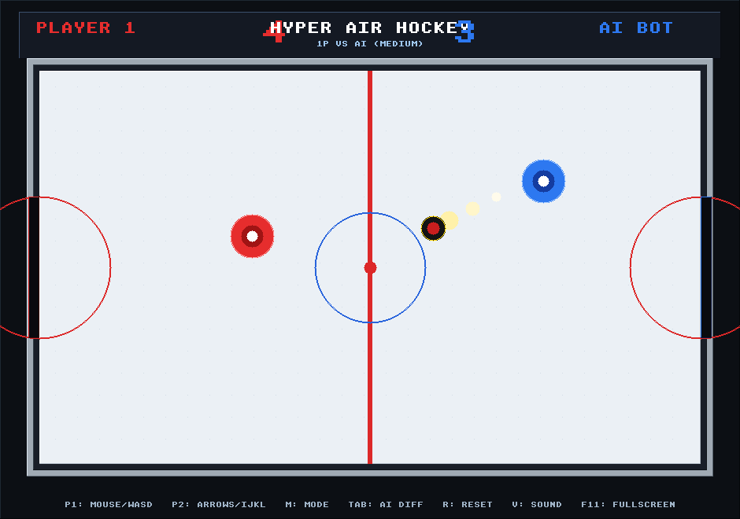

- **Objective**: Use your mallet to strike the puck across the centerline and score into your opponent's goal. First to 7 goals wins the match!
- **Controls**:
  - `Mouse` cursor tracking or `WASD`: Player 1 (Left Mallet).
  - `Arrow Keys` or `IJKL`: Player 2 (Right Mallet).
  - `Tab`: Cycle AI difficulty (Easy, Medium, Pro).
  - `M`: Toggle 1P vs AI / 2P Local mode.
  - `R`: Reset match score.
  - `V`: Toggle procedural sound effects.
- **Rules & Mechanics**:
  - Continuous circle-on-circle collision physics with mallet-to-puck momentum transfer, bank shots, and friction decay.
  - Mallets are physically constrained to their respective halves of the table.
  - Goal horn audio synthesis and dynamic particle spark explosions celebrate every scored point.
- **Pro Tip**: Hit the puck while your mallet is actively accelerating forward to execute high-speed bank trick shots off the side rails!

---

<a id="asteroids"></a>

### 2. Asteroids Pro (`asteroids/`)

_Vector Inertia Space Dogfight with Asteroid Splitting & Power-Ups_

```bash
v run asteroids
```

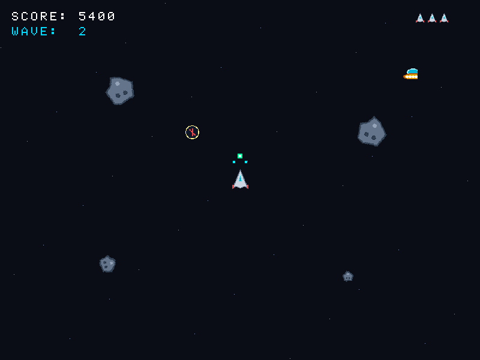

- **Objective**: Pilot your spacecraft in zero-gravity space, pulverize floating asteroid fields into smaller fragments, eliminate hostile alien UFOs, and survive infinite waves.
- **Controls**:
  - `A` / `D` or `Left` / `Right`: Rotate spacecraft orientation.
  - `W` or `Up`: Fire main inertia thrusters.
  - `Space`: Fire photon laser cannons.
  - `H`: Engage emergency Hyperspace teleportation.
  - `S`: Deploy plasma shield (absorbs 1 collision).
  - `R`: Restart game.
- **Rules & Mechanics**:
  - Asteroids split hierarchically: Large (20 pts) -> 2 Medium (50 pts) -> 2 Small (100 pts) -> Destroyed.
  - Flying Saucers hunt the player and fire targeted laser bursts (200-1,000 pts).
  - Collect floating power-up orbs: 3x Spread Shot, Overcharged Shield, Rapid-Fire Pulse, and EMP Screen Nuke.
- **Pro Tip**: Keep your spacecraft near the center of the screen and avoid excessive forward thrust momentum to prevent drifting uncontrollably into off-screen asteroid spawns.

---

<a id="balloonfight"></a>

### 3. NES Balloon Fight (`balloonfight/`)

_1984 Nintendo Flight Classic with Dual Helium Balloon Aerodynamics_

```bash
v run balloonfight
```

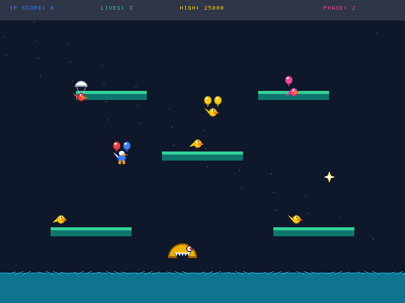

- **Objective**: Flap your arms to gain altitude, swoop down from above to pop enemy balloons, and kick parachuting enemies into the water before they re-inflate!
- **Controls**:
  - `A` / `D` or `Left` / `Right`: Steer horizontal flight trajectory.
  - `W` / `Space` / `Up`: Flap wings for vertical lift.
  - `P`: Pause game.
  - `M`: Toggle procedural audio.
  - `R`: Restart game.
- **Rules & Mechanics**:
  - Height Advantage: Colliding with an enemy when you are higher pops their balloon. Colliding when lower pops your own balloon!
  - You have 2 helium balloons. Losing both results in falling into the abyss.
  - Giant Fish Hazard: Lingering too close to the water surface triggers the giant carnivorous fish!
  - Balloon Trip Mode: Navigate side-scrolling obstacle courses avoiding electrified spark nodes.
- **Pro Tip**: Tap flap rhythmically rather than holding it down to maintain precise altitude control and effortlessly swoop over oncoming birds.

---

<a id="battleship"></a>

### 4. Battleship Pro (`battleship/`)

_10x10 Tactical Naval Warfare with Sonar Radar Sweeps_

```bash
v run battleship
```

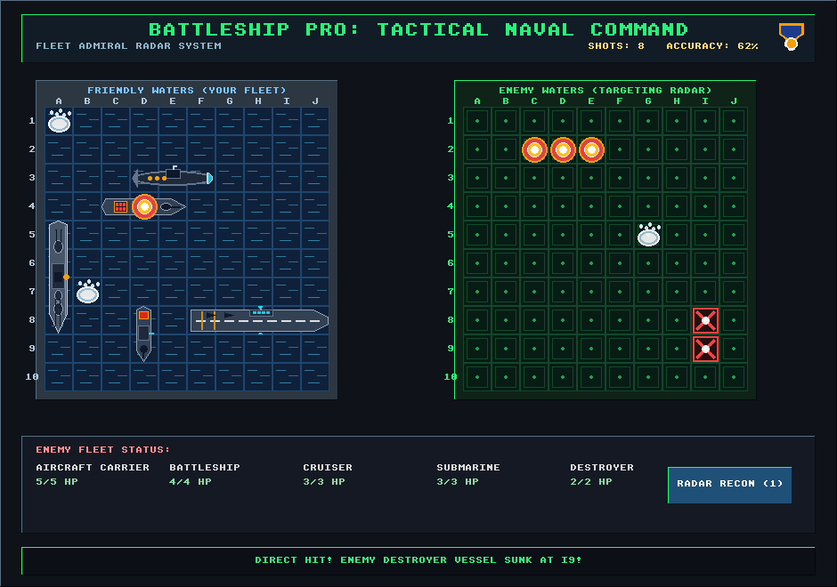

- **Objective**: Secretly position your 5-ship naval fleet on a 10x10 grid and hunt down the enemy's hidden warships before they sink yours!
- **Controls**:
  - `Left Click`: Target coordinate grid / Place selected ship.
  - `Right Click` or `R`: Rotate ship horizontally / vertically during placement.
  - `F`: Instant random fleet auto-placement.
  - `Space`: Confirm fleet and start combat phase.
  - `V`: Toggle sound effects.
- **Rules & Mechanics**:
  - 5 Fleet Classes: Aircraft Carrier (5 cells), Battleship (4 cells), Cruiser (3 cells), Submarine (3 cells), Destroyer (2 cells).
  - Red markers indicate HIT, White pegs indicate MISS. Sunk ships reveal their entire hull.
  - Radar Recon Scan: Deploy a 3x3 sonar sweep once per game to reveal any enemy vessels hiding in that sector.
  - Intelligent Hunt-and-Target AI systematically checks adjacent coordinates upon registering a hit.
- **Pro Tip**: Use a checkerboard (parity) firing pattern to locate all ships of length 2 or greater in half the total shots!

---

<a id="bejeweled"></a>

### 5. Bejeweled Match-3 (`bejeweled/`)

_PopCap Classic HD Suite with 7 Game Modes, Star Lasers, Supernovas, Hypercubes & Trance Audio_

```bash
v run bejeweled
```

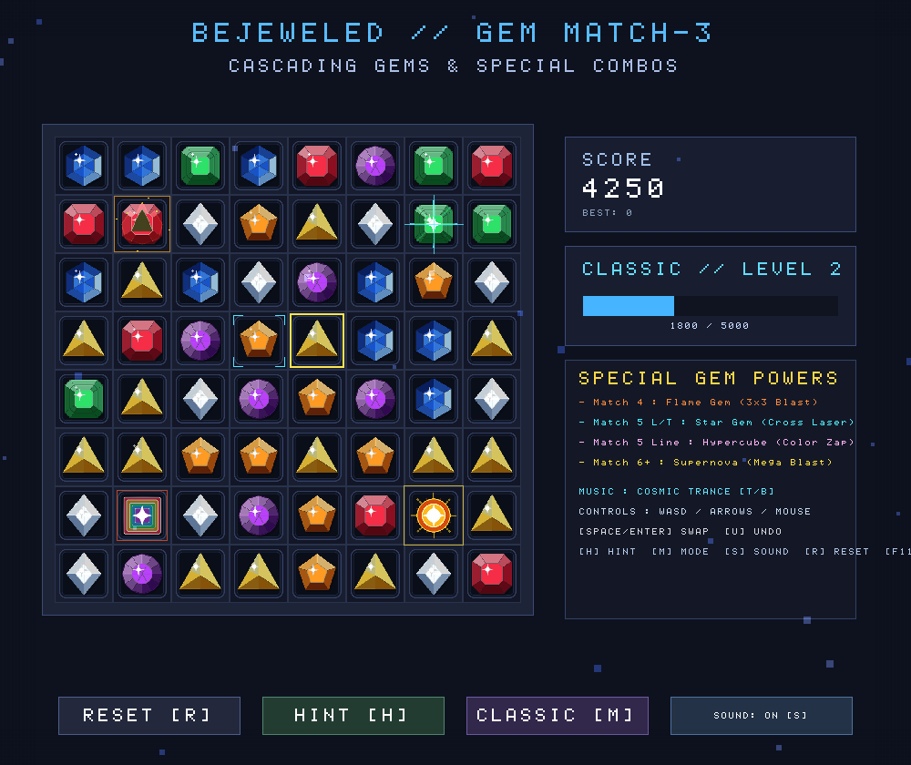

- **Objective**: Swap adjacent gems to form horizontal or vertical lines of 3 or more matching colors to score points, trigger explosive gravity cascades, and conquer all 7 PopCap HD game modes!
- **Game Modes**:
  - **Classic**: Traditional level progression with escalating target scores and cascade multipliers.
  - **Zen**: Endless tranquil relaxation with breathing guides, ambient soundscapes, and no timers or game overs.
  - **Lightning**: Fast-paced 60-second speed blitz where special gem detonations add +5s bonus time extensions.
  - **Butterflies**: Animated butterfly gems flutter upward from the bottom row toward the spider web at Row 0—match them before they are caught!
  - **Diamond Mine**: Excavate subterranean dirt, rock, and golden treasure chests by matching adjacent gems to delve deeper into the earth before time runs out.
  - **Poker**: Deal gems from your matches to construct 5-card poker hands (Flushes, Full Houses, 3-of-a-Kind, Pairs) for massive chip payouts.
  - **Ice Storm**: Dynamic rising frozen ice columns climb the grid—shatter them with vertical gem matches before they freeze the entire board!
- **Controls**:
  - `Mouse Click` / `Drag`: Select and swap adjacent gems.
  - `WASD` / `Arrow Keys`: Move glowing keyboard cursor bracket.
  - `Space` / `Enter` / `J` / `Z`: Select cursor gem or swap with adjacent gem.
  - `U`: Undo last gem swap.
  - `H` / `G`: Highlight a valid legal move hint.
  - `T` / `B`: Cycle Procedural Soundtrack (Cosmic Trance / Electro Rush / Zen Ambient / Off).
  - `M` / Click `[M] MODE` button: Cycle through all 7 Game Modes.
  - `S`: Toggle audio effects.
  - `R`: Reset game.
- **Rules & Mechanics**:
  - Flame Gem (4 in a line): Detonates a 3x3 surrounding grid shockwave with flame embers.
  - Star Gem (5 in T or L shape): Fires dual cross laser beams that clear the entire row and column simultaneously!
  - Hypercube (5 in a line): Swapping with any adjacent gem fires branching lightning electric arcs, vaporizing every gem of that color from the board.
  - Supernova (6+ in a line): Mega solar explosion combining a 3x3 shockwave with dual full-screen cross lasers!
  - Cosmic Singularity (Hypercube + Hypercube): Swapping two hypercubes together obliterates the entire 8x8 board in a single blast!
- **Pro Tip**: In Butterflies mode, prioritize bottom-row butterfly matches to forge Star Gems and laser-clear multiple columns of climbing butterflies in a single move!

---

<a id="blackjack"></a>

### 6. Blackjack 21 Pro (`blackjack/`)

_Vegas Strip Blackjack with Multi-Hand Betting, Splitting & Double Down_

```bash
v run blackjack
```

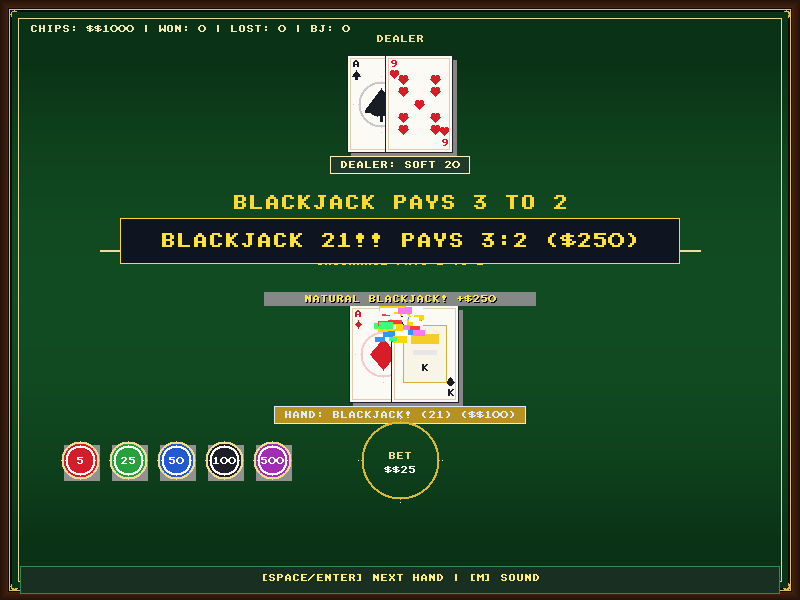

- **Objective**: Beat the dealer's hand total without exceeding 21. Natural 21 Blackjack pays 3:2!
- **Controls**:
  - `Space` or `Enter`: Deal new hand / Place default bet.
  - `H`: Hit (draw another card).
  - `S`: Stand (end your turn and lock hand value).
  - `D`: Double Down (double your wager, receive exactly 1 card, and stand).
  - `P`: Split pairs into two independent active hands.
  - `1-5`: Select chip denominations ($1, $5, $25, $100, $500).
  - `R`: Reset bankroll.
- **Rules & Mechanics**:
  - Dealer stands on all 17s (hard and soft).
  - Aces count dynamically as 1 or 11.
  - Insurance offered when dealer shows an Ace (pays 2:1 on dealer Blackjack).
  - Detailed statistical HUD tracks win rate, hands played, and peak bankroll.
- **Pro Tip**: Always Double Down on a hard 11 when the dealer shows a 2 through 10!

---

<a id="blockdude"></a>

### 7. TI-83 Block Dude (`blockdude/`)

_1996 Graphing Calculator Block-Stacking Puzzle Platformer (11 Handcrafted Levels)_

```bash
v run blockdude
```

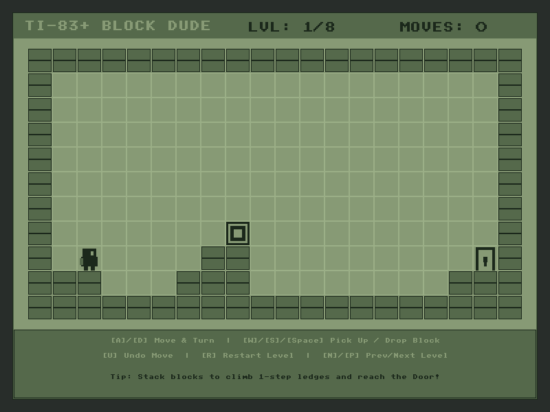

- **Objective**: Pick up, carry, and stack movable stone blocks to build staircases over towering canyon cliffs and reach the exit doorway in each level!
- **Controls**:
  - `A` / `D` or `Left` / `Right`: Walk left and right.
  - `W` or `Up`: Step / climb up a 1-block elevation step.
  - `Space` or `Enter` or `J`: Pick up a block in front of you / Drop the carried block.
  - `U`: Undo last block movement.
  - `R`: Restart current level puzzle.
  - `[` / `]`: Select previous / next level (1 to 11).
- **Rules & Mechanics**:
  - Block Dude can only carry 1 block at a time above his head.
  - You cannot jump over obstacles higher than 1 block; you must build staircases.
  - Blocks obey gravity and fall when unsupported.
  - You cannot drop a block if the space in front or overhead is obstructed.
- **Pro Tip**: Plan your staircase from the exit doorway backwards so you don't trap the last required block in a bottom trench.

---

<a id="bomberman"></a>

### 8. Bomberman Arcade (`bomberman/`)

_Grid Maze Demolition with Explosive Chain Reactions & Multi-Powerups_

```bash
v run bomberman
```

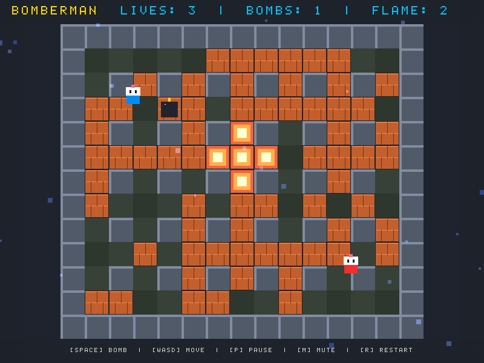

- **Objective**: Navigate destructible soft brick mazes, plant timed bombs to demolish barriers, uncover hidden power-ups, and eliminate all roaming monsters before reaching the exit!
- **Controls**:
  - `WASD` or `Arrow Keys`: Move Bomberman through grid corridors.
  - `Space`: Plant a timed bomb at your current tile.
  - `E`: Detonate remote bombs (when Remote Detonator is collected).
  - `P`: Pause game.
  - `R`: Restart game.
  - `M`: Toggle sound.
- **Rules & Mechanics**:
  - Bomb Up (Flame +): Increases maximum simultaneous bombs placed (+1).
  - Fire Up (Explosion Icon): Increases explosion cross radius by +1 tile.
  - Speed Skates: Increases Bomberman's movement speed.
  - Detonator / Remote Fuse: Grants remote bomb detonation.
  - Eliminate all enemies to unlock the exit portal.
- **Pro Tip**: Never trap yourself in a dead-end alley with your own bomb! Plan your escape route before dropping a bomb.

---

<a id="boulderdash"></a>

### 9. Boulder Dash Retro (`boulderdash/`)

_Subterranean Cave Excavation with Falling Rocks & Amoeba Core_

```bash
v run boulderdash
```

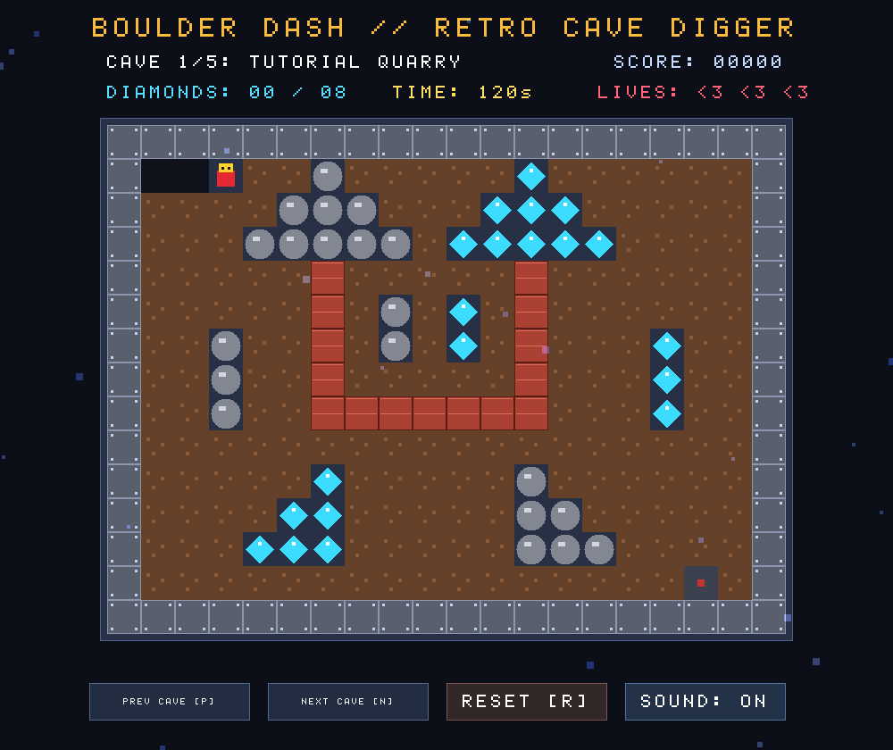

- **Objective**: Dig through dirt caves, collect the required quota of sparkling diamonds, avoid or crush hostile creatures, and escape through the exit vault before the timer expires!
- **Controls**:
  - `WASD` or `Arrow Keys`: Dig dirt, push boulders, and move Rockford.
  - `Space` + Direction: Dig or grab adjacent tile without moving.
  - `P` / `N` or `[` / `]`: Select previous/next cave (5 Handcrafted Levels).
  - `R`: Restart current cave.
  - `S`: Toggle sound.
- **Rules & Mechanics**:
  - Boulders & Diamonds: Obey gravity and roll sideways off rounded edges. Falling rocks will crush enemies and player!
  - Fireflies: Patrol walls counter-clockwise; explode into empty space when crushed.
  - Butterflies: Patrol walls clockwise; explode into a 3x3 grid of 9 diamonds when crushed by a boulder!
  - Amoeba: Expanding fluid hazard. Enclose it completely to transform it into diamonds!
- **Pro Tip**: Drop a boulder on top of a Butterfly to generate an instant jackpot of 9 diamonds!

---

<a id="bowling"></a>

### 10. 10-Pin Bowling Pro (`bowling/`)

_Realistic Hardwood Alley Bowling with Pin Physics & Multi-Hook Curves_

```bash
v run bowling
```

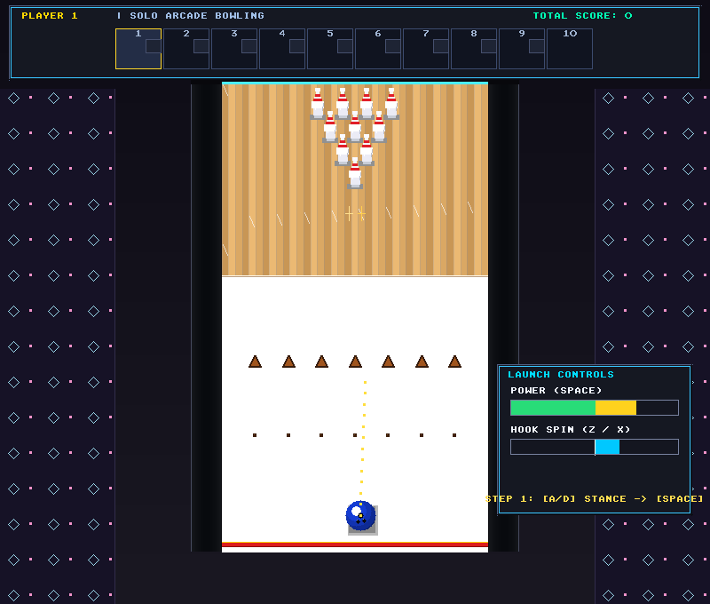

- **Objective**: Roll 10 frames of authentic bowling, master hook spin angles, pick up tricky spares, and aim for the legendary 300 perfect game!
- **Controls**:
  - `A` / `D` or `Left` / `Right`: Adjust bowler lane standing position.
  - `Space` (1st press): Lock aim trajectory angle.
  - `Space` (2nd press): Set ball launch speed & power.
  - `Space` (3rd press): Dial in hook spin curve (left/right hook).
  - `R`: Reset match.
- **Rules & Mechanics**:
  - Full 10-frame scoring engine with strike (X) and spare (/) bonuses.
  - Dynamic pin-to-pin collision response with ricochets and sliding pins.
  - Gutter ball detection with oil-pattern lane friction deceleration.
- **Pro Tip**: Aim for the 'pocket' between the 1-pin and 3-pin with a slight inward hook spin for the highest strike probability!

---

<a id="breakout"></a>

### 11. Breakout Overdrive (`breakout/`)

_Dynamic Brick Breaker with Paddle Spin Physics & Multi-Weapons_

```bash
v run breakout
```

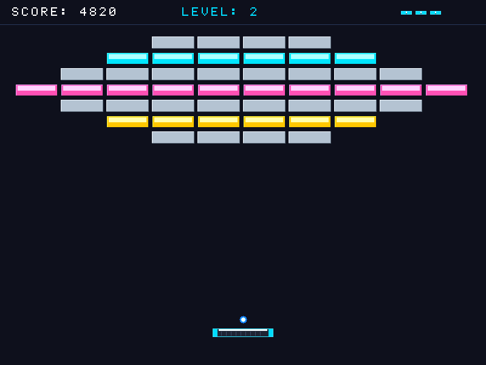

- **Objective**: Deflect the bouncing energy sphere with your paddle to smash all bricks in each level without letting the ball fall past the bottom!
- **Controls**:
  - `Mouse` or `A` / `D` or `Left` / `Right`: Slide paddle.
  - `Space` or `Left Click`: Launch ball from paddle / Fire equipped blaster lasers.
  - `L`: Cycle level selection (5 Distinct Level Layouts).
  - `R`: Restart game.
- **Rules & Mechanics**:
  - Armored Bricks: Require multiple hits to shatter.
  - TNT Bricks: Detonate surrounding bricks in a fiery chain reaction.
  - Power-Up Capsules: Multiball (3x balls), Laser Cannons, Paddle Expander, Sticky Catch, and Slow Ball.
- **Pro Tip**: Hitting the ball with the outer edges of your paddle imparts aggressive spin angles to reach the upper ceiling rows and bounce repeatedly behind brick clusters!

---

<a id="bubbleshooter"></a>

### 12. Bubble Shooter Pro (`bubbleshooter/`)

_Hexagonal Match-3 Bubble Popper with Wall Trajectory Reflections_

```bash
v run bubbleshooter
```

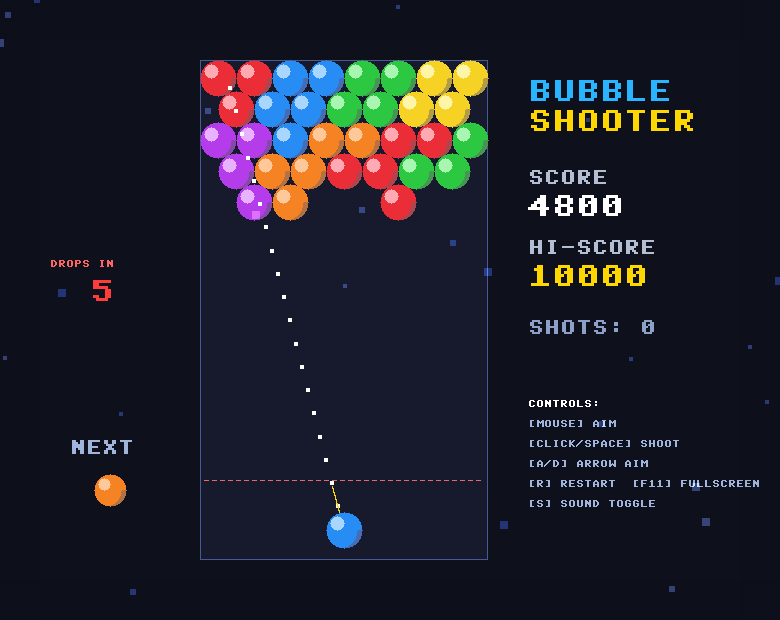

- **Objective**: Aim and fire colored bubbles from the bottom cannon into the ceiling cluster. Match 3 or more bubbles of the same color to pop them and clear the board before the descending ceiling crushes you!
- **Controls**:
  - `Mouse Aim`: Direct laser aiming trajectory guide.
  - `Left Click` or `Space`: Fire bubble from cannon.
  - `S`: Toggle sound effects.
  - `R`: Restart game.
- **Rules & Mechanics**:
  - Hexagonal Grid: Bubbles snap into an interlocking honeycomb structure.
  - Bank Shots: Rebound bubbles off the left and right walls to access tight pockets.
  - Avalanche Drop: Any bubbles left floating without a connection to the ceiling immediately detach and fall for bonus points!
- **Pro Tip**: Target the high anchor bubbles holding large groups of dissimilar colors to drop dozens of bubbles in a single shot.

---

<a id="centipede"></a>

### 13. Cyber Centipede Pro (`centipede/`)

_Atari Arcade Classic with Segmented Insects & Poison Mushrooms_

```bash
v run centipede
```

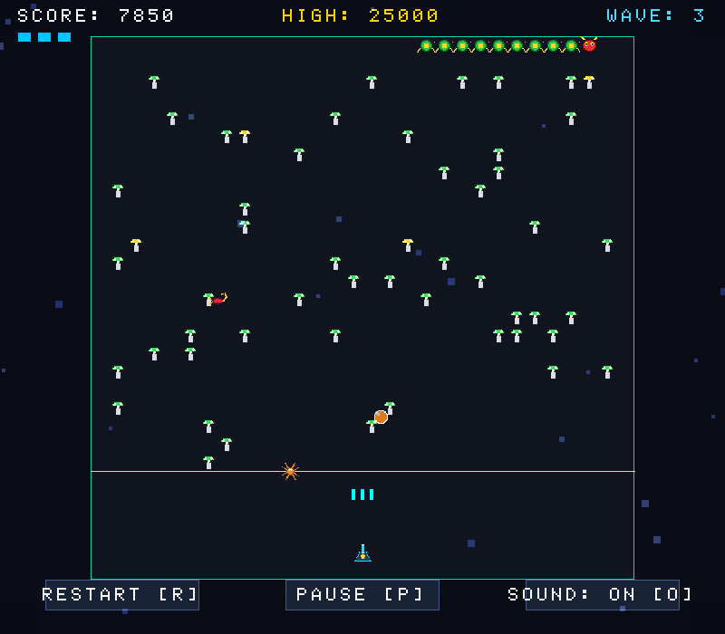

- **Objective**: Defend the enchanted mushroom forest from a multi-segmented Centipede winding down toward your player zone, while fending off Fleas, Spiders, and Scorpions!
- **Controls**:
  - `WASD` or `Arrow Keys`: Move Bug Blaster freely in the bottom player zone.
  - `Space`: Rapid-fire laser bolts.
  - `P`: Pause game.
  - `O`: Toggle sound.
  - `R`: Restart game.
- **Rules & Mechanics**:
  - Centipede: Shooting a middle segment splits the centipede into two independent bugs, leaving behind a mushroom!
  - Spider: Bounces erratically through the player zone, eating mushrooms.
  - Flea: Drops vertically from the top, planting mushrooms in its wake.
  - Scorpion: Runs horizontally, poisoning mushrooms (poisoned mushrooms cause centipedes to dive straight down).
- **Pro Tip**: Clear a wide horizontal channel near the bottom to cleanly pick off descending centipedes without mushrooms obstructing your laser shots.

---

<a id="chimptest"></a>

### 14. Chimp Test Pro (`chimptest/`)

_Primate Spatial Working Memory Benchmark_

```bash
v run chimptest
```

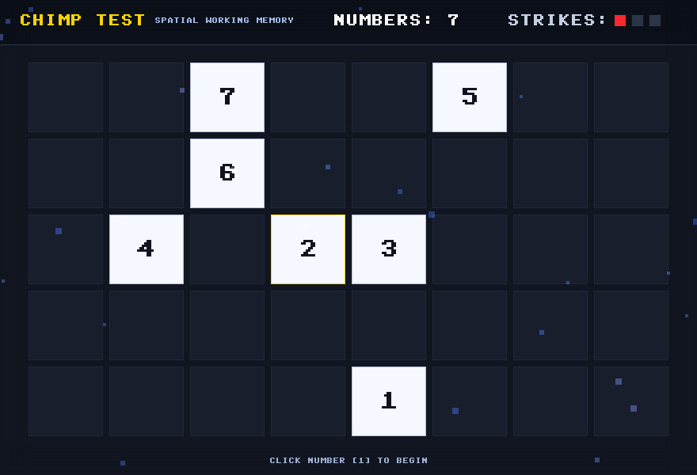

- **Objective**: Test your working memory capacity against the famous primate cognitive benchmark! Memorize the positions of scattered numbered tiles (1 to N), then click them in ascending numerical order after they mask into blank squares!
- **Controls**:
  - `Left Click`: Select tiles in order (1 -> 2 -> 3 -> ... -> N).
  - `Space`: Advance to next round after completing a level.
  - `R`: Reset test.
- **Rules & Mechanics**:
  - Level 1 begins with 4 numbers. Each successful round adds +1 additional number.
  - The moment you click tile 1, all remaining numbers on the grid mask into blank white squares.
  - 3 Strikes: You have 3 lives before your final working memory score and cognitive percentile ranking are evaluated.
- **Pro Tip**: Chunk numbers into spatial clusters (e.g., 'top-left triangle, bottom-right pair') to hold more than 9 digits in working memory simultaneously!

---

<a id="chipschallenge"></a>

### 15. Chip's Challenge Deluxe (`chipschallenge/`)

_Classic 1989 Windows Entertainment Pack Tile Puzzle Adventure_

```bash
v run chipschallenge
```

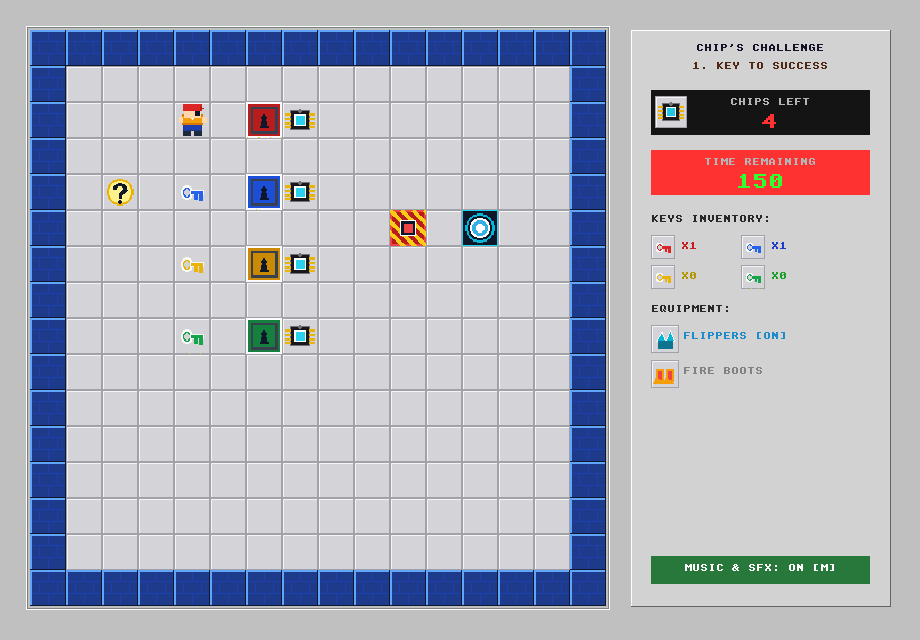

- **Objective**: Guide Chip through dangerous puzzle levels, collect computer microchips, pick up elemental boots (Fire, Water, Ice, Suction), bypass security doors, and reach the exit socket!
- **Controls**:
  - `WASD` or `Arrow Keys`: Walk and push blocks.
  - `R`: Restart current level puzzle.
  - `N` / `P`: Skip to next / previous level (10 Handcrafted Levels).
  - `M`: Toggle sound.
- **Rules & Mechanics**:
  - Microchips: Collect all microchips on the stage to open the Chip Socket barrier.
  - Keys & Doors: Blue, Red, Green, and Yellow keys unlock matching color-coded doors (Green keys have unlimited re-use).
  - Special Boots: Fire Boots (walk on fire), Flippers (swim in water), Ice Skates (steer on ice), Suction Boots (ignore force floors).
  - Hazards: Gliders, Fireballs, Bugs, Paramecia, and Dirt Blocks.
- **Pro Tip**: Push dirt blocks into water tiles to construct safe walking bridges over moats!

---

<a id="clickarcade"></a>

### 16. Clicker Arcade Empire (`clickarcade/`)

_4-in-1 Casual Arcade Tycoon with Retro Mini-Games & Automation_

```bash
v run clickarcade
```

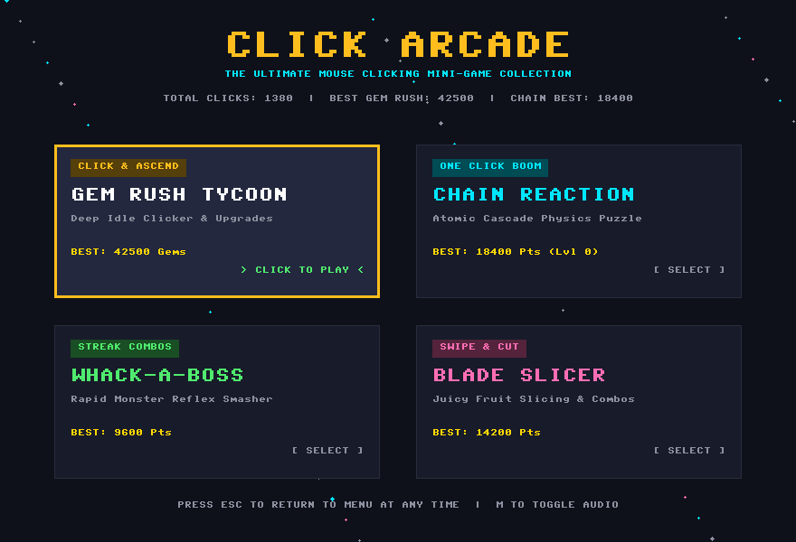

- **Objective**: Click to generate arcade tokens, purchase retro arcade cabinets (Pong, Space Invaders, Pac-Man, Galaga), hire technicians, upgrade ticket dispensers, and build the ultimate arcade empire!
- **Controls**:
  - `Left Click`: Tap arcade coin slot to earn manual tokens.
  - `Click Upgrades`: Purchase automated revenue streams & multipliers.
  - `1-4`: Launch mini-games (Target Reflex, Whack-a-Mole, Coin Drop, Memory Match).
  - `R`: Prestige / Reset for permanent Golden Token multiplier.
- **Rules & Mechanics**:
  - Each cabinet tier yields exponential passive income per second.
  - Ticket Dispensers unlock prize claw machines and rare retro collector trophies.
  - Mini-games award instant token bursts and temporary 2x frenzy multipliers.
- **Pro Tip**: Invest early in automated coin collectors before upgrading individual cabinet yields to maximize idle progression!

---

<a id="columns"></a>

### 17. Sega Columns (`columns/`)

_1990 Falling Gem Triplet Match-3 with Magic Jewels & Multiplier Cascades_

```bash
v run columns
```

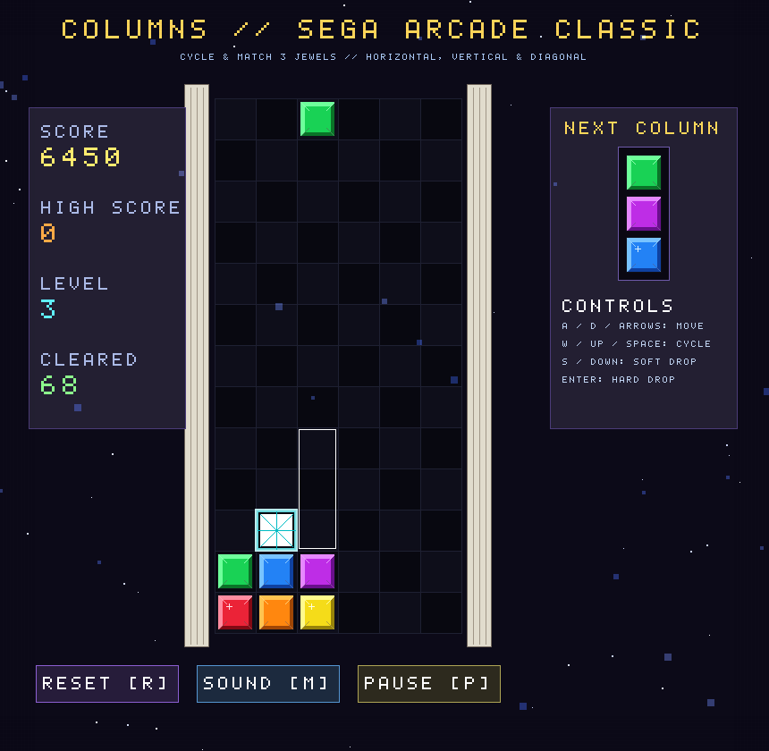

- **Objective**: Guide falling vertical triplets of sparkling ancient jewels into the temple well. Align 3 or more matching jewels horizontally, vertically, or diagonally to clear them and trigger cascading chain reactions!
- **Controls**:
  - `A` / `D` or `Left` / `Right`: Slide falling column horizontally.
  - `W` / `Up` / `Space`: Cycle color order of the 3 jewels inside the falling column.
  - `S` / `Down`: Soft drop column faster.
  - `Enter` / `J`: Hard drop column instantly to the bottom.
  - `P`: Pause game.
  - `R`: Reset match.
- **Rules & Mechanics**:
  - Match 3 or more identical gems horizontally, vertically, or along diagonals.
  - Magic Jewel: A glowing flashing rainbow column that vaporizes every gem matching the color it lands on!
  - Gravity Cascades: Unsupported gems fall naturally into gaps, triggering massive score multiplier chains.
  - Temple levels accelerate falling speeds and introduce higher jewel color variations.
- **Pro Tip**: Focus heavily on diagonal setups—they create the most unpredictable and devastating multi-stage chain reactions!

---

<a id="connect4"></a>

### 18. Connect 4 Pro (`connect4/`)

_Vertical 4-in-a-Row Strategy with Minimax Depth-8 AI_

```bash
v run connect4
```

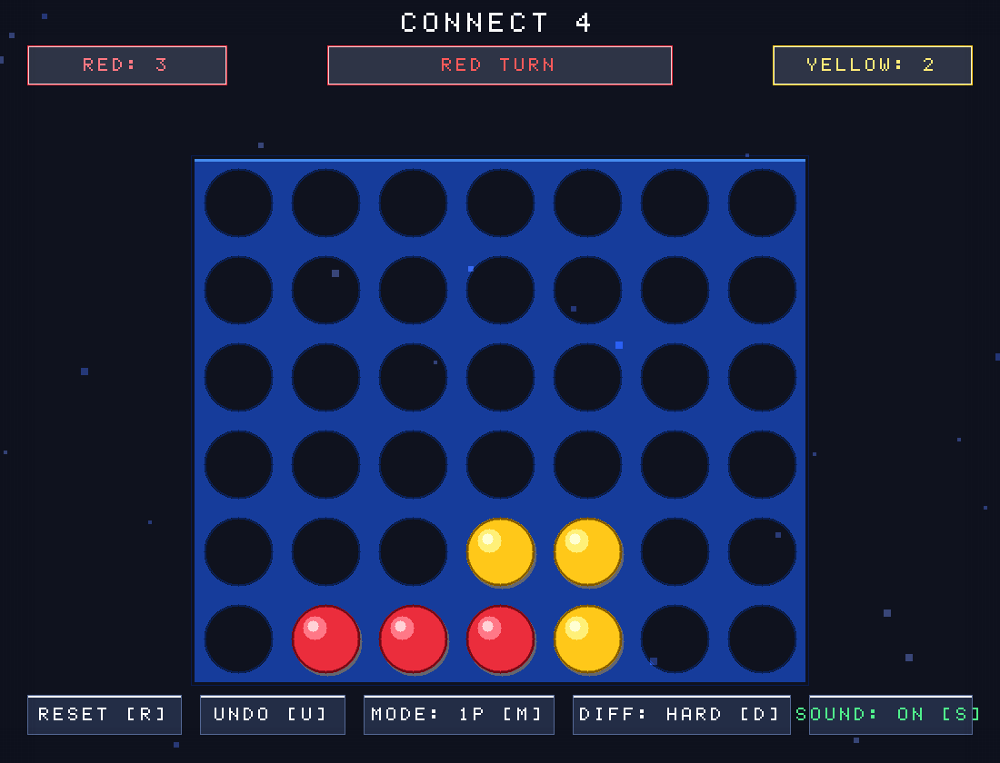

- **Objective**: Drop your colored discs into the 7-column vertical grid to connect 4 of your pieces in a row horizontally, vertically, or diagonally before your opponent does!
- **Controls**:
  - `1-7` or `Left Click` column: Drop disc into selected slot.
  - `Left` / `Right`: Move disc dropper selector.
  - `Space` / `Enter`: Drop disc at selector.
  - `U`: Undo last move.
  - `A`: Toggle AI opponent difficulty (Easy, Medium, Master Minimax).
  - `R`: Restart board.
- **Rules & Mechanics**:
  - Discs fall to the lowest unoccupied space within the chosen column.
  - Connect 4 in a line (horizontal, vertical, diagonal) to win instantly.
  - Minimax AI evaluates thousands of board states with alpha-beta pruning.
- **Pro Tip**: Control the center column (Column 4)—it allows for the most possible 4-in-a-row connections across the entire board!

---

<a id="cyberrunner"></a>

### 19. Cyber Runner 2088 (`cyberrunner/`)

_3D Neon Grid Endless Runner with Obstacle Vaulting & Nitro Boost_

```bash
v run cyberrunner
```

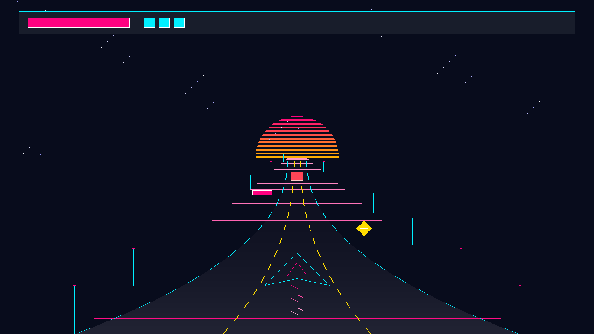

- **Objective**: Race a supersonic cyber hovercraft down an endless neon synthwave highway, dodging laser barriers, leaping over plasma pits, collecting energy gems, and surviving at breakneck speeds!
- **Controls**:
  - `A` / `D` or `Left` / `Right`: Strafe across 3 highway lanes.
  - `Space` or `W` or `Up`: Jump hovercraft over low laser barriers and chasms.
  - `S` or `Down`: Slide / dive under high security sensors.
  - `LShift` / `E`: Engage Nitro Boost (requires 100% boost charge).
  - `P`: Pause game.
  - `R`: Restart run.
- **Rules & Mechanics**:
  - Speed increases continuously over time as distance milestones are achieved.
  - Energy Cores recharge your shield generator and boost meter.
  - Shields: You start with 3 shield points; colliding with barriers depletes 1 shield.
  - Near-miss bonuses award huge score multipliers when dodging obstacles at the last millisecond.
- **Pro Tip**: Chain near-miss lane shifts right before jumping over hurdles to keep your multiplier at maximum 10x!

---

<a id="darts"></a>

### 20. Pub Darts 501 / Cricket (`darts/`)

_Realistic Bristle Dartboard with 501 Countdown, Cricket & Physics Sway_

```bash
v run darts
```

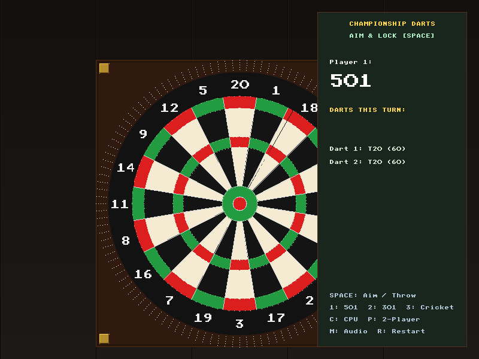

- **Objective**: Throw sets of 3 steel-tip darts to reduce your score from 501 to exactly 0 (finishing on a double), or close out numbers 15-20 and the Bullseye in Cricket!
- **Controls**:
  - `Mouse Aim`: Position dart crosshair on the board.
  - `Hold Left Click`: Draw back dart and time the fluctuating power/accuracy meter.
  - `Release Left Click`: Throw dart at the target.
  - `M`: Switch Game Mode (501 Countdown / Cricket / Free Practice).
  - `R`: Reset match.
- **Rules & Mechanics**:
  - 501 Rules: Deduct points each round; must reach exactly 0 with a Double or Bullseye. Busting resets to turn start.
  - Cricket Rules: Hit numbers 15-20 and Bullseye 3 times each to close them out and score points on open numbers.
  - Inner ring awards Triple Points (Triple 20 = 60 pts); outer ring awards Double Points.
- **Pro Tip**: Triple 20 is worth more points than a Bullseye (60 pts vs 50 pts)—aim for T20 to reduce your 501 total rapidly!

---

<a id="digdug"></a>

### 21. Dig Dug Classic (`digdug/`)

_1982 Namco Subterranean Action with Rock Drops & Harpoon Inflations_

```bash
v run digdug
```

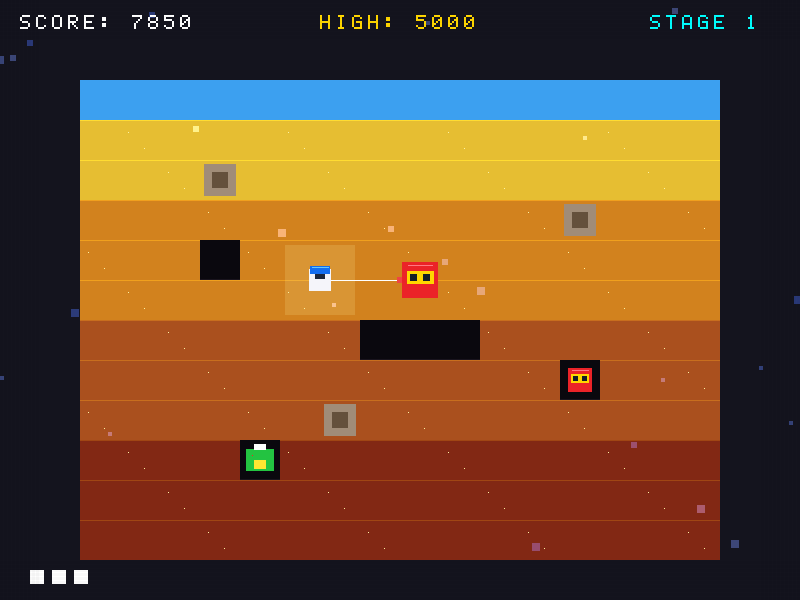

- **Objective**: Tunnel through subterranean dirt layers, inflate underground Pookas and Fygars with your air pump until they pop, and drop heavy boulders to crush enemy swarms!
- **Controls**:
  - `WASD` or `Arrow Keys`: Dig underground tunnels in 4 cardinal directions.
  - `Space` or `J`: Fire harpoon / rapidly pump to inflate captured monsters.
  - `P`: Pause game.
  - `R`: Restart game.
- **Rules & Mechanics**:
  - Pookas (red goggles) and Fygars (green dragons) roam tunnels and turn into ghosts to slip through solid dirt.
  - Fygars periodically breathe horizontal fire bursts across tunnels.
  - Tunneling directly underneath large rocks causes them to wobble and fall, crushing anything below for huge bonus points.
  - Clear all monsters on the stage or eliminate the last fleeing enemy to clear the level.
- **Pro Tip**: Lure multiple enemies directly underneath a trembling boulder before dropping it to earn up to 4,000 combo points!

---

<a id="donkeykong"></a>

### 22. Donkey Kong Arcade (`donkeykong/`)

_1981 Nintendo Girder Climbing Platformer with Rolling Barrels & Hammers_

```bash
v run donkeykong
```

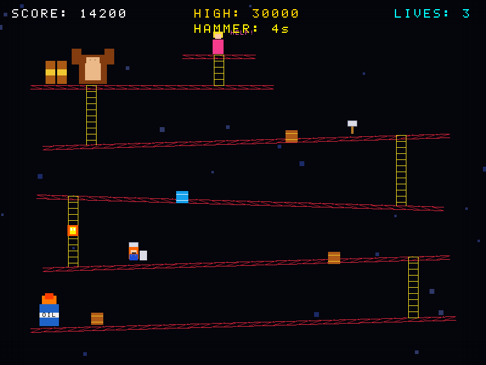

- **Objective**: Guide Jumpman (Mario) up tilted industrial girder scaffoldings, leap over rolling wooden and blue incendiary barrels, climb ladders, grab heavy smash hammers, and rescue Lady Pauline from Donkey Kong!
- **Controls**:
  - `A` / `D` or `Left` / `Right`: Run left and right across slanted girders.
  - `W` / `S` or `Up` / `Down`: Climb up and down intact industrial ladders.
  - `Space` or `J`: Jump over rolling barrels, fireballs, and gaps.
  - `P`: Pause game.
  - `R`: Restart game.
- **Rules & Mechanics**:
  - Rolling Barrels: Donkey Kong hurls wooden barrels down the girders that bounce down ladders.
  - Blue Barrels: Drop into the oil drum at the bottom to spawn aggressive climbing Fireballs.
  - Hammer Power-Up: Grab a hammer to smash barrels and fireballs for 300-800 bonus points (cannot jump or climb ladders while wielding the hammer).
  - Broken ladders cannot be climbed.
  - Falling from elevations greater than Mario's height is fatal.
- **Pro Tip**: Time your jumps directly over rolling barrels while running in the opposite direction to consistently earn 100 bonus points without landing on top of them.

---

<a id="dopewars"></a>

### 23. Dope Wars 1990 (`dopewars/`)

_Turn-Based Commodity Trading Simulation Across NYC Boroughs_

```bash
v run dopewars
```

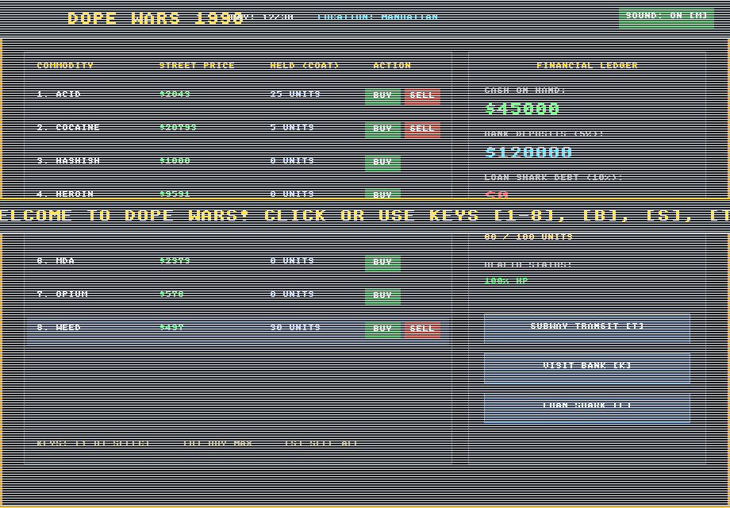

- **Objective**: Travel across New York City boroughs (Manhattan, Brooklyn, Queens, Bronx, Staten Island, Coney Island), buy low and sell high across fluctuating market prices, pay off the loan shark, evade the DEA, and amass a fortune in 30 days!
- **Controls**:
  - `1-8`: Select commodity to trade.
  - `B`: Buy selected commodity.
  - `S`: Sell commodity in inventory.
  - `T`: Travel via subway to another NYC borough (advances calendar by 1 day).
  - `K`: Visit Bank to deposit/withdraw cash and earn interest.
  - `L`: Visit Loan Shark to repay high-interest debt.
  - `G`: Visit Gun Shop to purchase defense weapons and trench coats (expand coat capacity).
  - `R`: Restart 30-day game.
- **Rules & Mechanics**:
  - 30-day calendar deadline to repay initial $5,500 debt and maximize net worth.
  - Market Events: Random police busts, rival muggers, and neighborhood price spikes/crashes.
  - Officer Hardass encounters give you the choice to Run or Fight.
- **Pro Tip**: Pay off your loan shark debt within the first 5 days to stop the punishing compound interest from eating your profits!

---

<a id="drmario"></a>

### 24. Dr. Mario Classic (`drmario/`)

_1990 Nintendo Falling Megavitamin Virus Eradication Puzzle_

```bash
v run drmario
```

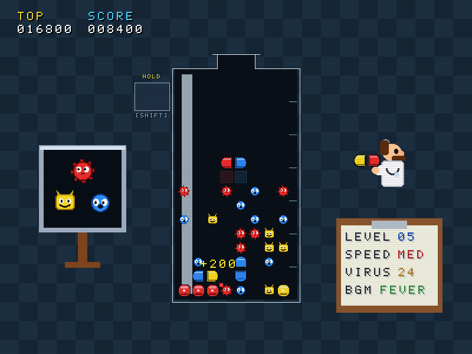

- **Objective**: Guide falling two-toned vitamin capsules into the medicine bottle. Align 4 or more segments of matching color with corresponding viruses (Red Fever, Blue Chill, Yellow Weird) to eliminate them and cure the patient!
- **Controls**:
  - `A` / `D` or `Left` / `Right`: Steer falling megavitamin capsule horizontally.
  - `W` / `J` / `Up`: Rotate capsule 90 degrees clockwise.
  - `K` / `Z`: Rotate capsule 90 degrees counter-clockwise.
  - `S` / `Down`: Soft drop capsule faster.
  - `Space`: Hard drop capsule instantly into position.
  - `LShift` / `C`: Hold capsule in reserve.
  - `P`: Pause game.
  - `R`: Reset match.
- **Rules & Mechanics**:
  - 3 Virus Colors: Red (Fever), Blue (Chill), and Yellow (Weird).
  - Capsules consist of two halves with matching or differing colors (Red, Blue, Yellow).
  - Aligning 4 matching colors in a vertical column or horizontal row obliterates the virus and pill segments.
  - When pill segments break, unsupported halves fall with natural gravity, allowing multi-stage chain combos.
  - Eliminate all viruses in the bottle to advance to the next medical phase.
- **Pro Tip**: Set up horizontal pill shelves above multiple viruses to trigger cascading gravity drops that clear several viruses in a single turn!

---

<a id="duke"></a>

### 25. Duke Nukem: Cyber Outpost (`duke/`)

_1991 Apogee 2D Action Platformer with Jetpacks & Cyber Sec-Bots_

```bash
v run duke
```

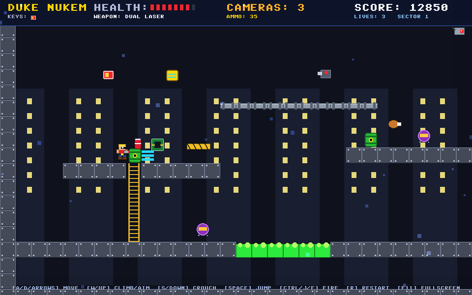

- **Objective**: Infiltrate Dr. Proton's subterranean mutant outpost, blast surveillance cameras and robotic sentries with your plasma ray, collect keycards and turkey drumsticks, and reach the sector exit!
- **Controls**:
  - `A` / `D` or `Left` / `Right`: Walk and run left/right.
  - `W` or `Up`: Look up / climb chain-link fences / ladders.
  - `S` or `Down`: Crouch / drop down through one-way platforms.
  - `Space`: Jump over hazards and obstacles.
  - `Ctrl` or `J`: Fire atomic plasma blaster.
  - `E`: Interact with elevators, computer consoles, and teleporters.
  - `P`: Pause game.
- **Rules & Mechanics**:
  - Destroy surveillance cameras and supply boxes to uncover soda cans (+1 HP) and turkey dinners (+3 HP).
  - Access Cards (Red, Blue, Green) deactivate electro-forcefield barriers.
  - Special inventory items: Jetpack (hold jump for sustained flight), Boots (leap higher), and Laser Sight.
  - Avoid electrified ceiling grids and acid toxic waste pools.
- **Pro Tip**: Hang and shoot while climbing chain-link fences to eliminate patrolling ceiling drones before dropping down into new rooms!

---

<a id="etchasketch"></a>

### 26. Etch A Sketch Deluxe (`etchasketch/`)

_Dual-Knob Precision Mechanical Drawing with Shading & Gallery Export_

```bash
v run etchasketch
```

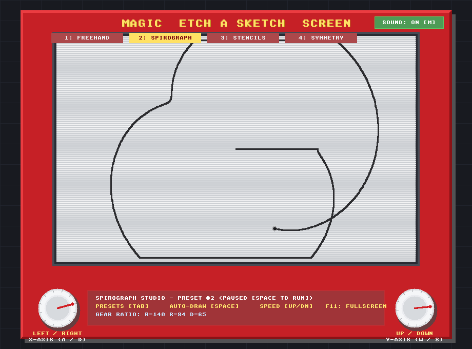

- **Objective**: Turn the dual aluminum-powder control knobs to sketch intricate vector line art on the classic glass screen, or shake the device to erase the canvas and start fresh!
- **Controls**:
  - `A` / `D` or `Left` / `Right`: Rotate Horizontal Knob (X-axis drawing stylus).
  - `W` / `S` or `Up` / `Down`: Rotate Vertical Knob (Y-axis drawing stylus).
  - `Mouse Drag`: Freehand cursor drawing across the screen.
  - `Space` or `Shake Button`: Shake device with particle physics to erase the glass screen.
  - `C`: Cycle drawing stylus color (Classic Dark Charcoal, Neon Cyan, Amber Phosphor, Rainbow Gradient).
  - `[` / `]`: Adjust line stroke width (1px to 6px).
  - `S`: Save current sketch artwork snapshot.
- **Rules & Mechanics**:
  - Authentic continuous line stylus simulation—the cursor never lifts from the glass.
  - Realistic screen shake animation with falling gray powder particle dissipation.
  - Grid overlay toggle for precision pixel art and geometric blueprints.
- **Pro Tip**: Combine subtle diagonal keyboard inputs (`W`+`D`, `S`+`A`) to render smooth, clean circular arcs and curved contours!

---

<a id="fire"></a>

### 27. Game & Watch: Fire (`fire/`)

_1980 Nintendo Silver Series Dual-Firefighter Trampoline Rescue_

```bash
v run fire
```

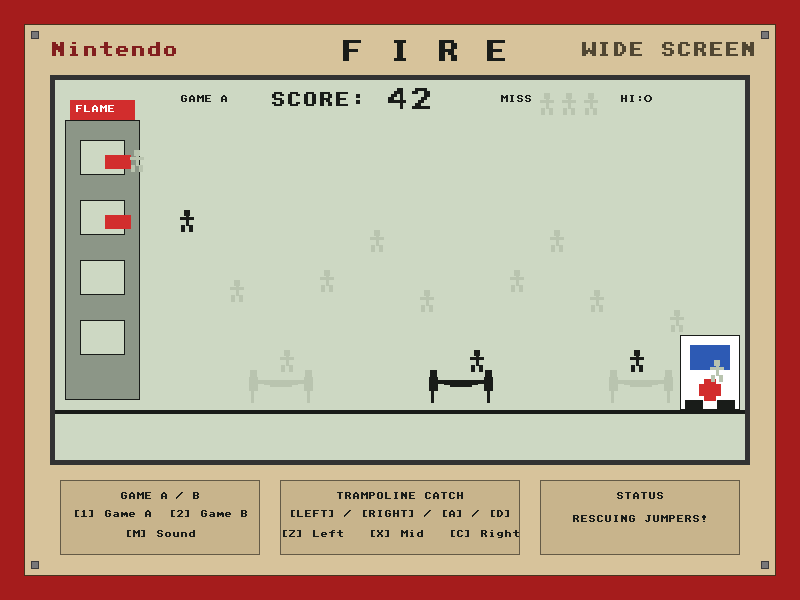

- **Objective**: Control a team of two heroic firefighters holding a rescue trampoline. Catch falling victims leaping from a blazing apartment building and bounce them safely into the awaiting hospital ambulance!
- **Controls**:
  - `A` / `D` or `Left` / `Right`: Move the rescue trampoline between 3 discrete positions (Left, Center, Right).
  - `1`: Start Game A (Normal tempo, single jumpers).
  - `2`: Start Game B (Fast tempo, multiple simultaneous jumpers).
  - `M`: Toggle authentic LCD piezo audio beeps.
  - `R`: Reset game.
- **Rules & Mechanics**:
  - Each jumper must be bounced 3 times across the screen to reach the ambulance safely.
  - Each successful bounce awards 1 point; landing safely in the ambulance awards bonus points.
  - Missing a jumper results in a Miss (splat). 3 Misses ends the game.
  - At 200 and 500 points, all current Misses are erased!
- **Pro Tip**: Position your trampoline based on the jumper closest to the ground rather than chasing the one who just jumped from the roof!

---

<a id="flappy"></a>

### 28. Flappy Bird Pro (`flappy/`)

_Precision Physics Tap Arcade with Parallax Cityscape & Day/Night Cycle_

```bash
v run flappy
```

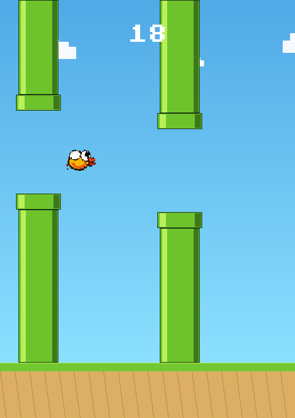

- **Objective**: Tap to flap your wings, maintain altitude through narrow gaps in green sewer pipe columns, and beat your highest score!
- **Controls**:
  - `Space` or `Up` or `Left Click`: Flap wings for an instant upward vertical velocity boost.
  - `P`: Pause game.
  - `S`: Toggle procedural audio.
  - `R`: Restart game.
- **Rules & Mechanics**:
  - Continuous downward gravity acceleration with nose-dive pitch rotation physics.
  - Passing cleanly between pipe columns awards 1 point.
  - Colliding with any pipe or the ground results in an immediate game over.
  - Dynamic day/night backdrop lighting shifts every 10 points scored.
- **Pro Tip**: Flap when the bird's eye lines up with the bottom pipe's top rim to consistently arc through the center of every gap!

---

<a id="frogger"></a>

### 29. Frogger Arcade (`frogger/`)

_1981 Konami Arcade Classic with Heavy Traffic & River Hazards_

```bash
v run frogger
```

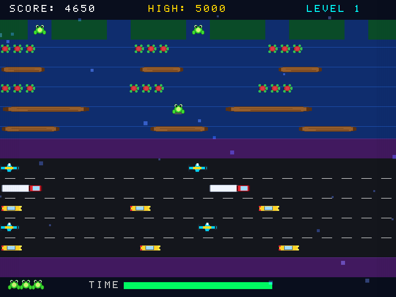

- **Objective**: Guide 5 frogs safely across a lethal 5-lane highway dodging speeding cars, trucks, and bulldozers, then hop across floating logs, turtles, and alligators to reach the 5 home bays!
- **Controls**:
  - `WASD` or `Arrow Keys`: Hop frog 1 grid tile in 4 cardinal directions.
  - `P`: Pause game.
  - `M`: Toggle sound.
  - `R`: Restart game.
- **Rules & Mechanics**:
  - Highway: Avoid speeding race cars, trucks, bulldozers, and dune buggies.
  - River: Hop on floating logs, turtles, and alligator backs to avoid drowning in the river water.
  - Diving Turtles: Submerge underwater periodically; jump off before they go under!
  - Home Bays: Fill all 5 home bays to clear the stage. Catch bonus flies for +200 points.
- **Pro Tip**: Never rush into a home bay without checking for the snapping alligator head; wait for it to submerge before hopping in!

---

<a id="galaga"></a>

### 30. Galaga Space Shooter (`galaga/`)

_1981 Namco Fixed Shooter with Tractor Beams & Dual Fighter Docking_

```bash
v run galaga
```

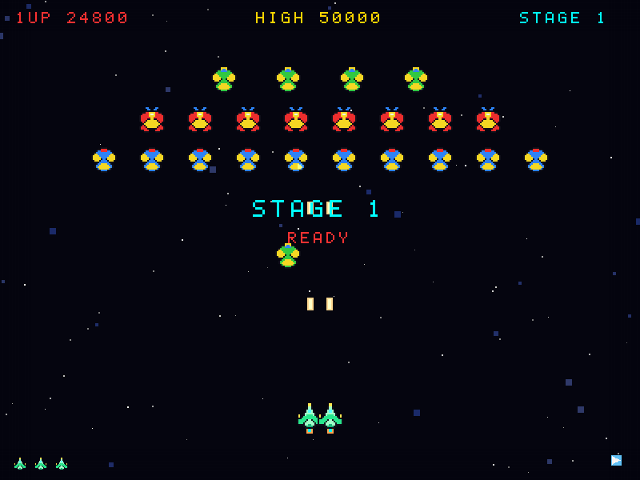

- **Objective**: Pilot your starship along the bottom of the screen, shoot down alien insect swarms assembling in formation, survive swooping dive-bomb attacks, and rescue captured fighters to form the lethal Dual Fighter!
- **Controls**:
  - `A` / `D` or `Left` / `Right`: Slide starfighter horizontally across the baseline.
  - `Space`: Fire rapid photon laser cannons (up to 2 shots on screen).
  - `P`: Pause game.
  - `M`: Toggle audio.
  - `R`: Restart game.
- **Rules & Mechanics**:
  - Alien Fleet: Boss Galaga (green/blue), Red Goei (moths), and Blue Zako (bees).
  - Tractor Beam: Boss Galaga can beam down a blue tractor beam to capture your ship.
  - Dual Fighter: Shoot down the Boss Galaga while it is swooping with your captured ship to free it and dock into a double-laser Dual Fighter!
  - Challenging Stages: Every 3 stages, test your accuracy in bonus waves with 40 enemies and zero return fire.
- **Pro Tip**: Intentionally let Boss Galaga capture your first ship early in stage 1, then liberate it on stage 2 for double firepower across the entire game!

---

<a id="game2048"></a>

### 31. 2048 Neon Pulse (`game2048/`)

_Smooth Sliding Tile Math Puzzle with Neon Glow & Hexagonal Grid Mode_

```bash
v run game2048
```

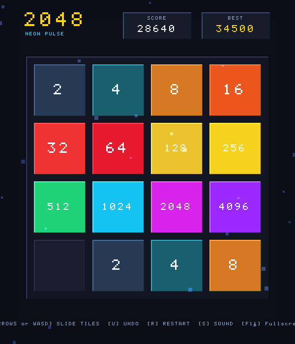

- **Objective**: Slide numbered tiles across the grid. When two tiles with the same number collide, they merge into one with double the value. Reach the legendary 2048 tile and beyond!
- **Controls**:
  - `WASD` or `Arrow Keys` or `Mouse Drag`: Slide all tiles in that direction.
  - `U`: Undo last slide move.
  - `H`: Toggle between Classic 4x4 Grid and Hexagonal 6-Direction Honeycomb Mode.
  - `R`: Restart board.
- **Rules & Mechanics**:
  - Every slide shifts all tiles to the edge of the board; new '2' or '4' tiles spawn in random empty spots.
  - Matching numbers merge upon collision (2+2=4, 4+4=8, 8+8=16, ..., 1024+1024=2048).
  - The game ends when no legal moves or empty spaces remain.
- **Pro Tip**: Keep your highest value tile locked permanently in one corner (e.g., bottom-right) and build decreasing numerical chains along that bottom row!

---

<a id="gnujump"></a>

### 32. GNUjump Tower (`gnujump/`)

_Vertical Scrolling Tower Platformer with Falling Floor Mechanics_

```bash
v run gnujump
```

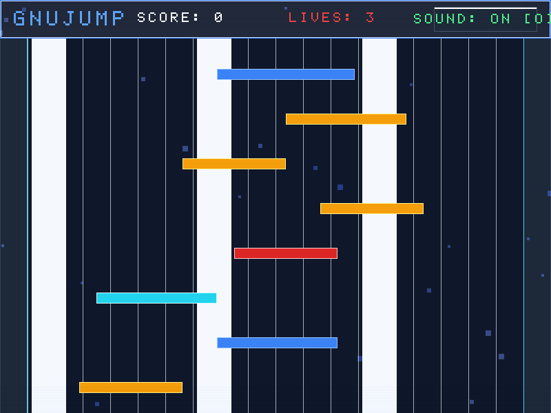

- **Objective**: Guide the cute GNU jumper continuously upward across endlessly scrolling platform tiers, dodging falling spikes and crumbly ice before the rising floor catches you!
- **Controls**:
  - `A` / `D` or `Left` / `Right`: Steer horizontal running momentum.
  - `Space` or `W` or `Up`: High spring jump.
  - `P`: Pause game.
  - `R`: Restart climb.
- **Rules & Mechanics**:
  - The screen scrolls upward at an accelerating rate.
  - Platform Types: Normal stone, Bouncy springs, Slippery ice, and Crumbling brittle platforms that break after 1 step.
  - Screen Wrap: Moving past the left edge wraps around to the right edge and vice-versa.
- **Pro Tip**: Use the left-right screen wrap-around to jump through the boundary walls and bypass long platform gaps!

---

<a id="goldminer"></a>

### 33. Gold Miner Classic (`goldminer/`)

_Winches & Dynamite Digger with Grab Mechanics & Shop Upgrades_

```bash
v run goldminer
```

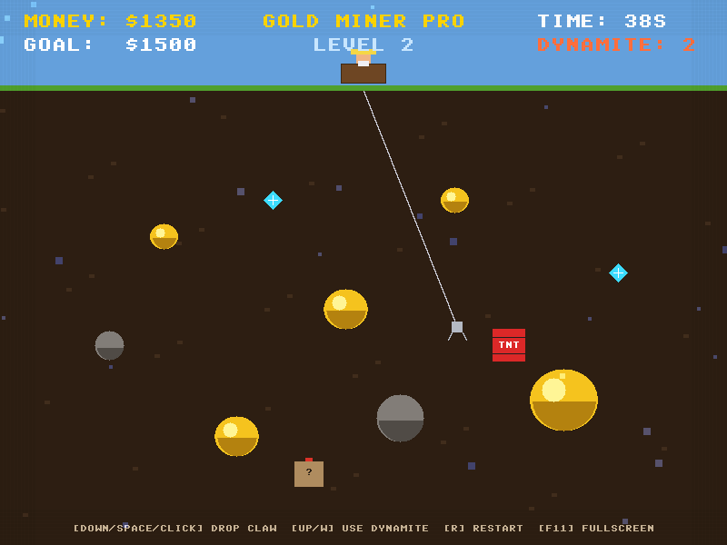

- **Objective**: Time your swinging mechanical winch claw to grab heavy gold nuggets, sparkling diamonds, and mystery grab bags to reach the cash target before the level timer expires!
- **Controls**:
  - `S` or `Down` or `Space` or `Left Click`: Launch winch claw downward along its swinging angle.
  - `W` or `Up`: Toss stick of dynamite to blow up slow worthless rocks caught in your claw.
  - `P`: Pause game.
  - `R`: Restart game.
- **Rules & Mechanics**:
  - Weight Physics: Heavy gold nuggets reel in slowly; small diamonds reel in super fast with high value.
  - Worthless heavy boulders waste precious seconds unless blasted with dynamite.
  - Between levels, visit the Miner's General Store to buy Dynamite, Strength Drink, Diamond Polish, and Lucky Clover.
- **Pro Tip**: Always buy Diamond Polish and prioritize small, glittering diamonds—they take only 1 second to reel in and award huge payouts!

---

<a id="jezzball"></a>

### 34. JezzBall Pro (`jezzball/`)

_1992 Windows Entertainment Pack Kinetic Ball Containment_

```bash
v run jezzball
```

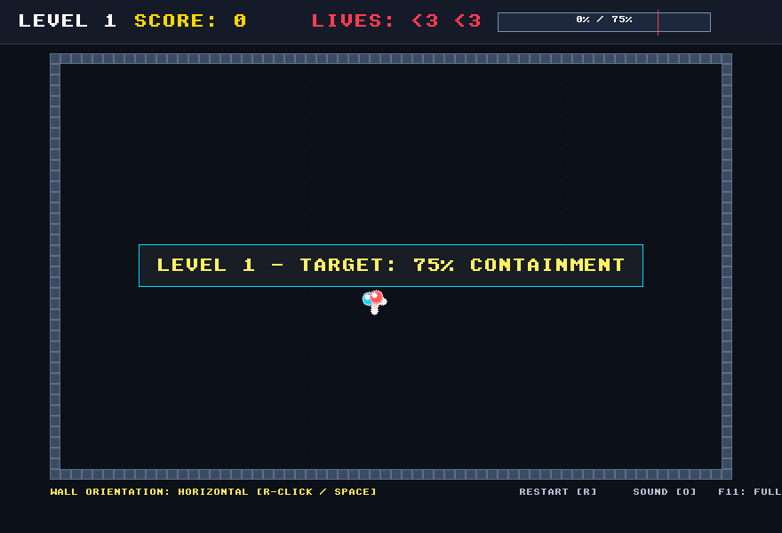

- **Objective**: Build horizontal and vertical containment walls across a chamber with bouncing kinetic atoms. Wall off sections to clear at least 75% of the screen area without bouncing atoms hitting unbuilt wall beams!
- **Controls**:
  - `Left Click`: Place and start constructing a dual-expanding containment wall at the cursor.
  - `Right Click` or `Space`: Flip wall building orientation between Horizontal and Vertical.
  - `P`: Pause game.
  - `R`: Restart chamber.
- **Rules & Mechanics**:
  - Walls expand simultaneously in both directions until they hit outer chamber borders or existing walls.
  - If a bouncing atom strikes a wall segment before it finishes building, the wall shatters and you lose a life!
  - Wall off at least 75% of total screen area to advance to the next level (+1 atom added per level).
- **Pro Tip**: Trap bouncing atoms into small corner pockets first, leaving large empty voids that you can wall off safely in one click!

---

<a id="klax"></a>

### 35. Atari Klax (`klax/`)

_1989 Conveyor Belt Tumbling Tile Match-3 with Rolling Flips & Bins_

```bash
v run klax
```

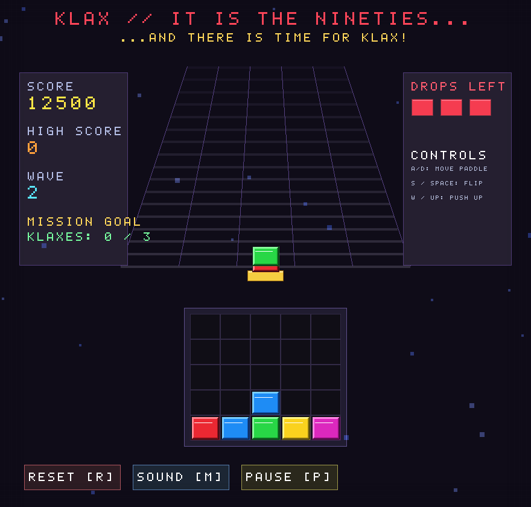

- **Objective**: Catch colorful tumbling tiles rolling down the conveyor belt with your paddle, flip them into a 5x5 bin, and create horizontal, vertical, and diagonal Klaxes (3 of a color) to meet wave objectives!
- **Controls**:
  - `A` / `D` or `Left` / `Right`: Steer catching paddle along the 5 conveyor lanes.
  - `S` or `Down` or `Space`: Flip top tile from paddle into the selected bin column.
  - `W` or `Up`: Push tile on paddle back up the conveyor belt.
  - `P`: Pause game.
  - `R`: Reset match.
- **Rules & Mechanics**:
  - Paddle can hold a stack of up to 5 tiles at once.
  - Tumbling tiles that fall off the conveyor count as a 'Drop'. Exceeding allowed drops ends the game.
  - Klax Types: Vertical (3 in a column), Horizontal (3 in a row), and Diagonal (3 across diagonal).
  - Wild Tiles (Blinking Rainbow): Count as any color.
  - Meet unique wave criteria: Total Klaxes, Diagonal Klaxes, or Point Targets.
- **Pro Tip**: Focus on building Diagonals—they yield 10x higher score values and frequently set off secondary horizontal and vertical matches!

---

<a id="kungfu"></a>

### 36. Kung-Fu Master (Spartan X) (`kungfu/`)

_1984 Irem 5-Floor Martial Arts Beat 'Em Up Arcade Legend_

```bash
v run kungfu
```

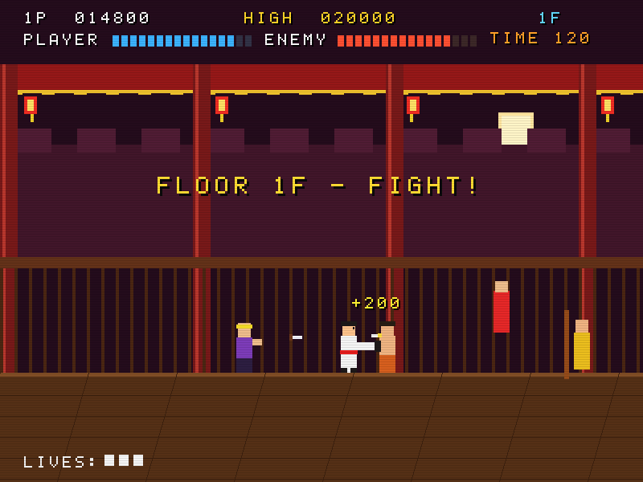

- **Objective**: Battle your way up the 5 distinct floors of the Devil's Temple as Thomas, defeat hordes of Gripper minions, Knife Throwers, and Tom Toms, topple lethal floor bosses, and rescue Sylvia!
- **Controls**:
  - `A` / `D` or `Left` / `Right`: Walk left and right through the temple corridor.
  - `W` or `Up`: High martial arts jump.
  - `S` or `Down`: Crouch / duck under high knife throws.
  - `J`: High Punch (fast, shorter range, 100 pts).
  - `K`: Mid Kick (longer range, 200 pts).
  - `W` + `J` / `K`: Jump Flying Punch / Jump Flying Kick.
  - `S` + `J` / `K`: Low Crouch Punch / Low Sweep Kick.
  - Rapidly tap `Left`/`Right`/`A`/`D`: Shake off gripping enemies.
- **Rules & Mechanics**:
  - 5 Unique Floors: 1F (Stick Fighter Boss), 2F (Boomerang Giant), 3F (Giant Bruiser), 4F (Black Magician), 5F (Mr. X Master).
  - Grippers latch onto Thomas, draining energy over time until shaken off.
  - Falling pots release poisonous snakes, dragons, and exploding confetti balls.
  - Knife Throwers throw two blades (one high, one low); duck or jump to evade.
- **Pro Tip**: Use low crouch punches on low Grippers and time jumping flying kicks against knife throwers to close the distance without taking damage!

---

<a id="legendofkage"></a>

### 37. The Legend of Kage (`legendofkage/`)

_1985 Taito Acrobatic Ninja Forest & Castle Rescue_

```bash
v run legendofkage
```

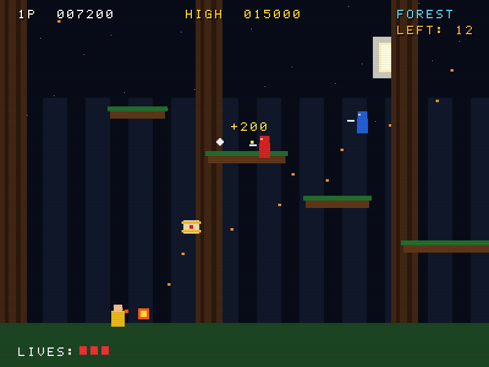

- **Objective**: Play as the young Iga ninja Kage, super-leap across towering forest treetops, deflect enemy shurikens with your Hayabusa sword, battle red and blue ninjas, and rescue Princess Kiri from Lord Yukikusa's castle!
- **Controls**:
  - `A` / `D` or `Left` / `Right`: Run across ground and tree branches.
  - `Space` or `W` or `Up`: Acrobatic Super Leap (soar high into the sky/treetops).
  - `S` or `Down`: Crouch / descend rapidly from treetop canopy.
  - `J`: Hayabusa Kodachi Sword Slash (deflects shurikens and slashes adjacent foes).
  - `K`: Throw Shuriken Ninja Stars (long-range projectile).
  - `1-4`: Trigger Ninjutsu Magic Scrolls (Lightning Screen Nuke, Smoke Clone).
- **Rules & Mechanics**:
  - 4 Seasonal Stages: The Forest (Summer/Autumn), Secret Moat Water Tunnel, Fortress Wall Climb, and Castle Sanctuary.
  - Sword Deflection: Timing your sword slash against incoming projectiles harmlessly deflects enemy shurikens.
  - Blue Ninjas throw shurikens; Red Ninjas drop smoke bombs; Fire Monks breathe vertical flame pillars.
  - Collect Power-Up Crystal Orbs: Blue (Speed), Red (Sword Armor), and Scroll (Instant Ninjutsu Meditation).
- **Pro Tip**: Keep your sword slashing continuously while soaring through the air to deflect enemy shurikens and slice through flying ninjas automatically!

---

<a id="lemmings"></a>

### 38. Lemmings Master (`lemmings/`)

_1991 Lemming Colony Strategy with 8 Specialist Skills_

```bash
v run lemmings
```

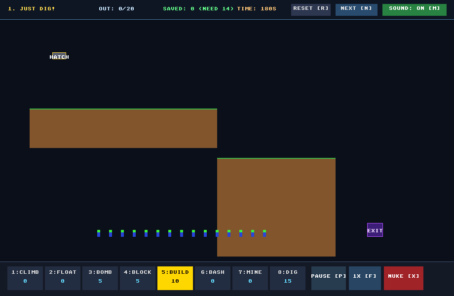

- **Objective**: Guide a marching column of mindless green-haired Lemmings from their entry hatch to the exit door by assigning specialist skills to dig, build, climb, and tunnel through obstacles!
- **Controls**:
  - `1-8`: Select Lemming skill (Climber, Floater, Bomber, Blocker, Builder, Basher, Miner, Digger).
  - `Left Click`: Assign selected skill to the Lemming under your cursor.
  - `F` or `Space`: Fast forward gameplay speed.
  - `P`: Pause time to examine terrain and plan strategies.
  - `Nuke Button`: Detonate all active lemmings.
  - `R`: Restart level.
- **Rules & Mechanics**:
  - Lemmings march straight forward, turning around upon hitting walls and walking off lethal cliffs.
  - Skill Set: Climbers (scale vertical walls), Floaters (deploy umbrellas), Blockers (turn around other lemmings), Builders (lay 12-step diagonal bridges), Bashers/Miners/Diggers (tunnel through terrain).
  - Rescue Quota: Save the required percentage of lemmings before the level timer expires.
- **Pro Tip**: Place a Blocker on both sides of your marching group to keep the entire flock contained safely in one spot while your Builder constructs the bridge to the exit!

---

<a id="liarsdice"></a>

### 39. Liar's Dice (Perudo) (`liarsdice/`)

_Classic Pirate Bluffing Dice Tournament with AI Psychological Models_

```bash
v run liarsdice
```

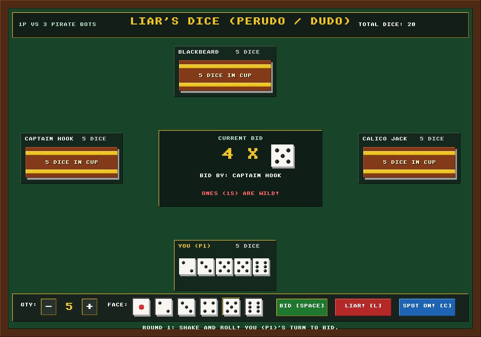

- **Objective**: Shake your cup of 5 dice, view your secret roll, and bid on the total number of dice matching a certain face across ALL players' hidden cups. Bluff your opponents and call 'Liar!' when you suspect they've overbid!
- **Controls**:
  - `Space` or `Enter`: Confirm current bid (Quantity & Dice Face).
  - `Up` / `Down`: Increase / decrease bid quantity.
  - `Left` / `Right`: Select bid dice face (2, 3, 4, 5, 6).
  - `L`: Call 'Liar!' (Challenge the previous player's bid).
  - `C`: Call 'Spot On!' (Bet that the exact bid quantity is present).
  - `R`: Reset match.
- **Rules & Mechanics**:
  - Each player starts with 5 dice in a cup. 1s (Aces) are Wild and count as any face!
  - Bidding must strictly increase: either raise the quantity of dice or raise the face value.
  - When a challenge is called, all cups lift: if the bid was true, the challenger loses a die; if false, the bidder loses a die.
  - Last player remaining with dice in their cup wins the tournament!
- **Pro Tip**: If you hold zero dice of a particular face value, bid that face early to trick opponents into believing there is a large supply on the table!

---

<a id="lightcycles"></a>

### 40. TRON Light Cycles (`lightcycles/`)

_Cyberpunk Grid Trail Survival with High-Speed Boost & Multi-AI_

```bash
v run lightcycles
```

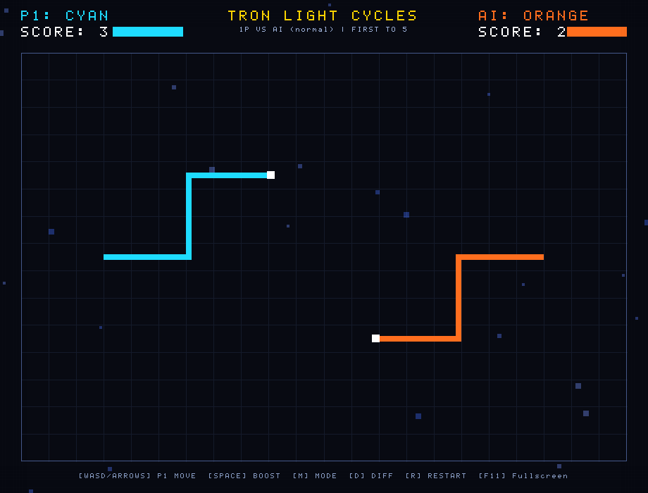

- **Objective**: Pilot your neon Light Cycle across the cyber grid at accelerating speeds, leaving behind a lethal solid light ribbon trail. Trap your opponent into crashing into your wall or the arena boundary!
- **Controls**:
  - `WASD`: Player 1 (Blue Cycle) 90-degree steering.
  - `Space`: Player 1 Turbo Boost.
  - `Arrow Keys` or `IJKL`: Player 2 (Orange Cycle) steering.
  - `Enter`: Player 2 Turbo Boost.
  - `Tab`: Toggle AI opponent on/off.
  - `R`: Reset match.
- **Rules & Mechanics**:
  - Light cycles cannot reverse 180 degrees into their own trail.
  - Colliding with any light trail or the outer grid border results in an instant de-resolution explosion.
  - Turbo boost provides a burst of speed but makes sharp turning harder to control.
- **Pro Tip**: Cut off your opponent's open grid space in large box enclosures to force them into a decreasing spiral of walls!

---

<a id="lolo"></a>

### 41. Adventures of Lolo: Cyberpunk Edition (`lolo/`)

_Hyper-Futuristic Puzzle-Arcade Powerhouse, Mario Maker Level Sandbox & Speedrun Platform_

```bash
v run lolo
```

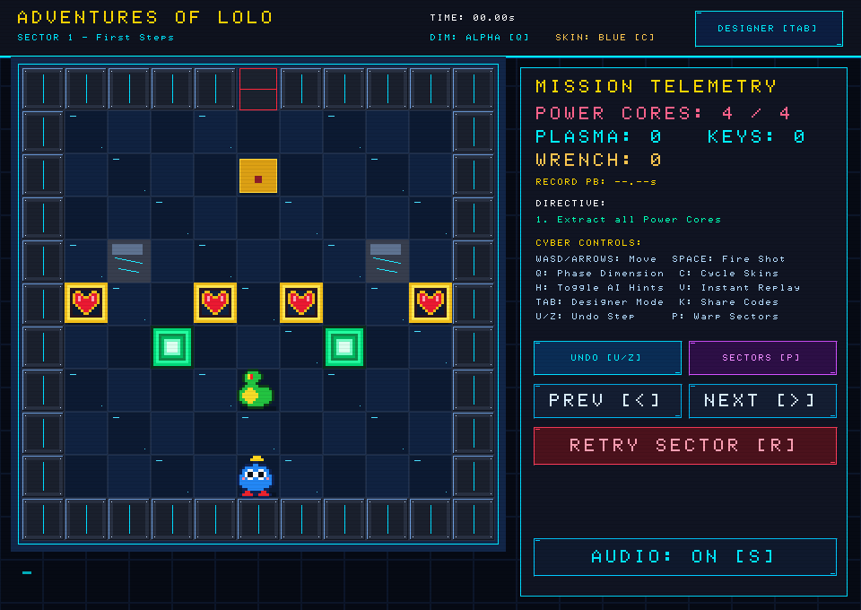

- **Objective**: Guide Prince Lolo through high-tech cyber sectors, collect all Antimatter Power Cores to unlock the Central Matrix Vault, access the Subspace Gateway, and rescue Princess Lala from King Egger!
- **Core Key Controls**:
  - `WASD` / `Arrow Keys`: Move Lolo & push Energy Blocks.
  - `Space` / `Enter`: Fire High-Energy Plasma Shot (encase enemies in stasis eggs / rotate prisms).
  - `Q`: Quantum Dimension Phase Shift (toggle between Dimension Alpha ↔ Beta).
  - `C`: Cycle 5 Cyber Chassis Skins (Neon Blue, Cyber Magenta, Obsidian Gold, Toxic Lime, Dark Matter).
  - `H`: Toggle AI Hint navigation breadcrumbs to next objective.
  - `V`: Instant Ghost Replay playback of your room clear.
  - `K`: Open Level Code Sharing console & 5 Featured Community Challenge Packs.
  - `Tab`: Open the full Mario Maker-style Level Designer console.
  - `U` / `Z`: Instant Quantum Undo step.
  - `P`: 20-Sector Warp directory modal.
  - `M`: Toggle 4-track procedural cyberpunk synth BGM.
  - `F5`: Instant 1-key playtest inside Designer.
  - `F11`: Toggle fullscreen desktop mode.
- **Modern Mechanics & Level Maker**:
  - **Laser Prisms (`/` & `\`)**: 45° optical crystal mirrors that bounce Medusa lasers 90° across the room.
  - **Quantum Phase Blocks (`Phase A` & `Phase B`)**: Solid only in active dimension, allowing Lolo and lasers to phase through when out-of-phase.
  - **Pressure Plates & Forcefields**: Stand on conductive plates or push blocks to lower lethal laser barriers.
  - **Directional Conveyor Belts**: Kinetic accelerator tracks that push traveling entities.
  - **Live AI Solver Verifier**: BFS search engine in the Designer that checks reachability and validates levels (`[PASS]`).
  - **6 Procedural Cyber Biomes**: Neo Cyber-Core, Quantum Biosphere, Solar Outpost, Cryo-Stasis Lab, Plasma Fusion Reactor, Void Singularity.
  - **13 Cybernetic Mecha Enemies**: Snakey-Bot, Alma-Mech, Leeper-Droid, Plasma Skull, Laser Sentinel, Dreadnoughts, Gol Dragon Tank, King Egger, Aero Gobby, Titan Golem, Turbine Moby, Phantom Wisp, Tesla Spike Traps.
- **Pro Tip**: Use `Q` to phase out of sync with laser turrets, and rotate `/` prisms to deflect deadly beams around corners into enemy tanks!

---

<a id="lunarlander"></a>

### 42. Lunar Lander Simulator (`lunarlander/`)

_1979 Vector Lunar Gravity Simulation with Realistic Fuel Dynamics_

```bash
v run lunarlander
```

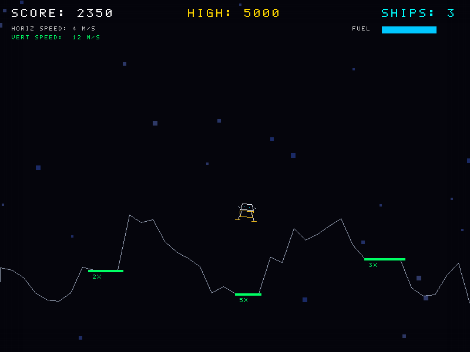

- **Objective**: Pilot the Apollo Lunar Excursion Module (LEM) safely down to the jagged lunar surface. Conserve fuel, counteract lunar gravity, and land gently on high-multiplier landing pads!
- **Controls**:
  - `A` / `D` or `Left` / `Right`: Rotate lander thruster gimbal angle.
  - `W` or `Up` or `Space`: Fire main rocket propulsion thrusters.
  - `P`: Pause game.
  - `R`: Restart descent with full fuel tank.
- **Rules & Mechanics**:
  - Vector Gravity: Constant downward gravitational acceleration pulls the lander down.
  - Landing Criteria: Touchdown velocity must be below 15 m/s, descent angle within 5 degrees of vertical, and both landing gear pads must land flat on a designated landing pad.
  - Landing Pad Multipliers: Flat, narrow pads award 2x, 3x, or 5x score bonuses.
  - Running out of fuel leaves the lander in a ballistic freefall trajectory.
- **Pro Tip**: Do not burn fuel constantly; let gravity pull you down and apply short, controlled bursts of thrust just before touchdown to softly kiss the surface!

---

<a id="mappy"></a>

### 43. Mappy Arcade (`mappy/`)

_1983 Namco Mansion Trampoline Chase with Microwave Blast Doors_

```bash
v run mappy
```

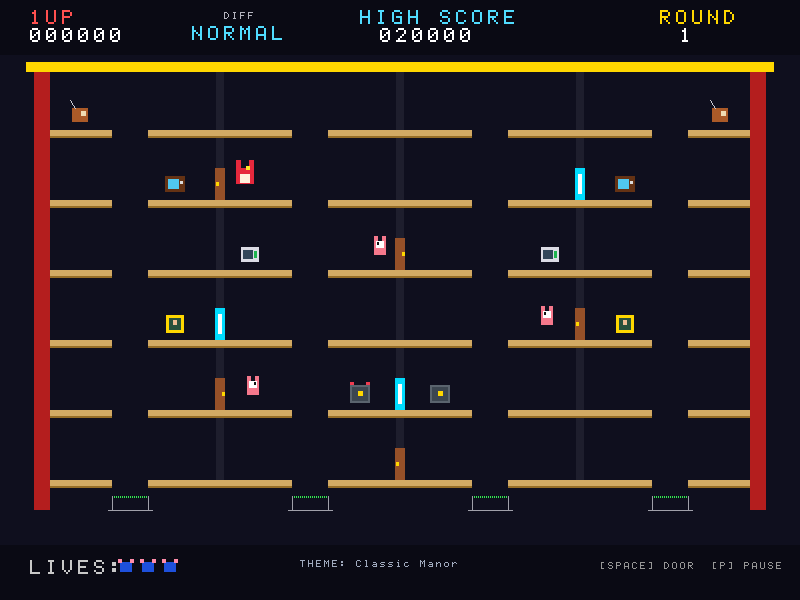

- **Objective**: Play as Micro Police Officer Mappy, bounce on trampolines through the Meowky mansion, retrieve stolen luxury goods (Radios, TVs, Paintings, Safes), and blast feline cat thieves away with microwave doors!
- **Controls**:
  - `A` / `D` or `Left` / `Right`: Run left and right / Dismount trampoline onto mansion floors.
  - `Space` or `W` or `J`: Open doors / Fire microwave acoustic shockwave doors.
  - `P`: Pause game.
  - `R`: Restart game.
- **Rules & Mechanics**:
  - Trampoline Safety: Mappy is invulnerable to enemies while bouncing in mid-air on trampolines.
  - Trampoline Wear: Trampoline cords turn Green -> Blue -> Yellow -> Red -> Break if bounced 4 consecutive times without landing on a solid floor!
  - Microwave Doors: Flashing doors release a wide acoustic shockwave that sweeps all cats off the screen for massive combo points.
  - Retrieve all 10 stolen items in matching pairs (Radio, TV, Computer, Mona Lisa, Safe) to maximize multiplier bonuses.
- **Pro Tip**: Lure Nyamco (the Boss Cat) and all Meowkies behind a flashing microwave door, then yank it open to sweep the entire pack for a 5,000 pt jackpot!

---

<a id="mariobros"></a>

### 44. Mario Bros. Arcade (`mariobros/`)

_1983 Nintendo Sewer Pipe Platformer with POW Block, Sliding Shells & 2P Co-op_

```bash
v run mariobros
```

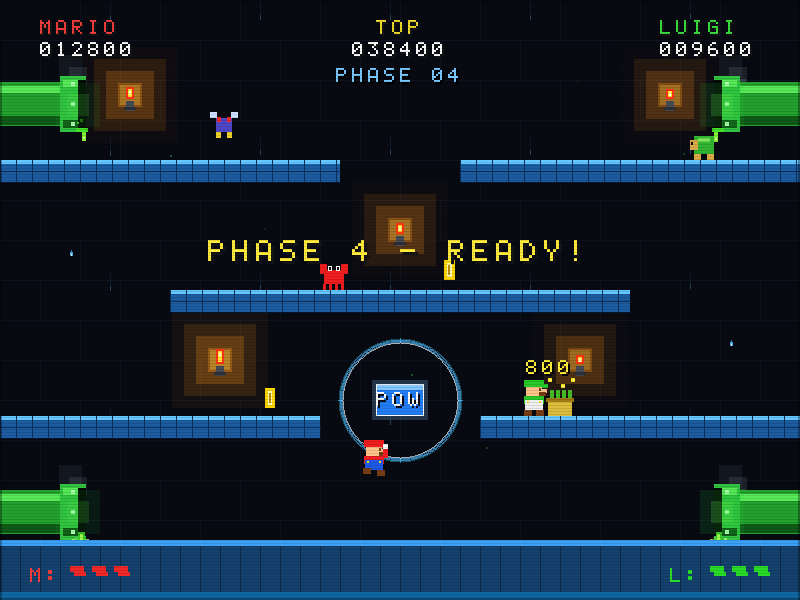

- **Objective**: Clear the underground New York City sewer pipes of pests! Bump platforms directly underneath Shellcreeper turtles, Sidestepper crabs, and Fighterflies to knock them on their backs, then kick them into the water before they recover!
- **Controls**:
  - **Player 1 (Mario)**: `A` / `D` run left/right, `Space` / `W` jump, `S` down charge (Super Spring Jump), `J` throw fireball.
  - **Player 2 (Luigi)**: `Left` / `Right` run, `Up` jump, `Down` charge, `L` fireball.
  - `1` / `2`: Toggle 1-Player or 2-Player Local Co-op mode.
  - `P`: Pause game.
  - `F`: Toggle CRT arcade scanline filter.
  - `M`: Toggle sound effects.
- **Rules & Mechanics**:
  - **Bumping Enemies**: Jump and bump the ceiling directly underneath an enemy to flip it onto its back (stunned). Run up to a stunned enemy to kick it into the sewer!
  - **Flipped Recovery**: Hitting an already flipped enemy from below flips them back upright and makes them active and dangerous again!
  - **Enemy Types**: Shellcreepers (1 hit to stun), Sidesteppers (1st hit enrages, 2nd hit stuns), Fighterflies (hop across floors; can only be flipped when touching the ground).
  - **POW Block**: Striking the center POW block shakes the entire stage, stunning all grounded enemies at once (3 hits per block).
  - **Sliding Shells**: Kicking a stunned turtle launches a high-speed sliding shell that bowls over other enemies in its path!
  - **Bonus Coin Phases**: Gather all floating golden coins against the timer in special bonus waves.
- **Pro Tip**: Save the 3 POW block charges for intense waves with multiple Fighterflies and angry Sidesteppers to flip them all simultaneously!

---

<a id="memorymatch"></a>

### 45. Memory Match Pro (`memorymatch/`)

_Card Flipping Pairs Memory Game with Shuffling & Themes_

```bash
v run memorymatch
```

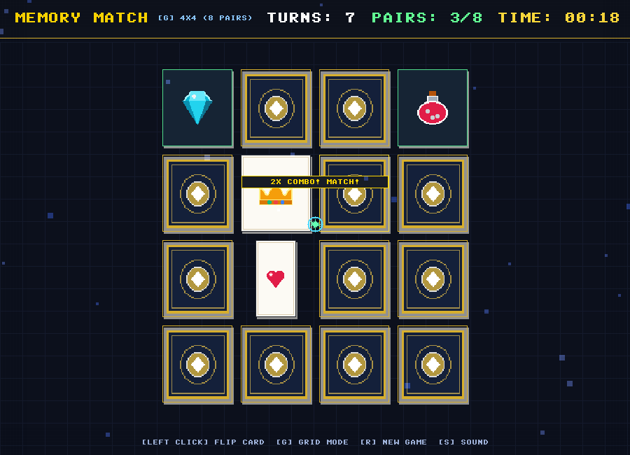

- **Objective**: Flip face-down cards two at a time to uncover matching pairs. Remember card positions and clear the entire grid in the fewest total turns!
- **Controls**:
  - `Left Click`: Flip card at cursor.
  - `G`: Cycle Grid Size (4x4 = 16 cards, 6x4 = 24 cards, 6x6 = 36 cards).
  - `T`: Cycle Card Theme (Retro Arcade, Cyberpunk Icons, Fruit Bakery, Geometric Shapes).
  - `R`: Shuffle and restart game.
- **Rules & Mechanics**:
  - Flipping two matching cards locks them face-up as a solved pair.
  - Flipping two non-matching cards reveals them briefly before flipping back face-down.
  - Star rating (1 to 3 stars) awarded based on total turns taken versus perfect memory par.
- **Pro Tip**: Focus on memorizing the 4 outer corner cards first to establish reliable spatial anchor points across the grid!

---

<a id="micromayhem"></a>

### 46. Micro Mayhem (`micromayhem/`)

_Tabletop RC Isometric Racing & Rapid-Fire Micro Marathon_

```bash
v run micromayhem
```

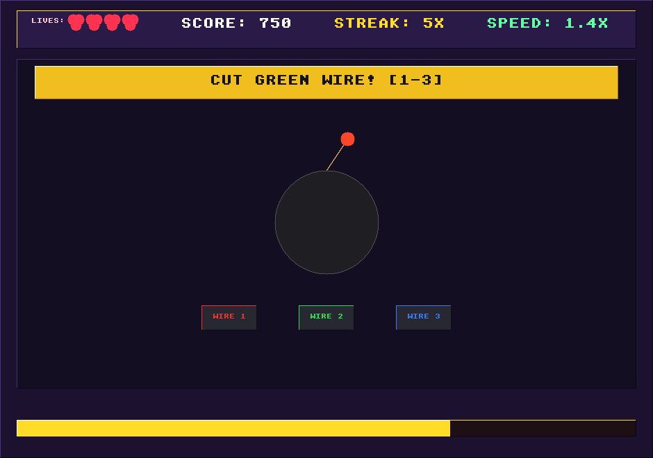

- **Objective**: Race micro RC race cars around kitchen tables, school desks, and living room carpet tracks, navigating pencils, books, and cereal boxes while using nitro boosts to outpace opponents!
- **Controls**:
  - `W` / `S` or `Up` / `Down`: Accelerate forward / brake and reverse.
  - `A` / `D` or `Left` / `Right`: Steer vehicle wheels.
  - `Space`: Trigger Nitro Speed Boost.
  - `C`: Cycle camera angle (Top-Down 2D, Isometric 3D).
  - `R`: Restart race.
- **Rules & Mechanics**:
  - Drift physics with tire-skid particles on wood, carpet, and tile surfaces.
  - Oil slicks cause spins; nitro pads provide speed boosts; ramps launch cars over obstacles.
  - Complete 3 laps in 1st place to unlock the next tabletop track.
- **Pro Tip**: Release acceleration slightly before entering tight hairpins to initiate a smooth drift, then engage nitro on exit!

---

<a id="minesweeper"></a>

### 47. Minesweeper Pro (`minesweeper/`)

_Windows Grid Logic Sweeper with Chord Clicking & First-Click Safety_

```bash
v run minesweeper
```

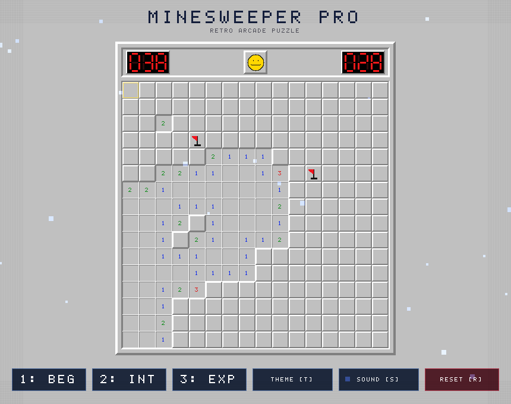

- **Objective**: Uncover all safe tiles across the grid without detonating any hidden explosive landmines. Use numerical clues to deduce where mines are located and mark them with flags!
- **Controls**:
  - `Left Click`: Reveal tile.
  - `Right Click`: Place / remove safety flag on suspected mine.
  - `Middle Click` or `Left+Right Click` (Chord): Automatically reveal all unflagged adjacent tiles if surrounding flags match the tile number.
  - `1`: Beginner (9x9, 10 mines).
  - `2`: Intermediate (16x16, 40 mines).
  - `3`: Expert (30x16, 99 mines).
  - `R`: Restart board.
- **Rules & Mechanics**:
  - First-Click Safety: The first revealed tile is guaranteed never to contain a mine.
  - Numbered tiles indicate the exact number of mines in the 8 surrounding neighbor cells.
  - Revealing a 0-tile automatically cascades and expands all connected empty areas.
  - Detonating any mine results in an immediate game over.
- **Pro Tip**: Master the '1-2-1' and '1-2-2-1' wall patterns to instantly deduce mine placements along straight edges without guessing!

---

<a id="missilecommand"></a>

### 48. Missile Command Air Defense (`missilecommand/`)

_1980 Atari Anti-Ballistic Missile Defense with Expanding Flak_

```bash
v run missilecommand
```

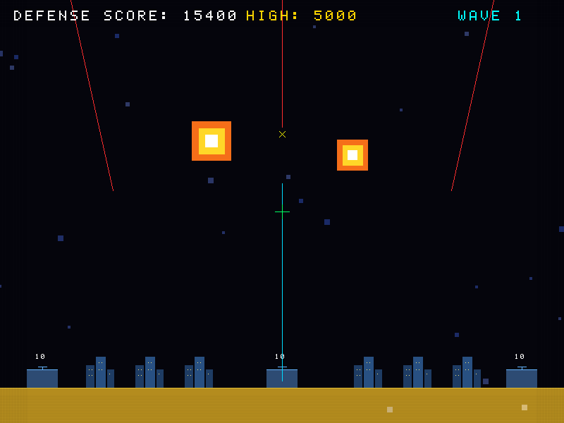

- **Objective**: Defend 6 coastal cities and 3 missile batteries from relentless waves of incoming nuclear ICBM warheads, MIRV cluster warheads, bombers, and satellites!
- **Controls**:
  - `Mouse Aim`: Position anti-missile detonation crosshair.
  - `Left Click` or `Space`: Fire interceptor missile from the nearest battery with ammo.
  - `1` / `2` / `3`: Fire specifically from Alpha (Left), Delta (Center), or Omega (Right) battery.
  - `P`: Pause game.
  - `R`: Restart defense.
- **Rules & Mechanics**:
  - Interceptor missiles take time to travel to the crosshair before detonating into an expanding flak cloud.
  - Any ICBM warheads or enemy bombers that contact the expanding flak cloud are obliterated.
  - Each battery has limited ammunition per round; running out leaves your cities defenseless.
  - Surviving cities award 100 bonus points each round; destroyed cities remain in ruins.
- **Pro Tip**: Lead incoming missile streaks by aiming ahead of their descent trajectory so they fly directly into your expanding flak clouds!

---

<a id="pacman"></a>

### 49. Pac-Man Arcade (`pacman/`)

_1980 Namco Maze Dot-Muncher with Authentic Ghost AI Personalities_

```bash
v run pacman
```

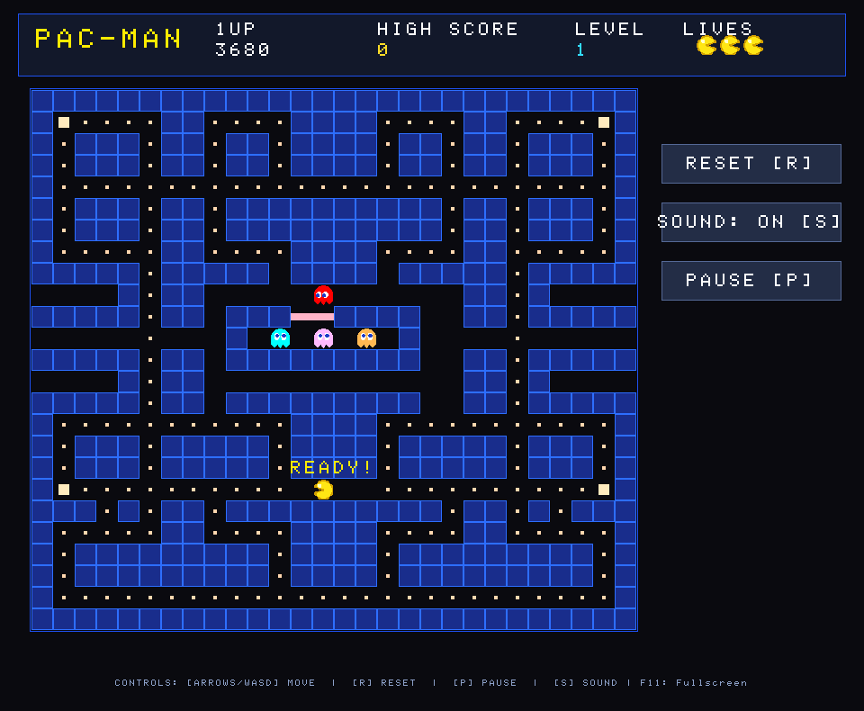

- **Objective**: Guide Pac-Man through the neon maze, chomp all 244 yellow dots and 4 Power Pellets, evade the 4 ghost monsters, and turn the tables to gobble blue ghosts for bonus points!
- **Controls**:
  - `WASD` or `Arrow Keys`: Steer Pac-Man's direction (pre-turning at intersections is buffered).
  - `P`: Pause game.
  - `M`: Toggle sound.
  - `R`: Restart game.
- **Rules & Mechanics**:
  - Chomp all 240 Pac-Dots (10 pts) and 4 Energizers (50 pts) to clear the stage.
  - Authentic Ghost AI Personalities: Blinky (BASHFUL/Red, directly pursues), Pinky (SPEEDY/Pink, targets 4 tiles ahead), Inky (FICKLE/Cyan, complex flanker), Clyde (POKEY/Orange, chases then retreats).
  - Power Pellets: Turn ghosts blue (Frightened); munching blue ghosts awards 200 -> 400 -> 800 -> 1,600 pts.
  - Fruit Bonus: Cherry, Strawberry, Orange, Apple, Melon, Galaxian Flag, Bell, and Key spawn under the ghost pen for bonus points.
- **Pro Tip**: Use the side warp tunnels—Pac-Man travels through the warp tunnels at full speed, while ghosts slow down significantly!

---

<a id="paneldepon"></a>

### 50. Panel de Pon / Puzzle League (`paneldepon/`)

_1995 Nintendo / Intelligent Systems Horizontal Swap Action Puzzler_

```bash
v run paneldepon
```

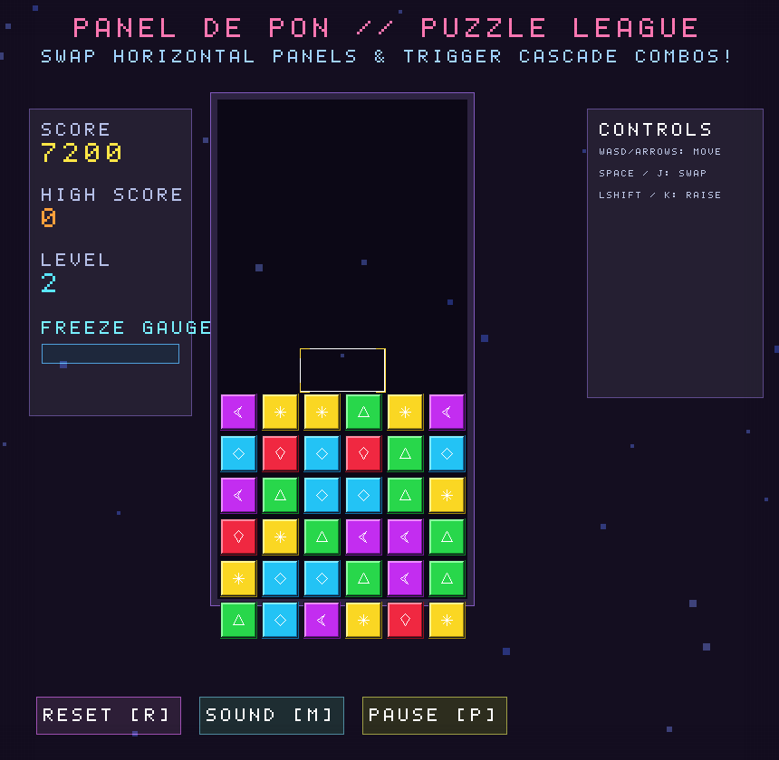

- **Objective**: Control a 2-tile horizontal cursor to swap adjacent colored panels. Align 3 or more matching panels horizontally or vertically to clear them, build active combo chains, and prevent the rising stack from touching the top ceiling!
- **Controls**:
  - `WASD` or `Arrow Keys`: Move 2-tile swap cursor bracket.
  - `Space` or `J` or `Z`: Swap the two panels inside the cursor bracket horizontally.
  - `LShift` or `K` or `Up`: Manually lift and accelerate the rising panel stack.
  - `P`: Pause game.
  - `R`: Restart match.
- **Rules & Mechanics**:
  - Panels clear when 3 or more matching colors align in a straight horizontal or vertical line.
  - Active Chains: You can continue swapping panels while other panels are currently clearing to construct massive multi-stage chain combos!
  - Garbage Blocks: Combos and 4+ clears drop thick garbage blocks on opponent boards; clearing panels adjacent to garbage transforms it into normal panels.
  - Game over occurs when any panel column touches the top ceiling for more than 1 second.
- **Pro Tip**: Master the 'Active Swap' technique—swap tiles under falling blocks while a match is clearing to keep the chain multiplier alive indefinitely!

---

<a id="peggle"></a>

### 51. Peggle Extreme (`peggle/`)

_PopCap Pachinko Ballistics with Fever Meter & Master Powers_

```bash
v run peggle
```

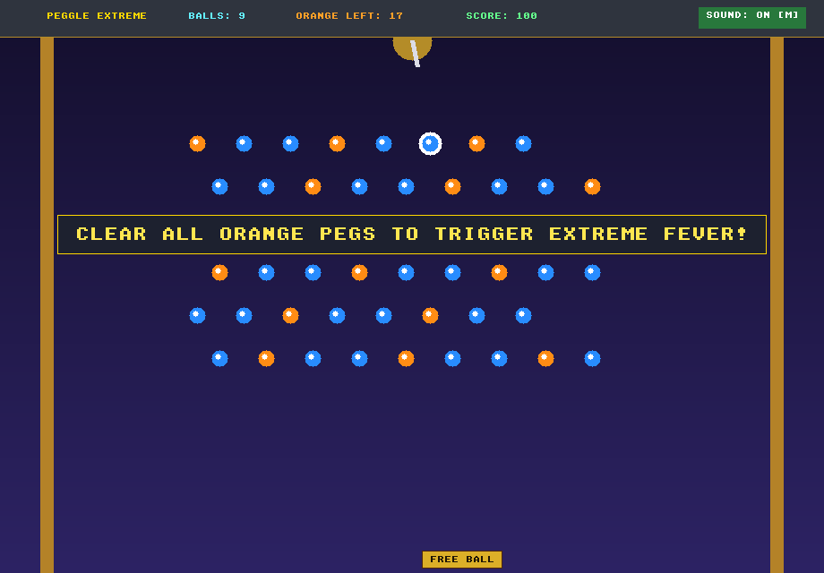

- **Objective**: Aim and fire silver balls from the top cannon into the field of blue, orange, green, and purple pegs. Eliminate all 25 Orange Pegs to trigger Extreme Fever and clear the board!
- **Controls**:
  - `Mouse Aim`: Direct laser ballistic trajectory aiming line.
  - `Left Click` or `Space`: Launch ball from cannon.
  - `Mouse Scroll`: Fine-tune aim angle pixel-by-pixel.
  - `R`: Restart stage.
- **Rules & Mechanics**:
  - Orange Pegs (25 total): Must all be cleared to achieve Extreme Fever victory.
  - Blue Pegs: Standard point pegs that help clear paths.
  - Purple Peg: High-value bonus peg (worth 10x points, shifts position every shot).
  - Green Pegs: Activate unique Master Magic Powers (Multiball, Super Guide, Pyramid, Space Blast).
  - Free Ball Bucket: Catches balls at the bottom of the screen to award a Free Ball.
- **Pro Tip**: Time your shot so that the ball drops into the moving Free Ball Bucket at the bottom to conserve your ball inventory!

---

<a id="picross"></a>

### 52. Picross Pro (`picross/`)

_Nonogram Picture Logic Grid with Clue Row/Column Deductions_

```bash
v run picross
```

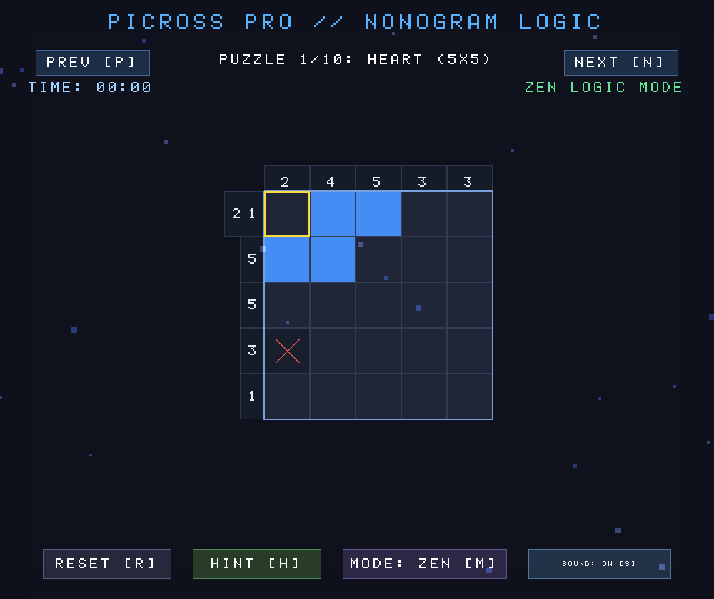

- **Objective**: Use numerical row and column clues to deduce which cells on the grid should be filled with solid pixels and which should be marked with crosses (X) to reveal a hidden pixel art masterpiece!
- **Controls**:
  - `Left Click` / `Drag`: Fill tile with solid pixel.
  - `Right Click` / `Drag`: Mark tile with safety cross (X).
  - `WASD` / `Arrow Keys`: Move grid cursor.
  - `Space`: Fill tile at cursor.
  - `X` / `Z`: Cross tile at cursor.
  - `H`: Request a logical hint.
  - `1-5`: Select puzzle board.
  - `R`: Reset puzzle.
- **Rules & Mechanics**:
  - Numbers above columns and to the left of rows indicate uninterrupted runs of filled pixels in that line.
  - Multiple numbers indicate separate runs separated by at least 1 cross (e.g., '3 2' means a block of 3, then 1+ spaces, then a block of 2).
  - Fill all correct pixels to complete the nonogram artwork.
- **Pro Tip**: Look for numbers that equal or exceed half the grid dimension—their overlap in the center must be filled regardless of position!

---

<a id="pinball"></a>

### 53. NES Pinball (`pinball/`)

_1984 Nintendo Multi-Tier Pinball Simulation with Breakout Bonus Stage_

```bash
v run pinball
```

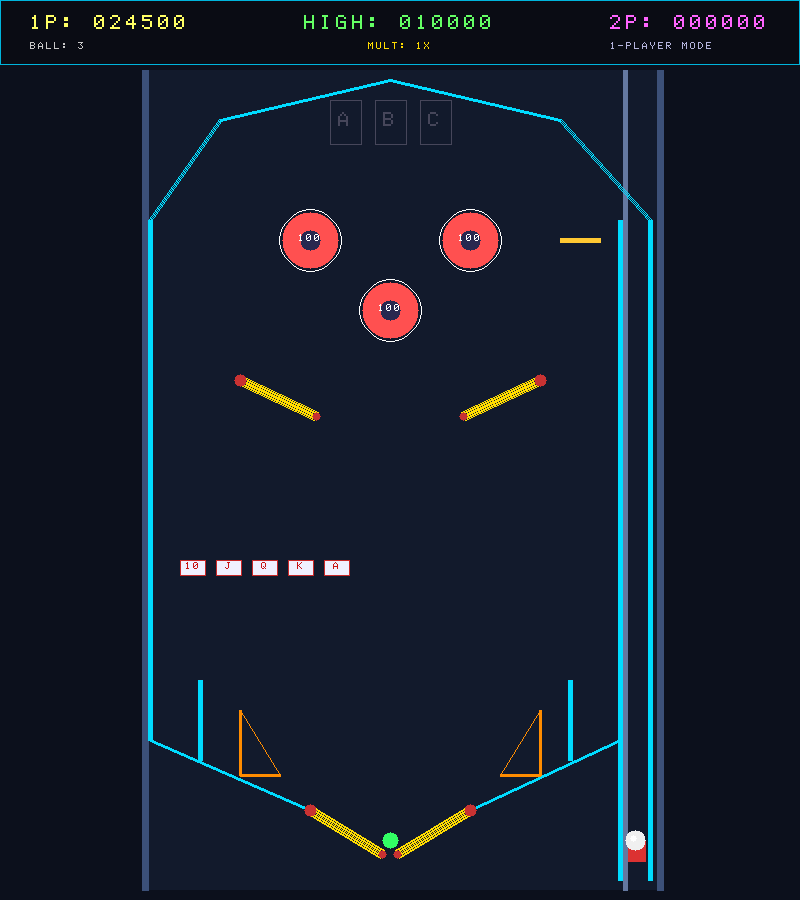

- **Objective**: Launch the silver pinball into the multi-tiered playfield, flip flippers to bounce balls into bumpers, targets, and kickers, and enter the secret lower Breakout bonus room with Mario!
- **Controls**:
  - `Space` (Hold & Release): Pull and release spring plunger.
  - `Z` or `A` or `Left Shift`: Trigger Left Flipper.
  - `/` or `D` or `Right Shift`: Trigger Right Flipper.
  - `T`: Nudge / Tilt table.
  - `P`: Pause game.
  - `R`: Restart game.
- **Rules & Mechanics**:
  - Two Tier Table: Upper playfield with bumpers and card targets; lower playfield with outlanes and flippers.
  - Slot Machine: Drop ball into the center hole to spin the slot reels for 100 to 10,000 bonus points.
  - Bonus Stage: Drop into the lowest hole to play the Mario & Pauline paddle breakout mini-game!
  - Drain blockers can be raised by hitting side rollovers.
- **Pro Tip**: Hold the flipper up when the ball is slowly rolling down the inlane to trap the ball, allowing you to aim precisely at the slot kicker!

---

<a id="pong"></a>

### 54. Hyper Pong (`pong/`)

_Cyberpunk Neon Paddle Rally with Speed-Reactive Glowing Ribbon Trails & Synthwave Audio_

```bash
v run pong
```

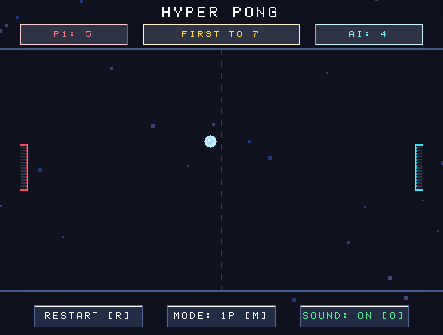

- **Objective**: Rally the glowing plasma orb across the digital court with your carbon-fiber paddle. Angle your returns to slip the ball past your opponent's paddle and score 7 points to win!
- **Controls**:
  - `W` / `S`: Player 1 (Left Paddle) vertical movement.
  - `Up` / `Down`: Player 2 (Right Paddle) vertical movement in 2P mode.
  - `M` / Click `[M] MODE`: Toggle 1P vs AI / 2P Local mode.
  - `O` / Click `[O] SOUND`: Toggle sound effects and synthwave soundtrack.
  - `R` / Click `[R] RESTART`: Reset match score.
  - `F11`: Toggle fullscreen.
- **Rules & Mechanics**:
  - **Speed-Reactive Ribbon Trail**: The plasma ball leaves a dynamic glowing ribbon trail that shifts from Electric Cyan (< 8.5) to Neon Magenta (8.5–11.0) and White-Hot Sunfire Gold (≥ 11.0) as rallies heat up.
  - **Deflection Spin Physics**: Striking the ball near the paddle edge imparts extreme return angles and accelerates ball speed.
  - **Audio Engine**: Studio WAV paddle strike, wall rebound, and score cheer SFX with driving cyber synthwave BGM.
- **Pro Tip**: Move your paddle while striking the ball to impart maximum deflection angle and send a blazing gold curve shot past the AI!

---

<a id="pool"></a>

### 55. 8-Ball Pool Billiards (`pool/`)

_Authentic Green Felt Billiards with Solids & Stripes Shaded Sprites, Spin Physics & Smooth Jazz_

```bash
v run pool
```

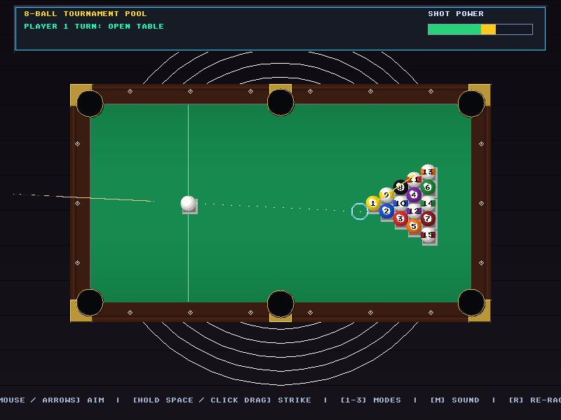

- **Objective**: Pocket your designated group of 7 balls (Solids 1-7 or Stripes 9-15), then legally sink the 8-Ball into a called pocket to win the game!
- **Controls**:
  - `Mouse Aim`: Rotate cue stick 360 degrees around the white cue ball.
  - `Hold Left Click` + `Drag Back`: Draw cue stick back to set shot power with live trajectory guide.
  - `Release Left Click`: Strike the cue ball.
  - `Arrow Keys` / `WASD`: Apply English spin to cue ball (Topspin, Backspin, Left/Right English).
  - `R`: Reset table rack.
- **Rules & Mechanics**:
  - **Shaded Sprite Balls**: High-fidelity shaded 3D spheres with accurate numbers, colors, and stripe rings.
  - **Break Shot**: Open the 15-ball rack; first ball pocketed assigns Solids or Stripes.
  - **Foul**: Scratching the cue ball or failing to hit your assigned ball group first awards Ball-in-Hand to your opponent.
  - **8-Ball**: Sinking the 8-Ball early or on a scratch results in an immediate loss; sinking it after all your group balls wins!
  - **Audio & Ambiance**: Smooth 115 BPM VIP lounge jazz soundtrack with authentic pool cue strikes, ball-to-ball clacks, cushion rebounds, and pocket drop SFX.
- **Pro Tip**: Apply backspin (draw) on straight-in shots to pull the white cue ball backwards and line up your next shot automatically!

---

<a id="puyopuyo"></a>

### 56. Puyo Puyo Cascade (`puyopuyo/`)

_Sega Competitive Match-4 Jelly Blobs with Nuisance Garbage_

```bash
v run puyopuyo
```

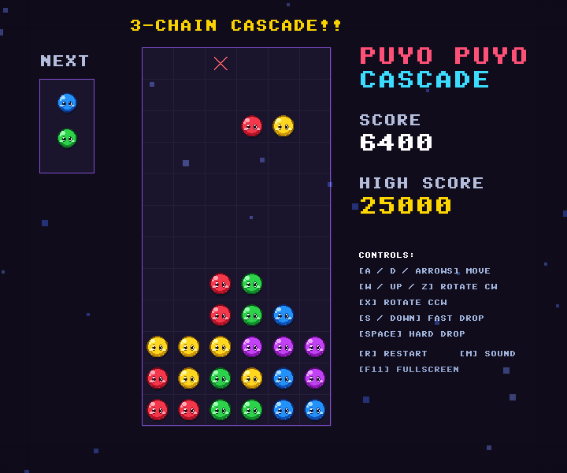

- **Objective**: Guide falling pairs of colorful jelly Puyos into the well. Connect 4 or more matching Puyos to pop them, trigger gravity cascades, and bury your opponent under nuisance garbage rocks!
- **Controls**:
  - `A` / `D` or `Left` / `Right`: Move falling Puyo pair horizontally.
  - `W` / `Up` / `Z`: Rotate Puyo pair 90 degrees clockwise.
  - `X`: Rotate Puyo pair 90 degrees counter-clockwise.
  - `S` / `Down`: Soft drop Puyo pair.
  - `Space`: Hard drop Puyo pair instantly.
  - `P`: Pause game.
  - `R`: Reset match.
- **Rules & Mechanics**:
  - Connect 4 or more adjacent Puyos of the same color (horizontal/vertical) to pop them.
  - Unsupported Puyos split and fall under gravity into empty slots below.
  - Chaining: Setting up multi-stage cascading reactions exponentially multiplies the score and sends lethal Nuisance Garbage Puyos to the opponent's board.
  - Game over occurs when column 3 (the X mark) overflows to the top.
- **Pro Tip**: Build 'stairs' (3 Puyos of one color with 1 of another on top) to create foolproof 4-chain and 5-chain cascade reactions!

---

<a id="puzzlefighter"></a>

### 57. Super Puzzle Fighter II Turbo (`puzzlefighter/`)

_1996 Capcom 1v1 Arcade Gem Battler with Power Gems & Counter Drops_

```bash
v run puzzlefighter
```

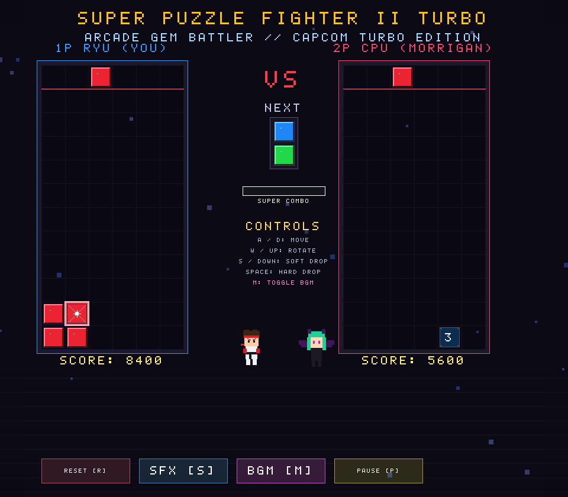

- **Objective**: Play as super-deformed chibi Capcom fighters, build massive rectangular Power Gems from falling gem pairs, and shatter them with Crash Gems to send devastating counter-gem patterns to KO your opponent!
- **Controls**:
  - `A` / `D` or `Left` / `Right`: Slide falling gem pair horizontally.
  - `W` / `Up` / `Z`: Rotate gem pair clockwise.
  - `X`: Rotate gem pair counter-clockwise.
  - `S` / `Down`: Soft drop gem pair faster.
  - `Space`: Hard drop gem pair instantly.
  - `P`: Pause game.
  - `R`: Reset match.
- **Rules & Mechanics**:
  - Normal Gems: Merge adjacent matching gems of the same color into 2x2, 2x3, or 3x3 giant Power Gems.
  - Crash Gems (Glowing Orbs): Shatter all connected gems of that matching color.
  - Counter Gems: Timed drop gems sent to the opponent that count down from 5 to 0 before transforming into normal gems.
  - Rainbow Diamond: Shatters all gems of whichever color it lands on across the entire board.
- **Pro Tip**: Do not shatter small 2x2 gems immediately—merge them into a giant 3x3 or 4x3 Power Gem for a catastrophic 30-gem counter attack!

---

<a id="qbert"></a>

### 58. Q\*bert Isometric (`qbert/`)

_1982 Gottlieb Isometric Pyramid Hopper with Flying Discs & Coily_

```bash
v run qbert
```

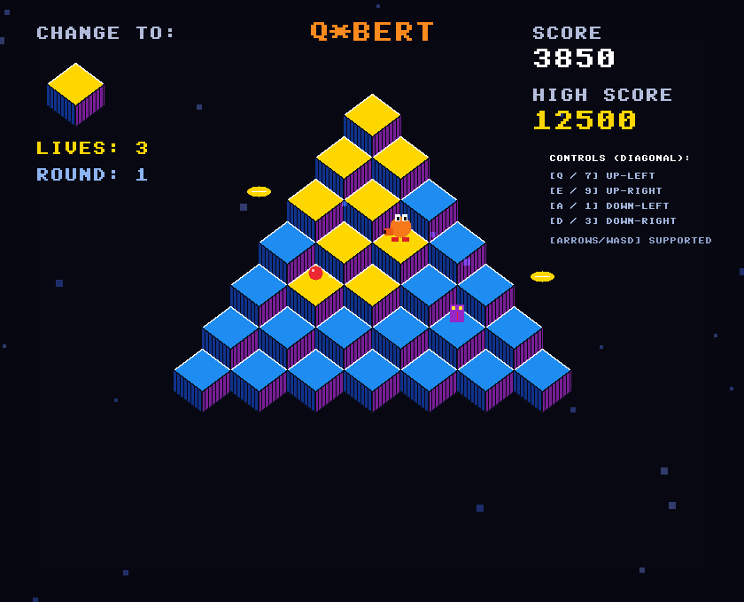

- **Objective**: Guide Q\*bert hopping across the 28 isometric cube steps of a towering pyramid, changing every cube to the target color while evading Coily the Snake, Red Balls, Sam, and Slick!
- **Controls**:
  - `Q` / `E` / `Z` / `C` or `WASD` or `Arrow Keys`: Hop diagonally in 4 isometric directions (Up-Left, Up-Right, Down-Left, Down-Right).
  - `P`: Pause game.
  - `R`: Restart game.
- **Rules & Mechanics**:
  - Hop on every cube to change its top surface to the stage target color.
  - Hopping off the edge of the pyramid causes Q\*bert to fall into the void!
  - Coily the Snake: Bounces down as an egg, hatches at the bottom into a purple snake, and relentlessly tracks Q\*bert.
  - Flying Escape Discs: Hop onto a floating disc beside the pyramid to float Q\*bert safely to the summit while luring Coily off the edge to his doom!
- **Pro Tip**: When Coily is one step behind you near the bottom edge, jump onto a side Flying Disc—Coily will jump off after you and plunge to his death!

---

<a id="racer"></a>

### 59. Cyber Drift Racer (`racer/`)

_Top-Down Drift Racing with Tire Friction, Skid Marks & Ghost Laps_

```bash
v run racer
```

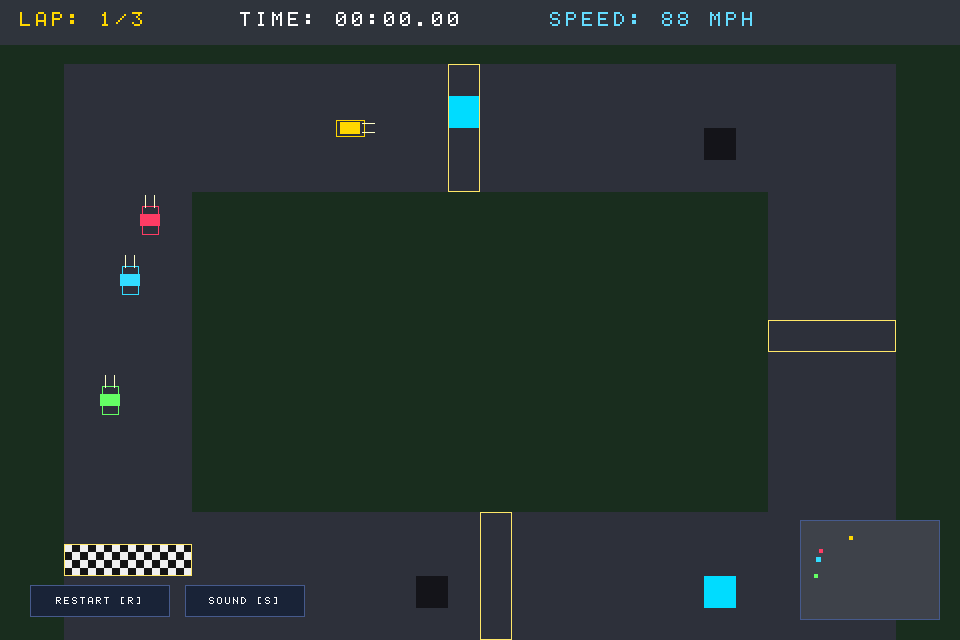

- **Objective**: Race high-performance drift sports cars around tight asphalt race tracks, feather the throttle to initiate wide powerslides, clip apex corners, and set blistering lap records!
- **Controls**:
  - `W` or `Up`: Accelerate throttle.
  - `S` or `Down`: Brake / Reverse.
  - `A` / `D` or `Left` / `Right`: Steer vehicle front wheels.
  - `Space`: Handbrake / Engage powerslide drift.
  - `LShift`: Fire Nitro Boost.
  - `C`: Cycle vehicle color and livery.
  - `R`: Restart lap timer.
- **Rules & Mechanics**:
  - Realistic tire friction physics with independent lateral and longitudinal slip angles.
  - Persistent rubber tire skid marks render on asphalt.
  - Off-road grass and sand gravel traps severely reduce vehicle traction and speed.
  - Leaderboard tracks Best Lap, Sector Times, and Top Speed.
- **Pro Tip**: Tap handbrake (`Space`) just as you turn into a corner to kick the rear bumper out into a controlled drift, then hammer the throttle on exit!

---

<a id="ragdoll"></a>

### 60. Ragdoll Physics Sandbox (`ragdoll/`)

_Verlet Particle Physics Lab with Ragdoll Tossing, Springs & Obstacles_

```bash
v run ragdoll
```

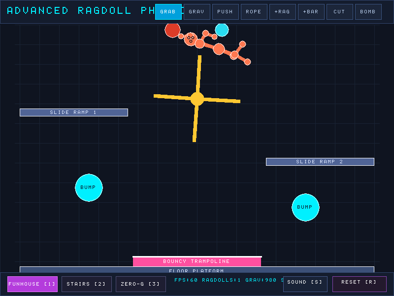

- **Objective**: Interact with fully articulated multi-jointed human ragdolls in a zero-latency Verlet physics sandbox. Toss ragdolls, build pinball bumpers, toggle gravity vectors, and trigger particle explosions!
- **Controls**:
  - `Left Click` + `Drag`: Grab and toss ragdoll limbs, head, and torso.
  - `Right Click`: Spawn new ragdoll at cursor.
  - `Space`: Detonate explosive shockwave blast at mouse cursor.
  - `G`: Cycle gravity modes (Normal 9.8m/s², Zero-G, Inverted Gravity, Lunar).
  - `C`: Clear sandbox canvas.
  - `1-5`: Spawn obstacles (Springs, Rotating Windmills, Bouncy Spheres, Laser Turrets).
- **Rules & Mechanics**:
  - Verlet integration with distance constraint solvers for realistic bone rigidity and joint limits.
  - Elastic particle-to-particle collisions with bounce restitution and friction dampening.
  - Stress testing mode allows simulating dozens of simultaneous ragdolls.
- **Pro Tip**: Switch to Zero-G mode (`G`), place rotating windmills, and detonate shockwaves (`Space`) to create mesmerizing kinetic ballet physics!

---

<a id="rain"></a>

### 61. Monsoon Overdrive (Rain Benchmark) (`rain/`)

_High-Performance 200,000+ Particle Fluid Rain Simulation & Hardware Benchmark_

```bash
v run rain
```

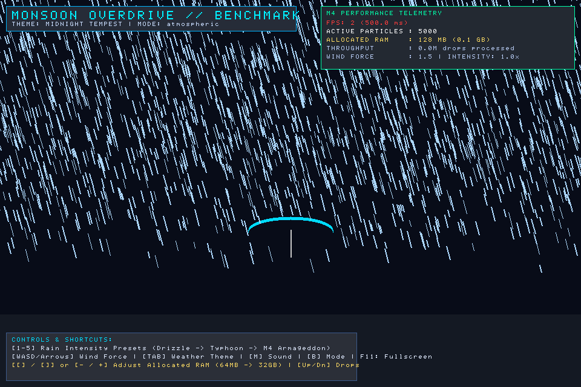

- **Objective**: Simulate torrential storm rain downpours with realistic raindrop velocity, wind gusts, ground puddles, splashing mist, and an interactive mouse-controlled umbrella shield!
- **Controls**:
  - `Mouse Move`: Position the interactive umbrella collision shield.
  - `1-5`: Select weather presets (Light Drizzle, Summer Shower, Thunderstorm, Monsoon Typhoon, Matrix Green Rain).
  - `[` / `]`: Increase / decrease raindrop particle count (1,000 up to 250,000+ drops).
  - `W`: Toggle dynamic wind shear vectors.
  - `L`: Toggle lightning flash storm effects.
  - `Space`: Freeze time / slow-motion water droplets.
- **Rules & Mechanics**:
  - Simulates up to 250,000+ independent physical water droplets with drag and terminal velocity.
  - Water drops bounce off the umbrella curve, creating splashing atomized mist particles.
  - Real-time FPS, frame latency, memory throughput, and benchmark score statistics display on HUD.
- **Pro Tip**: Crank particle count to 150,000+ on preset 4 (Monsoon) to stress test your machine's CPU rendering performance!

---

<a id="reversi"></a>

### 62. Reversi Master (`reversi/`)

_8x8 Classic Reversi (Othello) with Flanking Flips & Depth-8 Minimax AI_

```bash
v run reversi
```

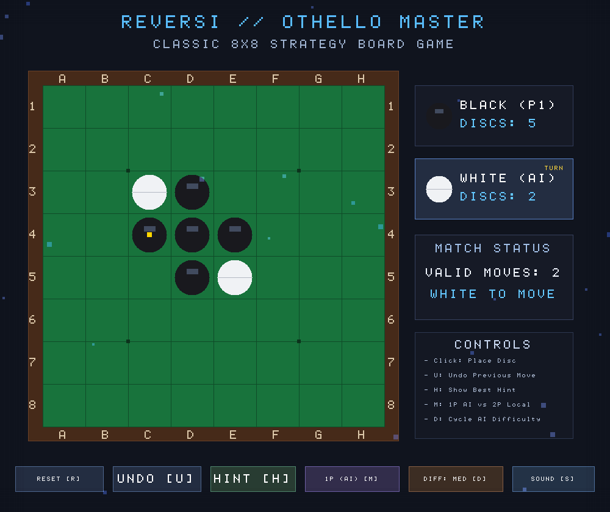

- **Objective**: Place your colored discs on the 8x8 board to flank and flip one or more of your opponent's discs horizontally, vertically, or diagonally. Have the most discs of your color when the board is full to win!
- **Controls**:
  - `Left Click` on valid highlighted square: Place disc and flip flanked opponent pieces.
  - `U`: Undo last move.
  - `H`: Show all legal valid move highlights.
  - `A`: Toggle AI difficulty (Novice, Intermediate, Grandmaster Minimax).
  - `R`: Restart board.
- **Rules & Mechanics**:
  - A move must outflank (sandwich) at least one opposing disc between your new piece and another piece of your color.
  - All flanked discs are flipped to your color.
  - If a player has no legal moves, their turn is passed.
  - Game ends when neither player can move or the board is completely filled.
- **Pro Tip**: Never give up the 4 outer corner squares (A1, A8, H1, H8)—discs placed in corners can NEVER be flipped by your opponent!

---

<a id="rodentsrevenge"></a>

### 63. Rodent's Revenge (`rodentsrevenge/`)

_1991 Windows Entertainment Pack Cat Trapping Strategy_

```bash
v run rodentsrevenge
```

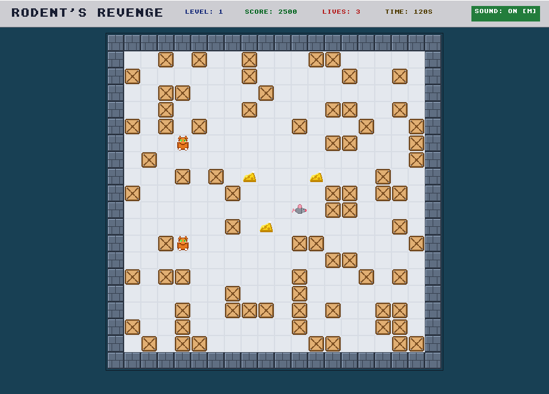

- **Objective**: Play as a clever mouse trapped in a room with hungry cats. Push movable stone blocks to surround and completely box in all cats, transforming them into delicious slices of cheese to eat!
- **Controls**:
  - `WASD` or `Arrow Keys`: Move mouse and push solid movable blocks.
  - `R`: Restart current room.
  - `P`: Pause game.
- **Rules & Mechanics**:
  - Cats relentlessly stalk the mouse and pounce if you step into adjacent squares.
  - Push blocks into complete 4-sided boxes around cats to trap them; trapped cats instantly turn into cheese (+500 pts).
  - Mousetraps and yarn balls present dangerous obstacles.
  - Clear all cats on the board to advance to the next level.
- **Pro Tip**: Construct long U-shaped block corridors and lure cats inside before pushing the final block behind them to seal them in!

---

<a id="samegame"></a>

### 64. SameGame / Collapse (`samegame/`)

_Classic Tile Cluster Elimination with Gravity Refill & Color Shifting_

```bash
v run samegame
```

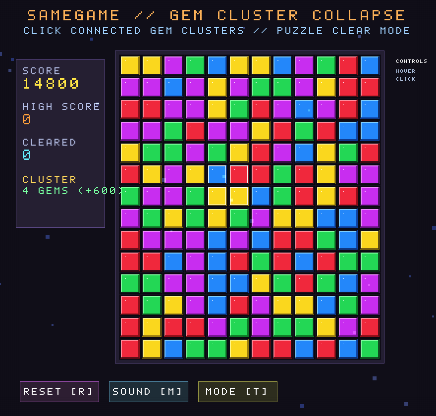

- **Objective**: Click contiguous clusters of 2 or more matching colored gems to vaporize them from the grid. Collapse the remaining tiles under gravity and clear the entire board for maximum score bonuses!
- **Controls**:
  - `Mouse Hover`: Highlight connected matching gem cluster.
  - `Left Click`: Shatter and remove selected cluster.
  - `T`: Toggle visual themes (Neon Gems, Retro Candy, Cyber Circuit).
  - `U`: Undo last cluster click.
  - `R`: Reset board.
- **Rules & Mechanics**:
  - Clusters must contain at least 2 adjacent gems of the same color.
  - Score formula: $(N - 2)^2$ where $N$ is the number of gems in the shattered cluster (larger clusters award exponentially higher points!).
  - When a column is completely emptied, all columns to the right shift left to close the gap.
  - Clearing the board entirely awards a huge 1,000 point perfect bonus.
- **Pro Tip**: Do not click small 2-gem pairs early—work around them to unite separate groups into one massive 30+ gem cluster for tens of thousands of points!

---

<a id="scorchedearth"></a>

### 65. Scorched Earth Deluxe (`scorchedearth/`)

_Destructible Voxel Artillery War with 30+ Weapons & Ballistic Wind_

```bash
v run scorchedearth
```

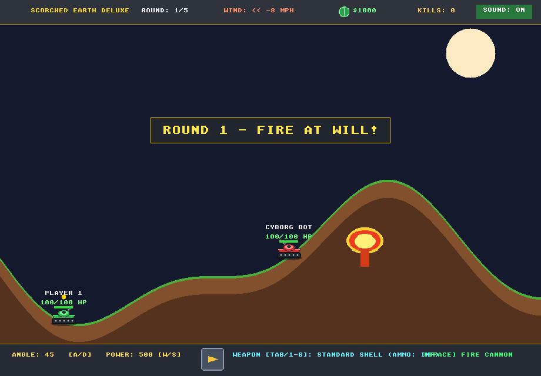

- **Objective**: Calculate ballistic trajectories across destructible voxel mountain landscapes, dial in turret elevation and firing power, account for crosswinds, and destroy enemy tanks with an arsenal of super-weapons!
- **Controls**:
  - `A` / `D` or `Left` / `Right`: Adjust tank turret barrel elevation angle.
  - `W` / `S` or `Up` / `Down`: Adjust gunpowder launch velocity / power.
  - `1-6` or `Tab`: Select active weapon from arsenal.
  - `Space` or `Enter`: Fire selected artillery weapon.
  - `R`: Generate new mountain terrain.
- **Rules & Mechanics**:
  - Ballistic gravity and fluctuating crosswind vectors alter projectile flight paths.
  - Destructible Terrain: Explosions blast spherical craters into mountains, causing dirt avalanches.
  - Arsenal: Baby Nuke, MIRV Cluster, Death's Head, Dirt Bomb, Napalm, Digger, and Laser Beam.
  - Defensive Shields: Buy Force Shields, Magnetic Deflectors, and Parachutes in the weapon shop.
- **Pro Tip**: When an opponent is buried deep on the other side of a mountain peak, fire a Dirt Bomb directly above them to bury them in an avalanche!

---

<a id="screensaver"></a>

### 66. Ultimate Retro Screensaver Suite (`screensaver/`)

_102 Classic 3D, Phosphor CRT, Math & Vector Screensavers_

```bash
v run screensaver
```

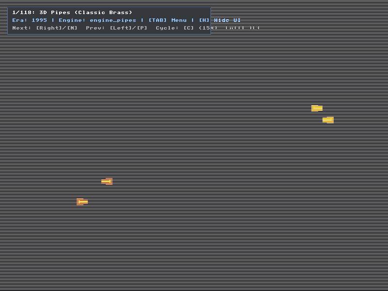

- **Objective**: Explore an expansive museum of 102 authentic retro screensavers spanning 1980s-2000s computing history (Windows 95/98/XP, Mac OS System 7, SGI IRIX, Amiga, and Unix X11)!
- **Controls**:
  - `Tab`: Open authentic Windows 95 Display Properties dialog to browse screensaver catalog.
  - `Right` / `Left` or `D` / `A`: Switch to next / previous screensaver.
  - `C`: Toggle Auto-Cycle mode (rotates screensavers every 15 seconds).
  - `M`: Quick jump to Matrix Digital Rain mode.
  - `1-9`: Adjust animation speed and particle density.
  - `Esc` or `Mouse Move`: Exit preview.
- **Rules & Mechanics**:
  - Includes 102 screensavers: 3D Flying Pipes, Starfield Simulation, Flying Toasters, 3D Maze 95, Mystify Your Mind, Matrix Digital Rain, Laser Vortex, 3D FlowerBox, Bouncing Béziers, Voronoi Cells, and 90+ more.
  - All math, vector geometry, rasterization, and 3D wireframe projections are computed procedurally in real-time.
- **Pro Tip**: Press `Tab` to bring up the Windows 95 settings window and test interactive parameter sliders on screensavers like 3D Pipes and Mystify!

---

<a id="shinobi"></a>

### 67. Cyber Shinobi (`shinobi/`)

_1987 Sega Ninja Action Platformer with Hostage Rescues & Ninjutsu_

```bash
v run shinobi
```

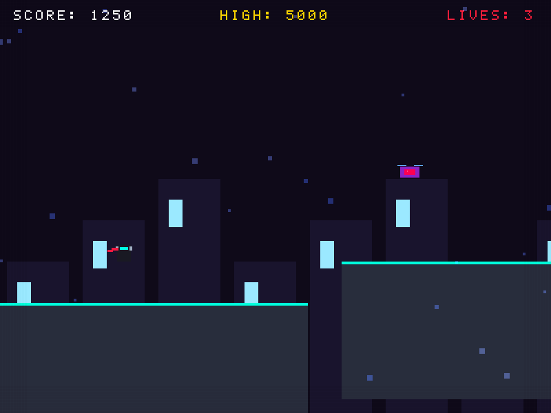

- **Objective**: Infiltrate cyber-terrorist strongholds as Master Ninja Joe Musashi, rescue kidnapped hostages, deflect gunfire, slice enemies with your katana, throw shurikens, and unleash ancient Ninjutsu spells!
- **Controls**:
  - `A` / `D` or `Left` / `Right`: Run left and right.
  - `W` or `Up`: Vertical jump / leap to higher floor tiers.
  - `S` or `Down`: Crouch / duck under bullets / drop down to lower tiers.
  - `J`: Close-range Katana slash / High Punch.
  - `K`: Throw long-range Ninja Shuriken stars.
  - `Space`: Unleash Ninjutsu Magic Screen Nuke (Tornado / Lightning / Invulnerability).
  - `P`: Pause game.
- **Rules & Mechanics**:
  - Hostages: Rescue all hostages in each district to unlock doors and receive weapon power-ups (Machine Gun, Explosive Shurikens).
  - Multi-Tier Levels: Jump between background and foreground platform levels.
  - Melee Auto-Switch: Attacks close to an enemy automatically switch from shurikens to lethal katana slashes.
- **Pro Tip**: Crouch (`S`) while throwing shurikens to eliminate shield-bearing guards by shooting under their ballistic defense plates!

---

<a id="sidescroller"></a>

### 68. Cyberpunk Vanguard (`sidescroller/`)

_2D Cyberpunk Action Side-Scroller with Multi-Weapons & Dash Physics_

```bash
v run sidescroller
```

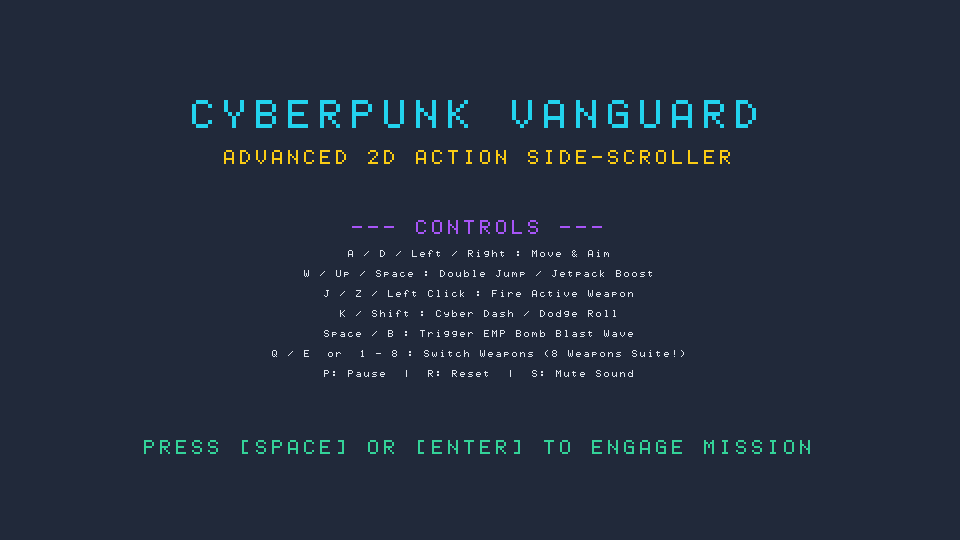

- **Objective**: Pilot a heavily armed cyber-soldier through futuristic dystopian industrial sectors, blasting alien mech droids, hovering gunships, and laser turrets while mastering jetpack hover mechanics!
- **Controls**:
  - `A` / `D`: Move left and right.
  - `W` or `Space` (Hold): Fire Jetpack thrusters for sustained vertical flight.
  - `S`: Crouch / fast descent.
  - `J`: Fire plasma blaster / assault rifle.
  - `K` or `LShift`: Perform high-speed invulnerable Dash evasion.
  - `1-4`: Switch weapon (Plasma Rifle, Spreader Shot, Homing Missiles, Railgun Laser).
  - `P`: Pause game.
- **Rules & Mechanics**:
  - Jetpack fuel recharges automatically when standing on solid ground.
  - Dash maneuver grants temporary invulnerability frames through laser fences and projectiles.
  - Defeat sector sub-boss mechs to unlock weapon modules.
- **Pro Tip**: Combine the forward Dash (`K`) with Jetpack flight to execute rapid airborne strafing runs across enemy defense bastions!

---

<a id="simon"></a>

### 69. Cyber Simon (`simon/`)

_1978 Milton Bradley Electronic Memory Game with Synthesized Tones_

```bash
v run simon
```

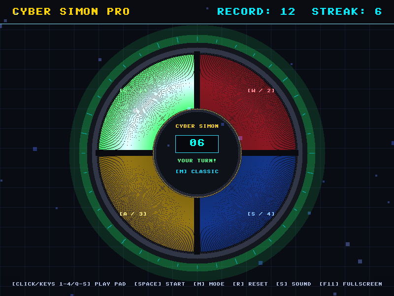

- **Objective**: Watch and listen to the sequence of illuminated colored pads (Green, Red, Yellow, Blue), then repeat the exact sequence without making a mistake as the pattern grows longer and faster!
- **Controls**:
  - `1` or `Q` or `Top-Left Click`: Green Pad (Tone E4 - 329.6 Hz).
  - `2` or `W` or `Top-Right Click`: Red Pad (Tone A4 - 440.0 Hz).
  - `3` or `A` or `Bottom-Left Click`: Yellow Pad (Tone C#4 - 277.2 Hz).
  - `4` or `S` or `Bottom-Right Click`: Blue Pad (Tone A3 - 220.0 Hz).
  - `M`: Switch Game Mode (Classic Simon / Reverse Sequence / Speed Demon).
  - `R`: Restart game.
- **Rules & Mechanics**:
  - Each successful round adds +1 new step to the repeating audio-visual sequence.
  - Playback speed accelerates at rounds 5, 10, 15, and 20.
  - Making an incorrect input plays the dreaded razor buzzer and ends the game.
- **Pro Tip**: Associate musical intervals with the pad positions to memorize long sequences as a melodic song rather than raw numbers!

---

<a id="sinksub"></a>

### 70. SinkSub Pro (`sinksub/`)

_1982 Destroyer Submarine Hunter with Sonar & Depth Charges_

```bash
v run sinksub
```

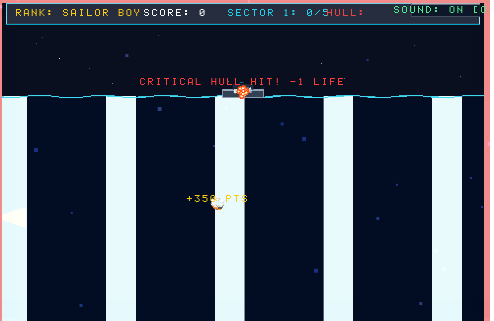

- **Objective**: Command a naval destroyer on the ocean surface, drop port and starboard depth charges to sink submerged enemy submarines, and dodge rising torpedoes and sea mines!
- **Controls**:
  - `A` / `D` or `Left` / `Right`: Steer destroyer ship along the surface.
  - `Z` or `J`: Drop Port (Left) depth charge into the sea.
  - `X` or `K`: Drop Starboard (Right) depth charge into the sea.
  - `Space`: Launch forward anti-air rocket / torpedo interceptor.
  - `P`: Pause game.
  - `R`: Restart mission.
- **Rules & Mechanics**:
  - Submarines cruise across 3 distinct ocean depth tiers (Shallow, Medium, Deep Abyss).
  - Depth charges sink under gravity and explode at predetermined depth intervals.
  - Submarines fire upward homing torpedoes and launch floating contact mines.
- **Pro Tip**: Drop depth charges in pairs while cruising at moderate speed to create a wide explosion carpet that covers multiple submarine depths!

---

<a id="skifree"></a>

### 71. SkiFree Extreme (`skifree/`)

_1991 Windows Slalom Classic with Mogul Jumps & the Abominable Snow Monster_

```bash
v run skifree
```

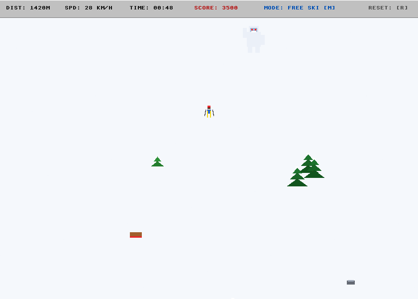

- **Objective**: Ski down a powdery alpine mountain, slalom between pine trees and snowmen, launch off mogul ski ramps to perform stylish aerial tricks, and escape the terrifying Abominable Snow Monster!
- **Controls**:
  - `A` / `D` or `Left` / `Right`: Steer ski angle (sharp turn, snow plow, carving).
  - `S` or `Down`: Fast downhill tuck speed.
  - `W` or `Up`: Slow down / walk uphill.
  - `Space`: Jump over rocks, fallen trees, and small snowmen.
  - `J` / `K` (in air): Perform aerial tricks (Twister, Backflip, 360 Spin).
  - `F`: Fast forward / speed ski mode.
- **Rules & Mechanics**:
  - 3 Alpine Modes: Free Ski, Slalom (pass through all flag gates), and Tree Slalom.
  - Colliding with trees, rocks, chairlift poles, or snowboards results in a wipeout.
  - At 2,000m down the mountain, the Abominable Snow Monster spawns to hunt you down!
- **Pro Tip**: When the Snow Monster appears at 2,000m, toggle Fast Ski mode (`F`) and perform diagonal jumps off moguls to outpace him!

---

<a id="slots"></a>

### 72. Vegas Jackpot Slots (`slots/`)

_3-Reel Classic Vegas Casino Slot Machine with Multi-Paylines, Hold & Dynamic Audio_

```bash
v run slots
```

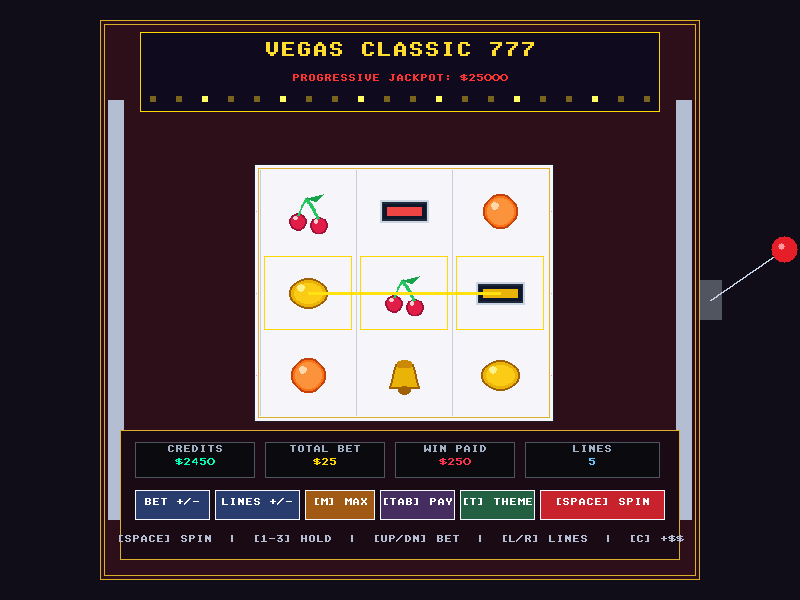

- **Objective**: Pull the vintage slot machine lever, spin the mechanical reels, hit matching cherries, bars, bells, and triple 777s across 5 paylines, and trigger the progressive jackpot!
- **Controls**:
  - `Space` or `Enter` or `Left Click Lever`: Spin slot reels.
  - `1` / `2` / `3`: Lock / Hold Reel 1, 2, or 3 for the next spin.
  - `Up` / `Down`: Increase / decrease wager bet amount ($1 to $100).
  - `T`: Cycle Theme (Vegas Classic 777, Cyberpunk Neon, Pirate Gold).
  - `O`: Toggle sound effects.
  - `R`: Reset casino bankroll.
- **Rules & Mechanics**:
  - **5 Active Paylines**: Top, Middle, Bottom, and 2 Diagonals.
  - **Payout Table**: Cherries (2x), Lemons (5x), Oranges (10x), Bells (25x), Bars (50x), Triple 777 (500x Jackpot!).
  - **Hold Feature**: Randomly offered after spins to lock 1 or 2 matching high-value symbols.
  - **Casino Audio Engine**: Multi-tiered win celebrations—Mega Jackpot 7-note brass fanfare with sirens, Big Win credit roll chimes, metallic coin cascades, and a distinctive descending negative loss buzzer on non-winning spins.
- **Pro Tip**: Always hold two 777 symbols when the Hold feature is active—it dramatically increases your probability of hitting the 500x jackpot on the next spin!

---

<a id="snake"></a>

### 73. Cyberpunk Snake (`snake/`)

_Nokia Nibbles Classic with Cyberpunk Neon Glow & Power Pellets_

```bash
v run snake
```

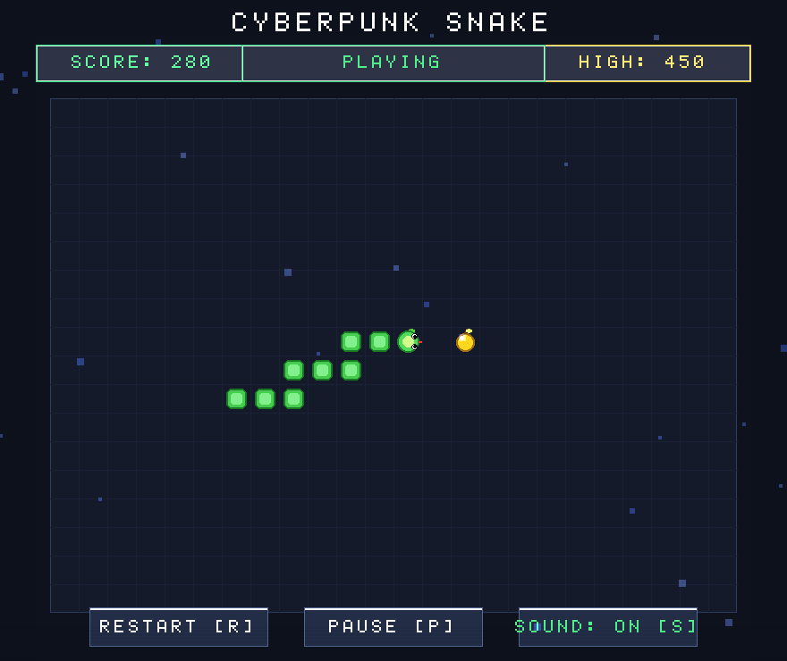

- **Objective**: Guide your growing cyber snake across the neon matrix grid, gobble glowing energy orbs to extend your length and score points, and avoid colliding with the walls or your own tail!
- **Controls**:
  - `WASD` or `Arrow Keys`: Steer snake heading in 4 cardinal directions.
  - `P`: Pause game.
  - `R`: Restart game.
- **Rules & Mechanics**:
  - Eating an energy orb extends the snake's tail length by +1 segment and increases score.
  - Bonus Golden Orbs spawn on a countdown timer for 5x points.
  - Colliding with the outer boundary walls or any segment of your own body results in an immediate crash.
- **Pro Tip**: Travel in an 'S-pattern' zigzag along the outer perimeter of the board to maximize space efficiency as your tail fills the grid!

---

<a id="sokoban"></a>

### 74. Sokoban Master (`sokoban/`)

_1982 Thinking Rabbit Warehouse Crate Puzzle (20 Handcrafted Levels)_

```bash
v run sokoban
```

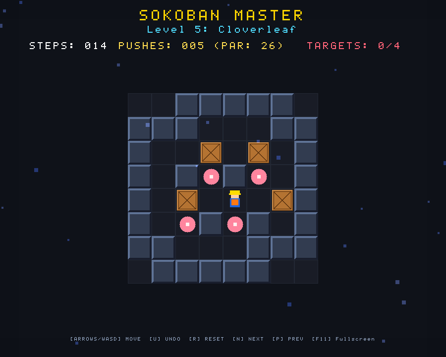

- **Objective**: Guide the warehouse keeper to push heavy wooden crates onto designated storage goal diamonds in the fewest total steps without getting boxes wedged into corners!
- **Controls**:
  - `WASD` or `Arrow Keys`: Move warehouse keeper and push crates.
  - `U`: Undo last step / push.
  - `R`: Restart current level puzzle.
  - `[` / `]`: Select previous / next level (1 to 20).
  - `M`: Toggle audio.
- **Rules & Mechanics**:
  - The keeper can only PUSH crates forward; you can NEVER pull crates.
  - You cannot push two adjacent crates simultaneously.
  - Crates pushed into solid wall corners can never be freed.
  - Place all crates onto all goal diamond tiles to complete the warehouse.
- **Pro Tip**: Never push a crate against a wall unless you have a verified path to slide it directly into a designated goal spot!

---

<a id="spaceinvaders"></a>

### 75. Space Invaders Pro (`spaceinvaders/`)

_1978 Taito Arcade Classic with Destructible Bunkers & Flying Mystery UFOs_

```bash
v run spaceinvaders
```

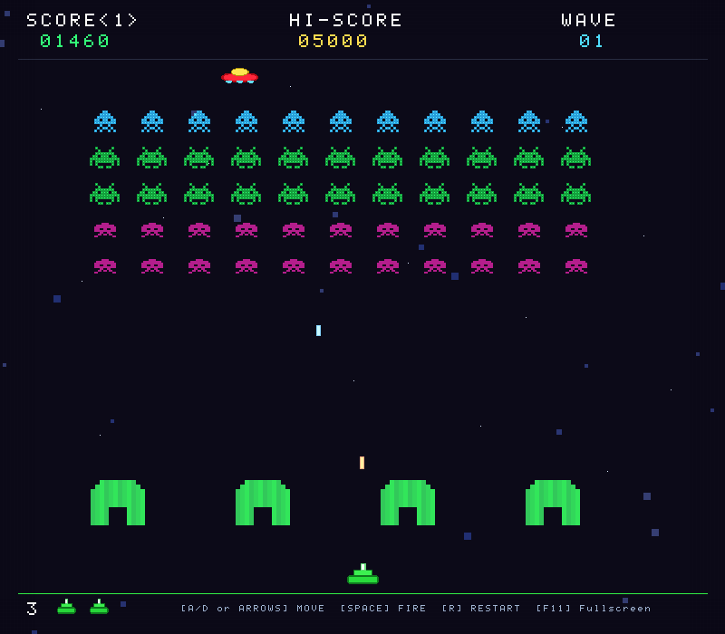

- **Objective**: Command your laser defense cannon behind 4 destructible green bunkers, shoot down 5 rows of advancing alien invaders, snipe the high-value Mystery UFO, and defend Earth!
- **Controls**:
  - `A` / `D` or `Left` / `Right`: Slide laser cannon along the baseline.
  - `Space`: Fire vertical laser beam (1 shot active at a time).
  - `P`: Pause game.
  - `R`: Restart game.
- **Rules & Mechanics**:
  - 55 Invaders marching in unison across 5 rows (Squids, Crabs, Octopuses).
  - Invaders descend 1 row whenever they reach the screen edge; march speed accelerates as their numbers diminish.
  - Destructible Bunkers: 4 green defense shields absorb incoming alien bombs and player lasers until eroded.
  - Mystery Flying Saucer: Flies across the top ceiling periodically for 50, 100, 150, or 300 mystery bonus points.
- **Pro Tip**: Carve a narrow vertical peephole through one of your bunkers to fire safely at invaders while protected from alien bombs!

---

<a id="tamagotchi"></a>

### 76. Tamagotchi Virtual Pet (`tamagotchi/`)

_1996 Bandai Digital Pet LCD Simulation with Evolution & Mood AI_

```bash
v run tamagotchi
```

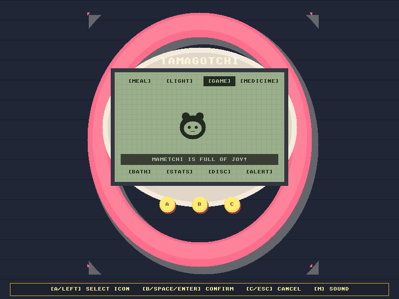

- **Objective**: Raise a virtual digital alien pet from an egg to adulthood! Feed meals and snacks, play games, discipline bad behavior, clean messes, turn off lights for sleep, and nurture your pet into rare secret evolutions!
- **Controls**:
  - `A` or `Left`: Cycle through the 8 icon menu commands.
  - `B` or `Space` or `Enter`: Confirm and execute selected command.
  - `C` or `Esc`: Cancel / open pet status meters (Hunger, Happiness, Discipline, Age, Weight).
  - `M`: Toggle sound.
- **Rules & Mechanics**:
  - 8 Core Care Actions: Feed (Meal/Snack), Light (Sleep), Play (Left/Right guessing game), Medicine (Cure sickness), Clean (Flush poop), Meter (View stats), Discipline (Praise/Scold), Alert.
  - Pet Evolutions: Egg -> Babytchi -> Marutchi -> Tamatchi -> Adult (Mametchi, Ginjirotchi, Masktchi, Kuchipatchi, etc.).
  - Neglecting hunger and happiness leads to illness, bad temperaments, or premature departure.
- **Pro Tip**: Play the guessing mini-game to boost happiness rather than over-feeding snacks to keep your pet's weight healthy and unlock top-tier evolutions!

---

<a id="tetris"></a>

### 77. Modern Tetris (`tetris/`)

_Super Rotation System (SRS) Tetris with 7-Bag Randomizer & Ghost Piece_

```bash
v run tetris
```

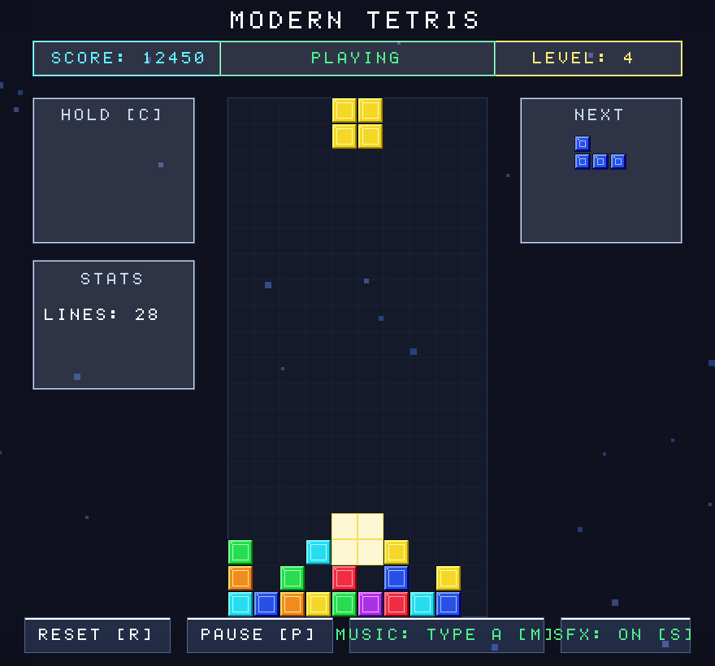

- **Objective**: Rotate and place falling geometric tetromino blocks (I, J, L, O, S, T, Z) to complete full horizontal lines, trigger multi-line clears, and score maximum points with Tetris clears and T-Spins!
- **Controls**:
  - `A` / `D` or `Left` / `Right`: Move tetromino horizontally.
  - `W` or `Up`: Rotate tetromino clockwise (with SRS wall-kicks).
  - `Z`: Rotate tetromino counter-clockwise.
  - `S` or `Down`: Soft drop tetromino.
  - `Space`: Hard drop tetromino instantly with lock-down.
  - `C` or `LShift`: Hold tetromino in reserve.
  - `P`: Pause game.
  - `R`: Restart game.
- **Rules & Mechanics**:
  - Super Rotation System (SRS) with authentic wall-kick and floor-kick tables.
  - 7-Bag Randomizer ensures an even distribution of all 7 tetromino shapes.
  - Ghost piece projection displays the exact landing footprint.
  - Clear 1 Line (Single), 2 Lines (Double), 3 Lines (Triple), or 4 Lines simultaneously (Tetris!).
- **Pro Tip**: Leave the rightmost column open and stack a clean 4-block deep well to clear consecutive 4-line Tetris bonuses with the long 'I' tetromino!

---

<a id="texas"></a>

### 78. Texas Hold'em Poker (`texas/`)

_No-Limit Texas Hold'em with 6-Max AI Bluffing & Chip Physics_

```bash
v run texas
```

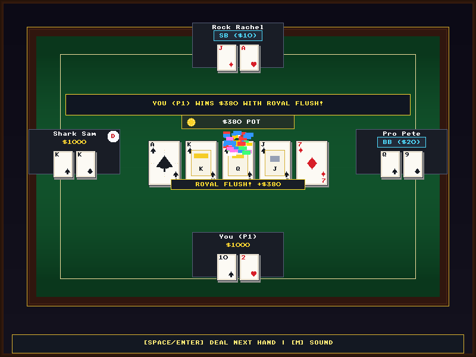

- **Objective**: Outsmart 5 AI poker opponents at the table! Combine your 2 hole cards with the 5 community cards (Flop, Turn, River) to forge the strongest 5-card poker hand or bluff your opponents into folding!
- **Controls**:
  - `C`: Check (when no bet is required) / Call current bet.
  - `R`: Raise bet amount (use Up/Down to adjust raise sizing).
  - `F`: Fold hand and forfeit the pot.
  - `A`: Go All-In with your entire remaining chip stack!
  - `Space`: Advance to next poker hand.
  - `R`: Reset tournament bankroll.
- **Rules & Mechanics**:
  - Standard Texas Hold'em 4-Round Betting Structure: Pre-Flop -> Flop (3 cards) -> Turn (1 card) -> River (1 card) -> Showdown.
  - Poker Hand Ranking: High Card < One Pair < Two Pair < Three of a Kind < Straight < Flush < Full House < Four of a Kind < Straight Flush < Royal Flush.
  - Advanced AI profiles simulate aggressive, tight, and bluffing playstyles.
- **Pro Tip**: Position is everything in poker—play aggressively when you are the Dealer (Button) and can act last on every betting round!

---

<a id="towerdefense"></a>

### 79. Kingdom Tower Defense (`towerdefense/`)

_Strategic Grid Turret Defense with Elemental Damage & Wave Scaling_

```bash
v run towerdefense
```

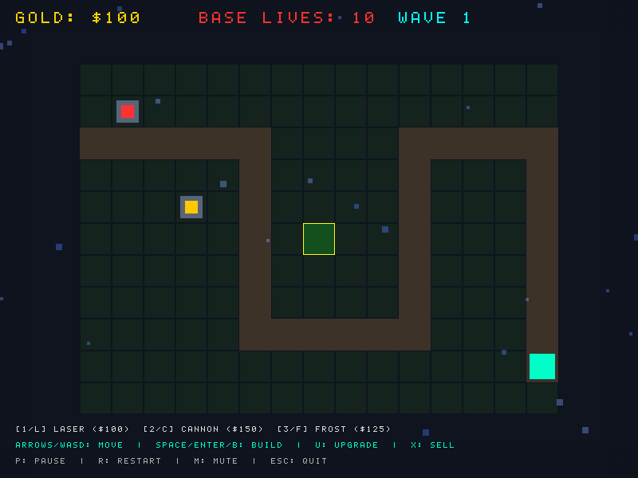

- **Objective**: Build and upgrade defensive battle turrets along winding stone pathways to eliminate oncoming hordes of invading creeps, armored tanks, and flying bosses before they reach your castle base!
- **Controls**:
  - `1`: Select Gatling Gun (Fast single-target ballistic fire).
  - `2`: Select Cannon Tower (Long-range high-explosive splash damage).
  - `3`: Select Laser Tower (Armor-piercing continuous beam).
  - `4`: Select Frost Tower (Cryo aura that slows enemy march speed).
  - `Left Click`: Place selected turret on valid green grid tile / Upgrade existing turret.
  - `Space`: Start next enemy wave immediately (awards early wave cash bonus).
  - `R`: Restart mission.
- **Rules & Mechanics**:
  - Defeating enemies rewards gold bounty to construct additional turrets and purchase range/damage upgrades.
  - Creeps travel strictly along the defined stone road path.
  - If 20 enemies breach your castle defenses, the game ends in defeat.
- **Pro Tip**: Place Frost Towers at tight hairpin turns right next to high-damage Cannons so enemies stay clustered together inside the blast radius!

---

<a id="trivia"></a>

### 80. Trivia Quest Master (`trivia/`)

_Arcade Quiz Showdown with 1,000+ Questions Across 8 Categories_

```bash
v run trivia
```

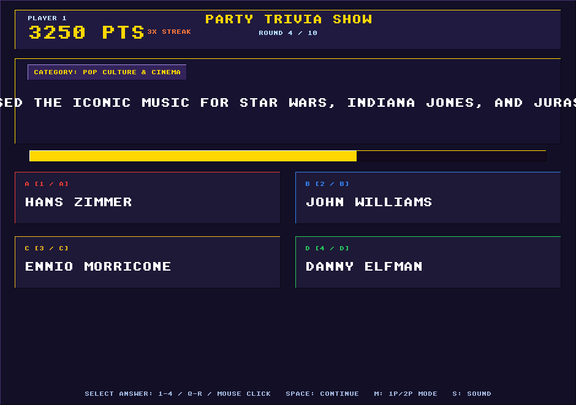

- **Objective**: Test your knowledge across 8 diverse trivia categories (Gaming, Science, History, Movies, Geography, Music, Tech, Sports). Answer timed questions, use lifelines, build multiplier streaks, and climb the high score ladder!
- **Controls**:
  - `1` / `2` / `3` / `4` or `Left Click`: Select corresponding multiple-choice answer.
  - `F`: Use 50:50 Lifeline (eliminates 2 incorrect options).
  - `S`: Use Skip Question Lifeline.
  - `Space`: Advance to next question.
  - `R`: Restart quiz.
- **Rules & Mechanics**:
  - Each question has a 15-second countdown timer. Answering faster awards bonus speed points.
  - Consecutive correct answers build a Combo Multiplier up to 5x.
  - Includes 1,000+ curated questions across all difficulty tiers.
- **Pro Tip**: Save your 50:50 lifeline for high-multiplier questions in round 10 and beyond to protect your combo streak!

---

<a id="typing"></a>

### 81. Nitro Typist Speed Test (`typing/`)

_Arcade Typing Benchmark with Real-Time WPM & Accuracy Metrics_

```bash
v run typing
```

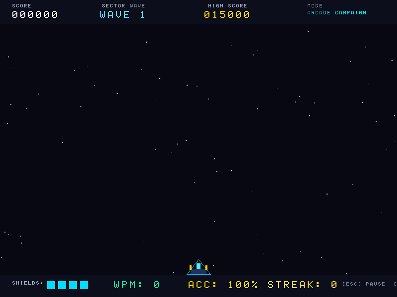

- **Objective**: Type falling words and code keywords before they reach the bottom laser barrier! Measure your Words Per Minute (WPM), character accuracy, and streak multipliers in real-time!
- **Controls**:
  - `Keyboard Typing`: Type letters matching the lowest active word on screen.
  - `Backspace`: Delete mistyped characters.
  - `Enter` or `Space`: Confirm completed word.
  - `Tab`: Toggle word dictionary (English Prose / Programming Keywords / Cyberpunk Lexicon).
  - `R`: Reset typing test.
- **Rules & Mechanics**:
  - Words fall from the top of the matrix at an accelerating velocity.
  - Typing the full word correctly disintegrates it in a burst of particles.
  - Live telemetry HUD displays net WPM, gross WPM, accuracy percentage, and keystroke latency.
- **Pro Tip**: Keep your eyes focused on the first 2 letters of oncoming words to buffer your finger keystrokes ahead of time!

---

<a id="uno"></a>

### 82. Uno Master (`uno/`)

_Classic 4-Player Color Match Card Game with AI Opponents_

```bash
v run uno
```

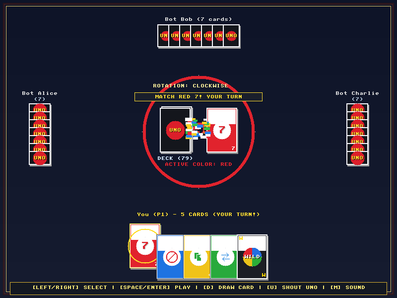

- **Objective**: Match cards in your hand by color (Red, Blue, Green, Yellow) or number against the top discard pile card. Play Draw Two, Skip, Reverse, and Wild cards to discard your entire hand first and shout 'UNO!'
- **Controls**:
  - `A` / `D` or `Left` / `Right`: Scroll and select cards in your hand.
  - `Space` or `Enter`: Play the selected card onto the discard pile.
  - `X` or `D`: Draw a card from the deck when you have no legal plays.
  - `U`: Call 'UNO!' when holding exactly 1 card remaining.
  - `1-4`: Choose new color when playing a Wild or Wild Draw 4 card.
  - `R`: Reset match.
- **Rules & Mechanics**:
  - Action Cards: Skip (next player loses turn), Reverse (switches play direction), Draw Two (+2 cards to next player).
  - Wild Cards: Wild (choose color), Wild Draw Four (+4 cards and choose color).
  - Failing to call 'UNO!' before the next player takes their turn results in a 2-card penalty.
- **Pro Tip**: Save a Wild Draw 4 card for your penultimate play so you can freely match whatever color is on the board and declare UNO effortlessly!

---

<a id="vampiresurvivors"></a>

### 83. Vampire Survivors (`vampiresurvivors/`)

_Gothic Bullet-Hell Survival Roguelike with Weapon Evolutions & 2P Co-op_

```bash
v run vampiresurvivors
```

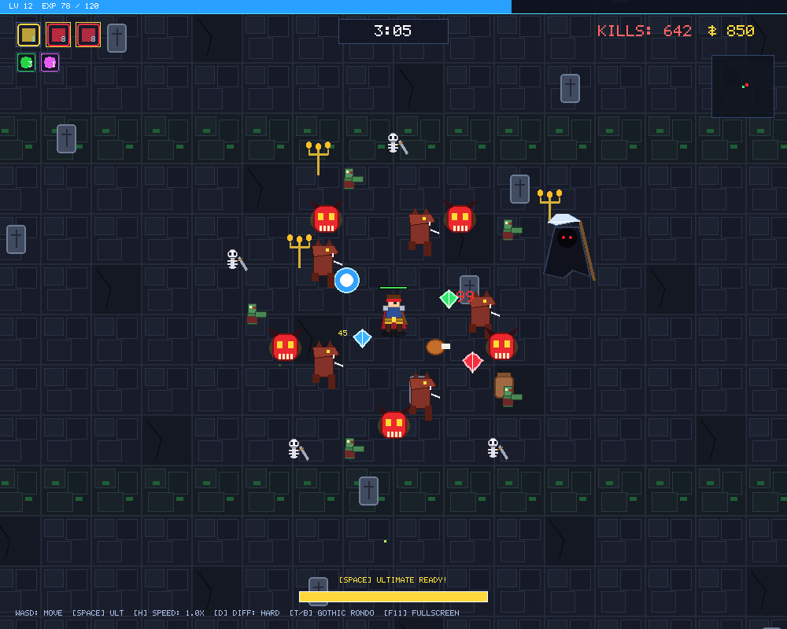

- **Objective**: Survive 30 minutes in a cursed gothic graveyard against tens of thousands of swarming bats, zombies, skeletons, and vampire bosses. Collect blue and red XP gems, level up, synergize weapon evolutions, and survive until Death arrives!
- **Controls**:
  - `WASD` / `Arrow Keys`: Move your hero (weapons fire automatically at nearest enemies).
  - `1` / `2` / `3` / `4` or `Space`: Select upgrade from level-up treasure chests.
  - `C`: Toggle 2-Player Local Co-op mode.
  - `T`: Cycle gothic synthesizer soundtrack.
  - `P`: Pause game.
  - `R`: Restart survival run.
- **Rules & Mechanics**:
  - Autofire combat: Position your hero strategically while weapons attack autonomously.
  - Collect fallen XP gems to fill your level-up bar.
  - Weapons: Whip, Magic Wand, Holy Water, Garlic Aura, Axe, Cross Boomerang, King Bible, Lightning Ring.
  - Weapon Evolutions: Max out a weapon (Lv 8) with its complementary passive item (e.g., Whip + Hollow Heart -> Bloody Tear) to forge god-tier evolved weapons!
- **Pro Tip**: Pick Garlic early for effortless low-tier crowd clearing, then build Holy Water and King Bible for an impenetrable spinning fortress of protection!

---

<a id="war"></a>

### 84. War Card Battle (`war/`)

_Classic 52-Card War Battle with Dynamic Card Animations & Auto-Play_

```bash
v run war
```

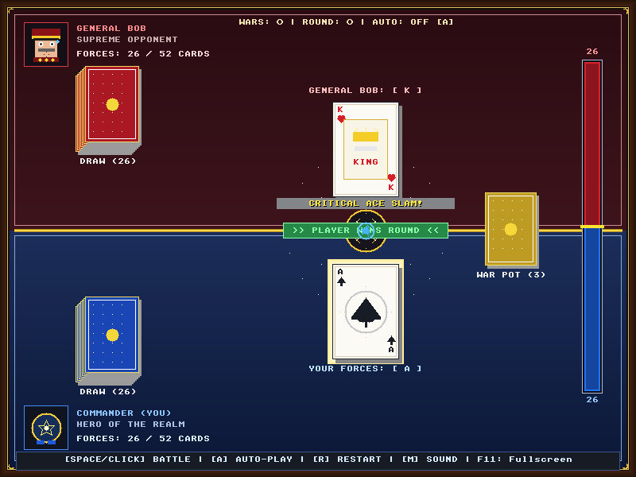

- **Objective**: Split a standard 52-card deck evenly between you and the computer. Flip cards simultaneously—the higher card takes both! When matching ranks collide, declare 'WAR!' and conquer the entire deck!
- **Controls**:
  - `Space` or `Enter` or `Left Click`: Flip cards for the current battle round.
  - `A`: Toggle Auto-Play fast simulation mode.
  - `S`: Toggle procedural audio effects.
  - `R`: Re-shuffle and restart match.
- **Rules & Mechanics**:
  - Card Ranking: 2 (lowest) up to Ace (highest).
  - When cards tie, WAR is declared: each player lays 3 cards face-down and 1 card face-up. The highest face-up card wins all 10 cards in the pot!
  - Double & Triple Wars occur if the face-up war cards tie again.
  - A player wins by capturing all 52 cards in the deck.
- **Pro Tip**: Enable Auto-Play (`A`) to watch high-speed statistical simulations of deck momentum swings!

---

<a id="yahtzee"></a>

### 85. Yahtzee Deluxe (`yahtzee/`)

_Classic 5-Dice Poker Scorecard with Upper Section Bonuses & Yahtzees_

```bash
v run yahtzee
```

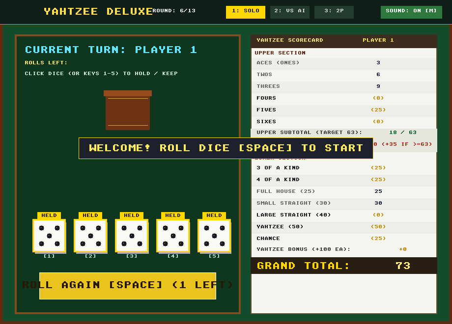

- **Objective**: Roll 5 dice up to 3 times per turn to fill out 13 distinct scorecard categories (Three of a Kind, Full House, Small Straight, Large Straight, Chance, and 5-of-a-kind YAHTZEE!). Maximize your score over 13 rounds!
- **Controls**:
  - `Space` or `Enter`: Roll active dice.
  - `1` / `2` / `3` / `4` / `5`: Toggle Hold on corresponding dice.
  - `Up` / `Down` or `W` / `S`: Navigate scorecard categories.
  - `Enter` / `Space`: Confirm and score category.
  - `R`: Reset scorecard.
- **Rules & Mechanics**:
  - Upper Section (Aces through Sixes): Scoring 63+ total points awards a +35 Upper Bonus.
  - Lower Section: 3-of-a-Kind, 4-of-a-Kind, Full House (25 pts), Small Straight (30 pts), Large Straight (40 pts), Yahtzee (50 pts), Chance.
  - Yahtzee Bonus: Scoring additional 5-of-a-kind Yahtzees awards +100 bonus points each!
- **Pro Tip**: Prioritize scoring high multiples of Fours, Fives, and Sixes in the Upper Section to guarantee unlocking the +35 bonus!

---

<a id="yiearkungfu"></a>

### 86. Yie Ar Kung-Fu (`yiearkungfu/`)

_1985 Konami 1v1 Fighting Arcade Legend with Weapon Deflections_

```bash
v run yiearkungfu
```

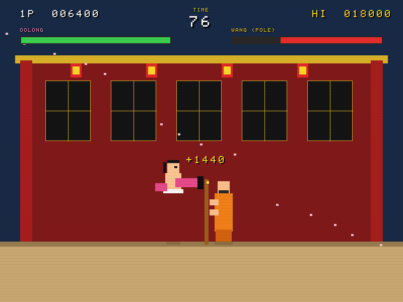

- **Objective**: Play as martial artist Oolong in the grand fighting tournament! Face 5 master martial artists with diverse fighting styles and weapons (Sumo, Shurikens, Nunchaku, Pole, Wings), timing punches and jump kicks to defeat each opponent!
- **Controls**:
  - `A` / `D` or `Left` / `Right`: Walk left and right / Turn.
  - `W` or `Up`: High acrobatic flip leap.
  - `S` or `Down`: Crouch / duck under high projectiles.
  - `J`: High/Mid Punch.
  - `K`: Mid/Low Kick.
  - `W` + `K`: Flying Jump Kick.
  - `S` + `K`: Low Sweep Kick.
  - Attack incoming projectiles (shurikens/thrown swords) to deflect them!
- **Rules & Mechanics**:
  - 5 Tournament Masters: Buchu (Flying Sumo Body Slam), Star (Ninja Shuriken Girl), Nuncha (Nunchaku Master), Pole (Staff Fighter), and Mu (Winged Flying Master).
  - Hit points displayed on health bars; deplete opponent's HP to advance to the next fight.
  - Weapon Deflection: Time punches and kicks to knock enemy shurikens out of the air.
- **Pro Tip**: Use the Flying Jump Kick (`W`+`K`) to leap over weapon attacks and strike bosses on their vulnerable heads!

---

<a id="yoshicookie"></a>

### 87. Yoshi's Cookie (`yoshicookie/`)

_1992 Nintendo Line-Sliding Bakery Match-3 Grid Puzzler_

```bash
v run yoshicookie
```

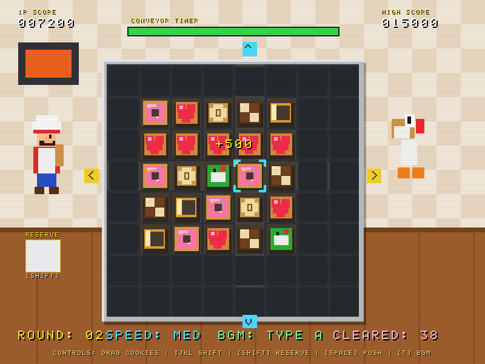

- **Objective**: Slide entire horizontal rows and vertical columns of freshly baked cookies in the bakery oven. Align full rows or columns of identical cookie types (Heart, Flower, Diamond, Circle, Checkered, Yoshi Star) to clear them before the tray overflows!
- **Controls**:
  - `WASD` or `Arrow Keys`: Move cursor bracket across the cookie grid.
  - `Hold Space` or `J` or `Z` + `WASD/Arrows`: Slide selected row horizontally or column vertically (with grid wrapping).
  - `P`: Pause game.
  - `R`: Restart level.
- **Rules & Mechanics**:
  - Line-Clearing: An entire row or column must consist of the SAME cookie type to clear.
  - Grid Wrapping: Sliding a cookie off the right edge loops it around to the left edge.
  - New rows and columns are added from the top and right sides as the oven conveyor moves.
  - Yoshi Star Cookies: Act as wild cards that can complete any cookie line.
  - If the cookie grid exceeds the maximum tray boundaries, the oven jams and the game ends.
- **Pro Tip**: Use the wrapping edges to rotate cookies into place from the opposite side of the grid in a single slide!

---

<a id="zuma"></a>

### 88. Zuma: Temple of the Stone Idol (`zuma/`)

_2003 PopCap Aztec Frog Track Marble Shooter with Chain Reactions_

```bash
v run zuma
```

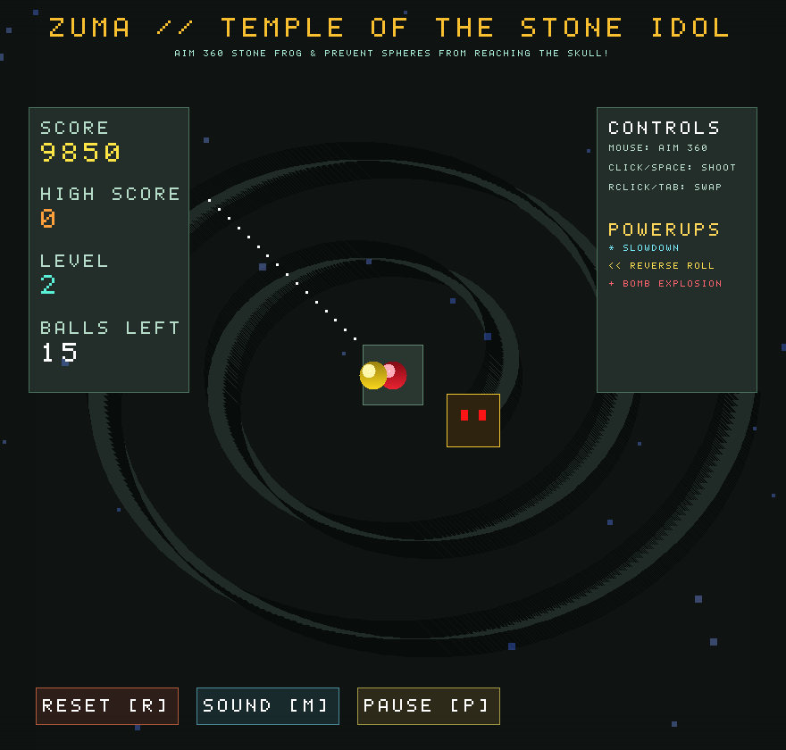

- **Objective**: Control the ancient Stone Frog Idol, rotate 360 degrees, and fire colored balls into the rolling track chain. Match 3 or more balls of the same color to detonate them before the chain reaches the golden skull pit!
- **Controls**:
  - `Mouse Aim`: Rotate Stone Frog Idol 360 degrees.
  - `Left Click` or `Space`: Fire colored ball from frog mouth.
  - `Right Click` or `Tab`: Swap active mouth ball with reserve back ball.
  - `P`: Pause game.
  - `R`: Restart temple.
- **Rules & Mechanics**:
  - Match 3 or more balls of the same color to eliminate them from the rolling chain.
  - Chain Pullback: Creating gaps where the balls on either side match causes them to magnetically pull back together, triggering bonus combo cascades!
  - Power-Up Balls: Bomb (explodes surrounding balls), Slow (slows chain track), Reverse (rolls chain backwards), and Accuracy (laser sight).
  - Clear all balls on the track to complete the temple level.
- **Pro Tip**: Shoot through gaps in the front track to hit matching balls on the rear track to trigger double-chain pullbacks!

---

<a id="89-marble-madness-nes-marblemadness"></a>

### 89. Marble Madness NES (`marblemadness/`)

```bash
v run marblemadness
```

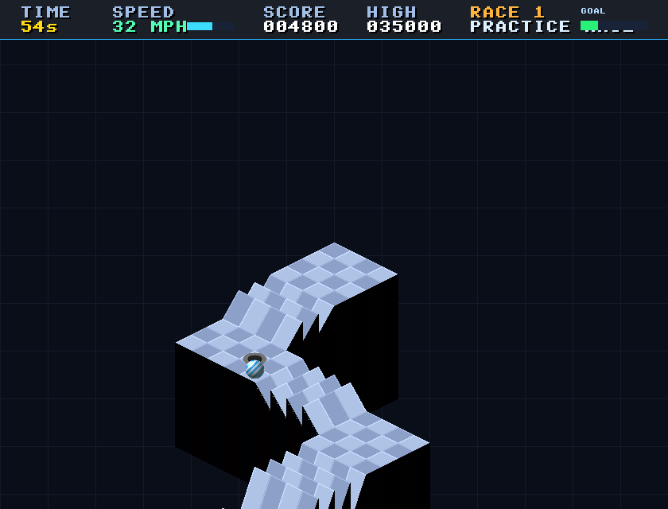

- **Objective**: Guide your marble downhill through 6 treacherous isometric courses (Practice, Beginner, Intermediate, Aerial, Silly, and Ultimate Races) to reach the goal line before the timer runs out! Carry over spare seconds to subsequent races for bonus points.
- **Controls**:
  - `Arrows` / `WASD`: Steer marble (continuous 8-way screen-relative or diagonal).
  - `Space` / `J` / `Z`: Turbo speed boost.
  - `T`: Toggle between Screen-Relative and Classic NES Diagonal Trackball control modes.
  - `1` - `6`: Quick Practice Race select.
  - `P`: Pause game.
  - `M`: Toggle 8-bit sound effects.
  - `R`: Restart current race.
- **Hazards & Mechanics**:
  - **Green Marble Munchers**: Acid pit predators that snap open and swallow passing marbles.
  - **Black Steel Rival Marble**: Aggressive heavy marble AI that attempts to ram you off cliffs.
  - **Vacuum Tubes**: Rapid transit chutes that catapult your marble across deep chasms.
  - **Dynamic Wave Terrain**: Undulating rolling surfaces requiring careful speed control.
  - **Pterodactyl Birds & Floor Sweepers**: Aerial predators and moving broom barriers pushing marbles into the abyss.
  - **Shatter Physics**: High falls shatter the marble into shards, requiring a time penalty to reassemble.
- **Pro Tip**: Use Turbo Boost just before ramps and jumps to clear wide chasms, but brake early on narrow ice catwalks!

---

<a id="90-contra-nes-contra"></a>

### 90. Contra NES (`contra/`)

```bash
v run contra
```

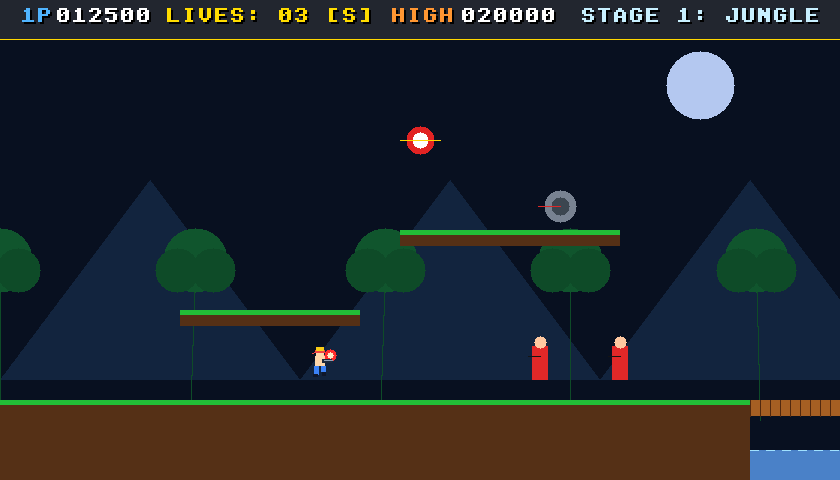

- **Objective**: Lead commandos Bill Rizer and Lance Bean on a high-octane infiltration mission against the alien Red Falcon Army across 4 intense multi-perspective stages (Jungle, 3D Base Corridor, Vertical Waterfall, and the Alien Lair)!
- **Controls**:
  - `WASD` / `Arrows`: Move commando & aim weapon in 8 directions (including crouch / prone crawling).
  - `J` / `Z` / `Left Click`: Fire weapon (hold for rapid auto-fire).
  - `K` / `X` / `Space`: Somersault jump.
  - `S + K` / `Down + Jump`: Drop down through pass-through platforms.
  - `1` - `4`: Stage Select (1: Jungle, 2: 3D Base, 3: Waterfall, 4: Alien Lair).
  - `C`: Toggle 1-Player vs 2-Player Co-op mode.
  - `P`: Pause game.
  - `M`: Toggle procedural 8-bit sound effects.
  - `R`: Restart mission.
  - **Konami 30 Lives Code**: On the Title screen, press `Up, Up, Down, Down, Left, Right, Left, Right, J, K` (or `B, A`) for 30 Lives!
- **Arsenal & Power-Ups**:
  - **Rifle (Normal)**: Standard single-shot rapid fire.
  - **Machine Gun (M)**: High-speed automatic bullet stream.
  - **Spread Gun (S)**: The legendary 5-way expanding red pellet shotgun blast!
  - **Laser Gun (L)**: Piercing high-damage energy beam.
  - **Fire Gun (F)**: Rotating corkscrew fireball shells.
  - **Rapid Fire (R)**: Increased bullet velocity and firing rate.
  - **Barrier (B)**: Temporary rainbow invulnerability shield.
- **Pro Tip**: Use prone firing (`Down` + `Shoot`) to duck underneath enemy sniper fire while taking out ground pillbox turrets!

---

<a id="91-3d-worldrunner-worldrunner"></a>

### 91. 3D WorldRunner (`worldrunner/`)

```bash
v run worldrunner
```

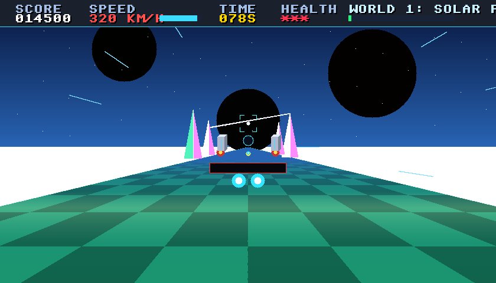

- **Objective**: Pilot your cyber commando across 5 cosmic worlds at speeds exceeding 320 KM/H! Leap across bottomless pits, shatter stone monoliths and brick walls with dual laser cannons, and destroy the legendary 14-segment Serpent Dragon Boss!
- **Controls**:
  - `A` / `D` / `Left` / `Right` / `Mouse`: 3D Lateral strafe with dynamic banking tilt & reticle aim.
  - `Space` / `K` / `X`: High jetpack jump with apex float.
  - `J` / `Z` / `Left Click`: Fire dual forward laser cannons.
  - `W` / `Up` / `Shift`: Turbo Boost (accelerate to 320+ KM/H).
  - `S` / `Down`: Active Air Brake (decelerate to 80 KM/H).
  - `Tab`: Toggle relative mouse lock.
  - `1` - `5`: Select World (1: Solar Plains, 2: Crystal Caverns, 3: Magma Wasteland, 4: Cyber Matrix, 5: Cosmic Abyss).
  - `P`: Pause | `M`: Toggle audio | `R`: Restart race | `F11`: Fullscreen toggle.
- **Power-Ups & Objects**:
  - **Energy Rings**: Pass through for instantaneous 3-second Turbo Boost surges.
  - **Invincible Shield**: Golden barrier bubble allowing you to obliterate solid stone pillars on contact.
  - **Speed Boosters & Health Packs**: Restore life hearts and maximize warp speed.
  - **Segmented Serpent Dragon**: Target the glowing head or blast through individual body segments to destroy the cosmic guardian.
- **Pro Tip**: Fire dual lasers while in mid-air at the apex of a jump to clear high floating spires and blast dragon segments from above!

---

## 🏗️ Technical Architecture & Design Philosophy

The V Arcade SDL Games Suite is designed around strict minimalism, ultra-fast compilation, and complete autonomy:

1. **Zero External Asset Dependencies**:
   - No audio `.wav` or `.mp3` files are bundled. All sound effects (explosions, laser chirps, coin jingles, jump thuds, engine hums, synthwave chords, and goal horns) are synthesized on-the-fly using 100% procedural PCM waveform oscillators (sine, square, triangle, saw, noise, frequency modulation, and ADSR envelopes).
   - No image `.png` or `.bmp` sprite sheets are bundled. All graphics (sprites, characters, tiles, scanlines, fonts, and particle systems) are rasterized directly using vector mathematics, primitive geometry routines, and custom embedded pixel font arrays.

2. **Pure V Performance**:
   - Every game compiles natively down to high-performance C binaries in milliseconds with `v run <dir>`.
   - Zero garbage collection latency during frame rendering loops.
   - Smooth 60 FPS / 120 FPS frame pacing with sub-millisecond input response.

3. **Comprehensive Unit Test Suites**:
   - Every single game includes automated test suites (`<game>_test.v`) verifying physics, collision detection, game state machines, scoring rules, and edge cases.
   - Run any test suite instantly with `v test <game>/<game>_test.v`.

---

## 📜 License & Open Source

This repository is open source and available under the **MIT License**. Feel free to fork, learn, modify, add new games, and enjoy building in V!
